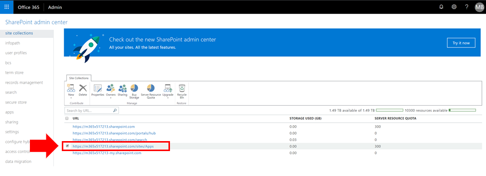
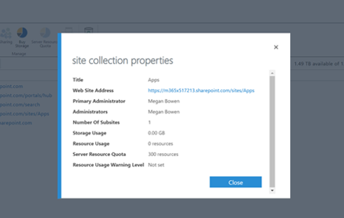
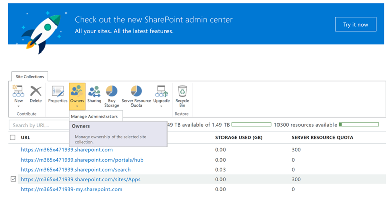
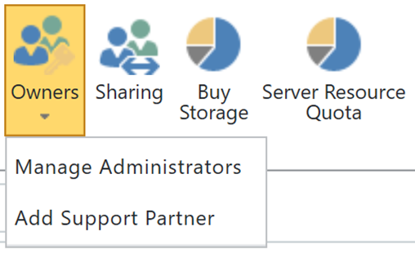

# View or Add an Administrator to your SharePoint Online App Catalog

To successfully install CLO365, the person doing the provisioning of the solution needs to be listed as an administrator of the tenant app catalog.

1. From the Office 365 Administration portal go to the SharePoint Online Admin Center
1. **Select** the App Catalog URL from the site collection list

1. Confirm that the CLO365 installer is listed as one of the app catalog administrators.

If your user name is listed you can return to provisioning the Custom Learning site.  If not complete the next steps. 

## Add an Administrator

1. From the SharePoint Admin Center select the checkbox next to the app catalog URL and select the Owners drop-down box.

1. Select Manage Administrators from the drop down menu

1. Add the correct individual as a Site Collection Administrator and click OK to save your changes.

### Next Steps - [Site Provisioning](installsitepackage.md)
