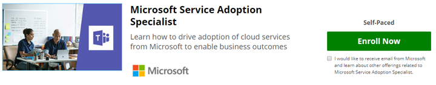

# Validate your Skills - Become a Service Adoption Specialist

If service adoption is a part of your role or you want to go deeper with formal training on this topic you can enroll in the online course provided by Microsoft on our partner site, EdX.org. 

This [Service Adoption Specialist on-line course](https://aka.ms/AdoptionCert) is **free to audit**.  If you'd like to receive your EdX certificate for completion a fee of $99.00 is required.  This course was authored by [Karuana Gatimu](https://linkedin.com/in/karuanagatimu) of Microsoft Teams Engineering with input from multiple Microsoft MVP's and Microsoft IT experts.  The best practices contained within have been gathered from observing the industry as a whole and are complimentary to a formal organizational change management education.  

Practical guidance, tools and additional content are contained in this course that will allow you to validate your skils in this important business capability.  

Learn more in our [announcement](https://aka.ms/AdoptionCertAnnouncement) about the publication of this course. 

Join our online community of business users and IT Professionals learning about adoption at https://aka.ms/DriveAdoption. 