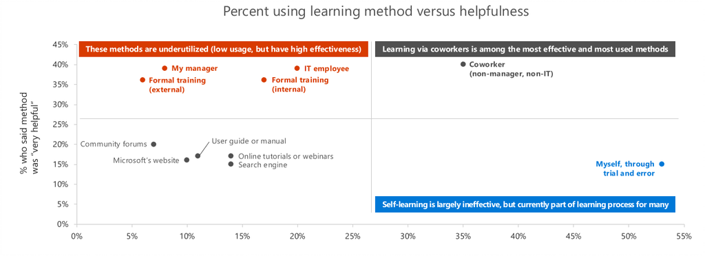

# Establish Champions for User Adoption 

Organizational change management is the art of changing the behavior of a targeted group of people. There is a great deal of science and research supporting this practice. In these articles we are going to help you drive the adoption of key services that will lead to business outcomes in your company.  Following our best practices will shorten your time to gaining measurable value from Office 365.  

A champions program is an essential part of driving adoption. These influencers in your company provide much needed support and encouragement to employees who are adopting the new technology. Review these pages to get informed about creating your adoption plan and running your own champion program. 

> [!NOTE]
> You can update or replace this playlist with information about your own program for reference across your organization.

## Who are champions and what makes them tick?

Champions are not only passionate about what they do, but are also excited to share their knowledge and help their co-workers learn more effective solutions. Champions are enthusiastic and often frustrated with existing tools. They will help you win the watercooler buzz challenge!  

We feel it is important to reward champions in meaningful ways. A few suggestions are:

- Allow successful membership in the Champion program to contribute to the employees' performance review
- Acknowledge your most successful Champions with rewards of Office swag and employee perks  
- Engage your Champions with ongoing training and content they can pass along to other employees 

The champion personality does not usually engage because of these rewards, but instead because it creates a more meaningful and measurable experience for them which contributes to employee satisfaction. 

## Why are champions important? 

Learning via co-workers is among the most effective method of learning in a professional environment. Champions will also provide your adoption program valuable insight about what is and is not working about your service deployment, training program and overall sentiment regarding the changes you are implementing.  

## How will Champions Support you?

Champions will help reduce the strain on the resources of the core project team, and help drive engagement throughout the community. They will also:

1. Create the groundswell an enthusiasm that grows adoption of improved ways of working
1. Build a circle of influence amongst their teams
1. Bring the new ways of working ot life across teams
1. Identify business challenges and possible solutions
1. Provide feedback to the project team and sponsors
