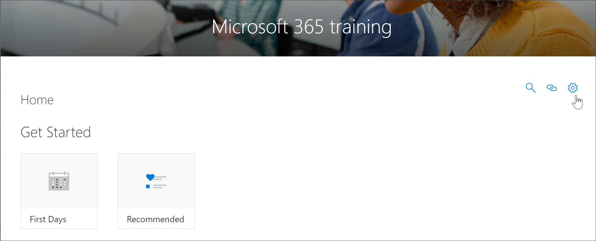
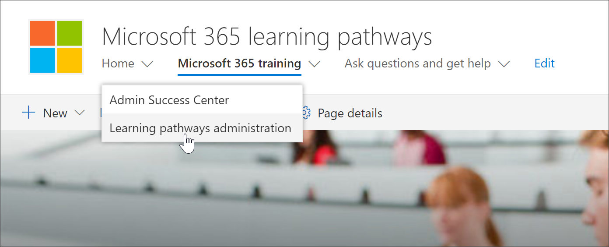

# Access the Learning Pathways Administration page

Learning pathways administration is managed from the CustomLearningAdmin.aspx page. This administration page is only available to SharePoint Administrators. Users with member privileges visiting the site will not see the **Administration** gear icon on the Web part. In addition, only Administrators will have the ability to open the administration page from the **Learning pathways administration** menu item under the SharePoint **Home** menu. 

> [!IMPORTANT]
> Changes made on the Custom Learning Administration page, such as hiding a product subcategory or playlist, will be reflected in all instances of the Web part. In addition, it’s recommended that only one administrator at time make changes from the administration page, since Custom Learning does not provide collision detection if multiple people are using the page at the same time.  

## Access from the Learning pathways web part - preferred method
Opening the Administration page from the web part is the preferred method since it opens the page in a new browser tab. With this method, it's easy to flip back and forth between the tabbed pages to check or modify your work.  

1. From the Microsoft 365 learning pathways **Home** page, click the **Office 365 training** tile.
2. Click the **Administration** icon in the Web part as shown in the following example.

## Access from the Home menu item
Rather than navigate to a page with a Web part, administrators can access the Adminstration page from the SharePoint **Home** menu item. 

- From the Microsoft 365 Learning Pathways Home page, click the **Home** menu, then click **Microsoft learning administration**.

