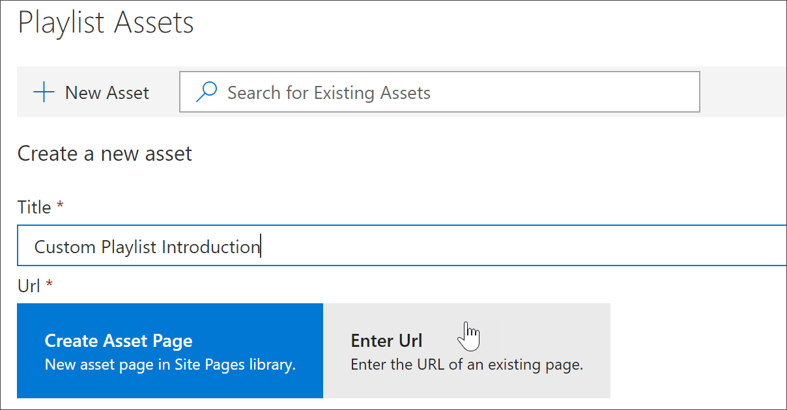

# Add assets to a custom playlist

With Custom Learning, you can add the following assets to a playlist:

- **Existing Custom-Learning-supplied assets** - these are assets that are part of the Microsoft online catalog. 
- **New assets** - thease are assets that you add to Custom Learning that are built from SharePoint pages the you create or SharePoint assets that are already available on a SharePoint site in your organization. 

> [!TIP]
> You can't modify the Custom Learning playlists supplied by Microsoft, but you can add Microsoft-supplied assets to a custom playlist. If a Microsoft playlist asset doesn't meet your needs, create a new playlist and then add the Microsoft assets and any newly created assets to the playlist. 

## Create a new asset for a playlist

To add new assets to a Custom Learning playlist, you can specify the URL of a SharePoint page or you can create a new asset page directly from the Custom Learning user interface. For this example, we’ll enter the URL of a previously created SharePoint page.  

1.	If the playlist isn't open for editing, from the Custom Learning Administration page, click the playlist you wish to edit. 
2. To add a new asset to a playlist, click New Asset. 
3. Enter a title, in this example “Custom Playlist Introduction”, and then click Enter URL.

4. Enter the URL of the SharePoint page you created in a previous section, and then fill out the remainder of the fields, as shown in the following illustration.

5. Click Save Asset. 

## Add an existing asset to a playlist

Existing assets consist of Microsoft-provided Custom Learning assets or assets that have already been added to Custom Learning by your organization. 

1.	If the playlist isn't open for editing, from the Custom Learning Administration page, click the playlist you wish to edit. 
2. In the Search box, enter a Search phrase, and then select an asset from the Search results. In this example, enter “What is Excel?” to add an Excel intro topic to the playlist.

You can fully customize the Custom Learning web site. If you are not familiar with creating pages within modern SharePoint Online sites we suggest you review [Customize your SharePoint site](https://support.office.com/en-us/article/customize-your-sharepoint-site-320b43e5-b047-4fda-8381-f61e8ac7f59b) article on support.office.com. 

### Customize the **Ask Questions and Get Help** page

As a starting point for customizing the site, select Ask questions and get help from the menu bar, then click the SharePoint Edit button and change the images and the links. 

## Customize available services

1.	Navigate to the Custom Learning Administration page within the website

1. Select **Technology** to see the full list of services that are included in the solution
1. Select a technology and **click the eye symbol** to hide this content.  Click the eye symbol again to show the content within the experience. 

The same process can be repeated for categories of playlists within the experience.  Simply select the Category option to show/hide playlists. 

### Next Steps

- [Customize and Share Playlists](customplaylist.md)
- [Drive Adoption](driveadoption.md) 