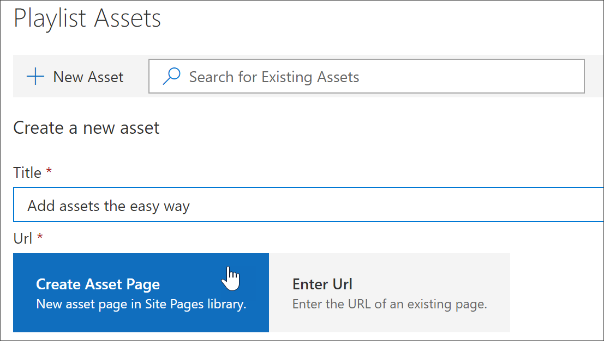
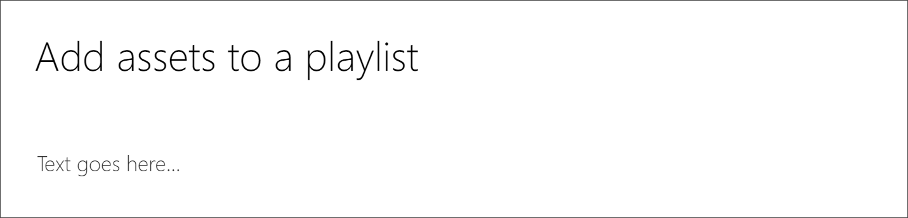
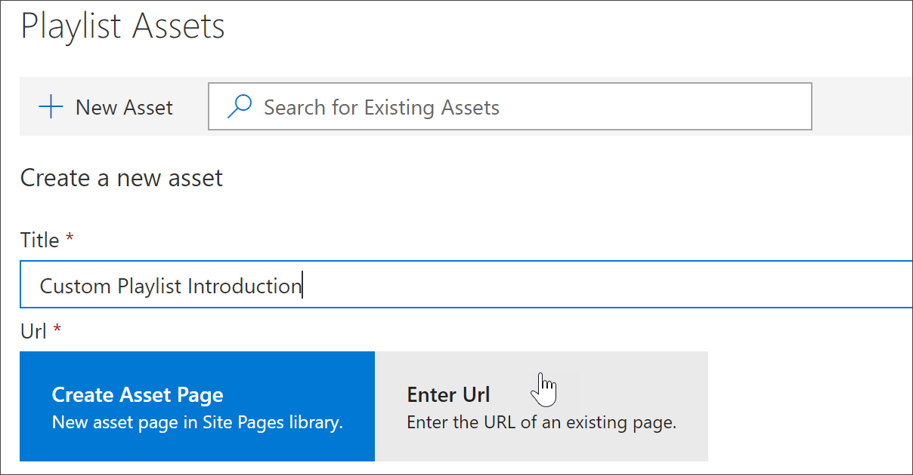
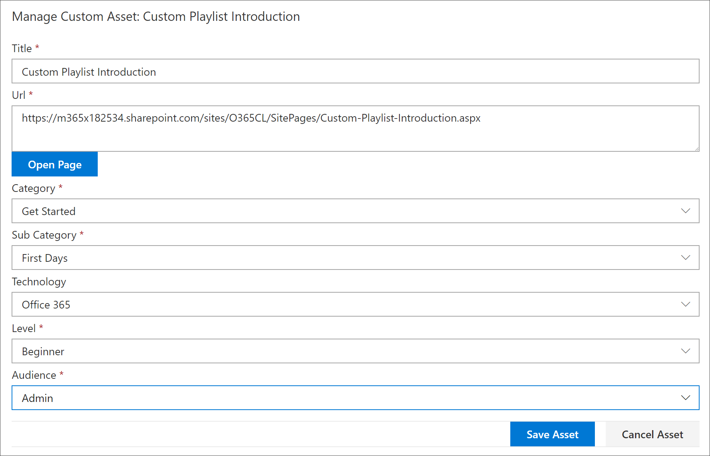
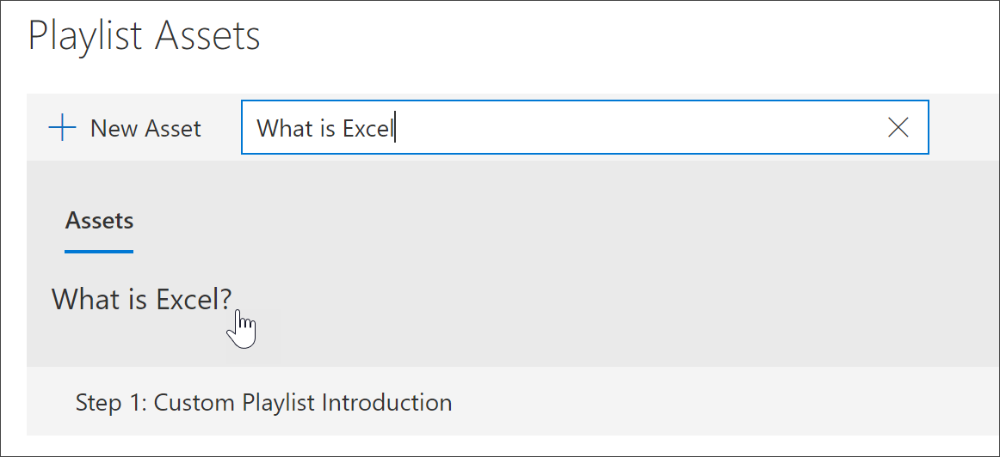
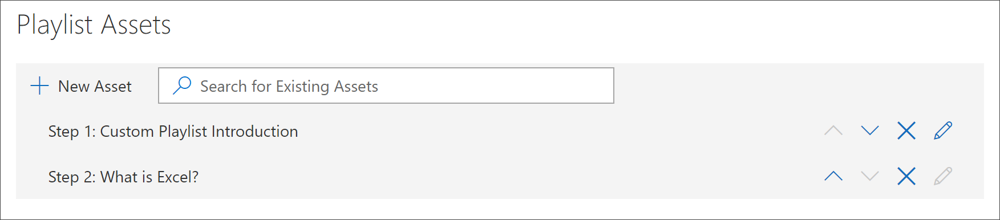
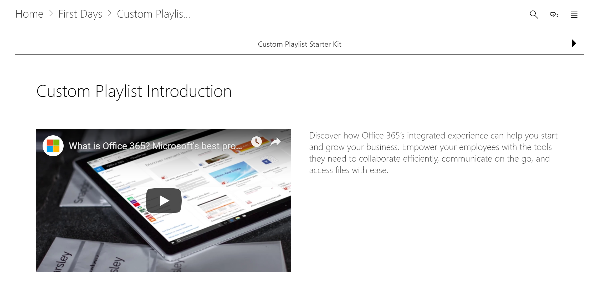

# Add assets to a custom playlist

With Custom Learning, you can add the following assets to a playlist:

- **Existing Custom Learning assets** - these are assets that are part of the Microsoft online catalog or assets that your organization has already added to Custom Learning.
- **New assets** - these are assets that you add to Custom Learning that are built from SharePoint pages that you create or SharePoint assets that are already available on a SharePoint site in your organization. 

> [!TIP]
> If a Microsoft playlist asset doesn't meet your needs, create a new playlist and then add the Microsoft assets and any newly created assets to the playlist to build the experience you want. You can't modify Custom Learning playlists supplied by Microsoft, but you can add Custom Learning-supplied assets to a custom playlist. 

## Create a new asset for a playlist

There are two options for adding a new asset to a playlist.

- **Create Asset Page** - with this option Custom Learning will generate a new,  blank SharePoint page for you and add it to the playlist. You can then add content to the page and save it.  
- **Enter the URL** - with this option, you build the page in advance or you already have the page available and you specify the URL to add the page to the playlist.

### Create Asset Page 
With the **Create Asset Page** option, you provide a title for the Asset, then click Create Asset page to create and open a new SharePoint page for editing. 

1.	If the playlist isn't already open for editing, from the **Custom Learning Administration** page, click the playlist you wish to edit. 
2. To add a new asset to a playlist, click **New Asset**. 
3. Enter a title. In this example enter “Add Assets to a Playlist”, and then click **Create Asset Page**.

4. Click **Open Page**.
5. Click the **Edit** icon, and then click **Edit Web part** in the Title area.
6. Under **Layout**, click **Plain**. 
7. Add a new one-column section, and then add some sample text to the page so it looks like the following example. 

7. Click **Publish**.
8. Return to the **Custom Learning Administration** page. 
9. Fill out the remainder of the properties for the asset, and then click **Save Asset.**

### Enter the URL
With the **Enter the URL** option, you provide a title for the Asset, then click **Enter the URL** to specify the SharePoint page you want to add to the playlist. 

1.	If the playlist isn't open for editing, from the **Custom Learning Administration** page, click the playlist you wish to edit. 
2. To add a new asset to a playlist, click **New Asset**. 
3. Enter a title. In this example, enter “Custom Playlist Introduction”, and then click **Enter URL**. 

4. Enter the URL of the SharePoint page you created in a previous [Create SharePoint pages for custom playlists ](custom_createnewpage.md) section, and then fill out the remainder of the fields, as shown in the following illustration.

5. Click **Save Asset**. 

## Add an existing asset to a playlist

Existing assets consist of Microsoft-provided Custom Learning assets or assets that have already been added to Custom Learning by your organization. 

- In the **Search** box, enter a Search phrase, and then select an asset from the Search results. In this example, enter “What is Excel?” to add an Excel intro topic to the playlist.

## Edit, move, and delete assets
You can edit custom assets that you create, but not assets from Microsoft. However, you can remove all assets from a playlist and change the order assets. 

### Edit an asset
- Click the Edit button for an asset, modify the asset, and then click Save Asset. 

### Move an asset in a playlist
- Click the up or down arrow to the right of the asset to move the asset order in the playlist

### Remove an asset from a playlist
- Click the Remove from Playlist X icon for the asset. 

## View the playlist in Action
Now that you've added assets to a playlist, let's close the playlist and see it in action. 

1. Click **Close Playlist**.
2. Click the tab with the **Office 365 training** page.
3. Refresh the page, and then click **First Days** under **Get Started**.
4. Click **Custom Learning Starter Kit** to view your first playlist in action. 

