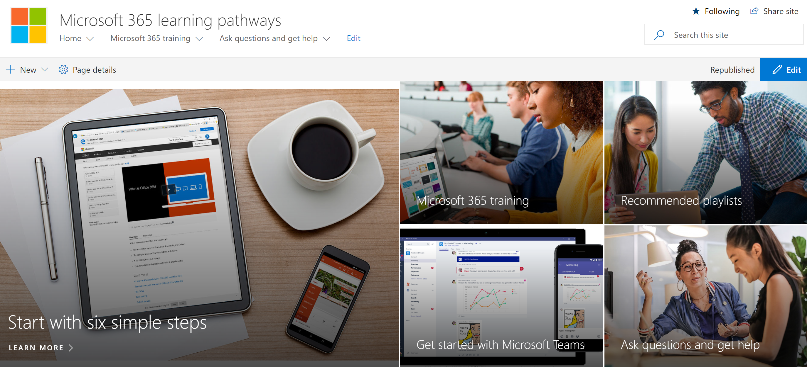

# Add Owners Custom Learning site

The Custom Learning for Office 365 site is hosted in your Office 365 tenant, so you'll need to sign in to Office 365, if you're not already signed in, to get to the site. 

## Sign in to Office 365 

1.	Open your Web browser and navigate to office.com or your organization’s sign-in location. 
2.	Sign in with your user name and password.
3. 	Navigate to the location of the site. If you don't have it available, you can find it in the mail you recieved from the PnP Provisioning Service. Select SharePoint from the Office 365 Home page, and then select the **Custom Learning for Office 365** site. You may have named it different. 
5. Click the **Office 365 training** tile to see the full suite of training playlist available with Custom Learning and to verify Custom Learning is working as expected. 

## View all the Custom Learning content
The Office 365 training page hosts the Custom Learning Web part configured to show all the training available for Custom Learning. 

1. Scroll down the page to view all the categories and subcategories.
2. Kick the tires a bit. Click a few subcategories, and then click a few playlists to get a feel for how Custom Learning content is organized. 

## Add Owners to Site
As the Tenant Admin, it's unlikely you'll be the person customizing the site, so you'll need to assign a few owners to the site. Owners have administrative privileges on the site so they can modify site pages and rebrand the site. They also have the ability to hide and show content delivered through the Custom Learning Web part. They'll also have the ability to build custom playlist and assign them to custom subcategories.  

1. From the SharePoint **Settings** menu, click **Site Permissions**.
2. Click **Advanced Permission Settings**.
3. Click **Custom learning for Office 365 Owners**.
4. Click **New** > **Add Users to this group**, add the people you want to be Owners, and then click **Share**.

