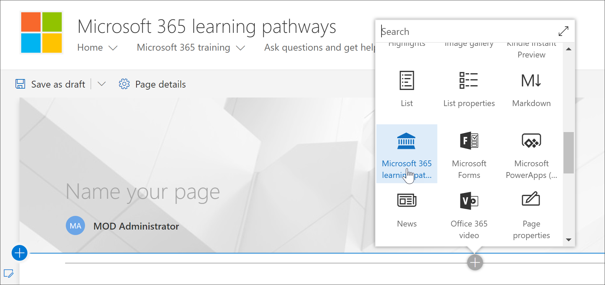
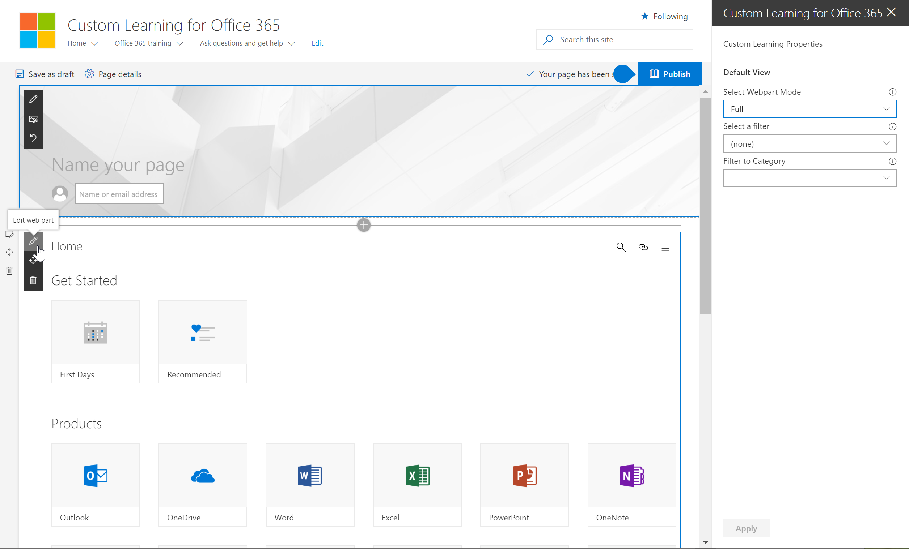

# Add the Custom Learning web part to a SharePoint page

Custom Learning gives you the flexibility to add the Custom Learning Web part to a SharePoint page, and then filter the contents of the Web part to meet the learning objectives for the page. For example, you could create a "Make the Switch to OneDrive" page, then add the Web part and configure it to show custom OneDrive migration playlists created especially for your organization.

1.	Click the SharePoint Gear icon, and then click **Add a page**.
2.	Click **Add a new section (+)** on the left-hand side of the page, and then click **One Column**.
3.	Click **+**, then select **Custom Learning for Office 365** web part. 

## Edit the Custom Learning web part
You can the edit Custom Learning Web part to show all the available Custom Learning content or a specific category, subcategory, playlist, or asset. 

1.	Click **Edit web part**.

2. In the Custom Learning Properties pane, filter the Web part for the following. 

- Webpart Mode: Full
- Filter: Subcategory
- Subcategory: Excel

3. Your page should now look something like the following image: 

## Add a title and publish the page
1. In the title area of the page, type "Create your own experience".
2. Click the **Edit web part** icon in the Title area, select **Plain** under **Layout**, and then close the **Properties** pane.
3. Click **Publish**.