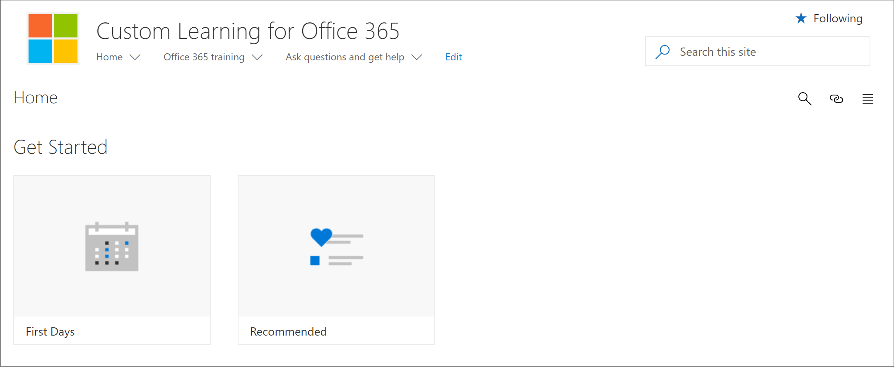

# Get to know the SharePoint Application pages

Learning pathways provides two SharePoint Application pages that you should know about as an administrator. These two pages are non-editable and should not be deleted. 

- CustomLearningAdmin.aspx
- CustomLearningViewer.aspx

## CustomLearningAdmin.aspx

The CustomLearningAdmin.aspx page provides Administrative features for learning pathways, including hiding and showing content and creating and editing subcategories and playlists. We’ll cover this page and its functionality in more detail in later sections.

### View CustomLearningAdmin.aspx

1. Click the SharePoint **Settings** icon, and then click **Site Contents** > **Site Pages**. 
2. Click **CustomLearningAdmin.aspx**. 

## CustomLearningViewer.aspx
The CustomLearningViewer.aspx page provides a viewer for displaying learning pathways contents in the web part. For example, if you copy a Playlist link and share it with a co-worker, the link, when clicked, takes the user to the Viewer page and displays the linked content. 

### View CustomLearningViewer.aspx

1. Click the SharePoint **Settings** icon, and then click **Site Contents** > **Site Pages**. 
2. Click **CustomLearningViewer.aspx**. 

