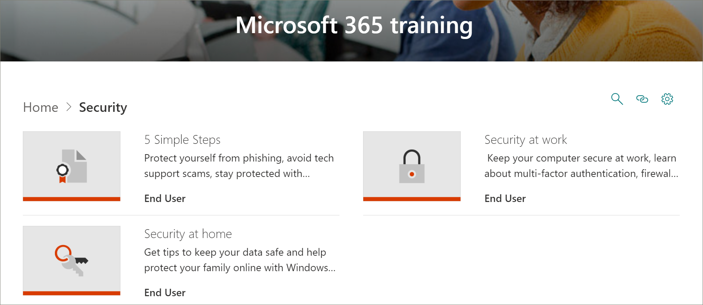

# Microsoft 365 Learning Pathways Content Updates
Learning pathways strives to adhere to a quarterly content update cycle. To learn more about how content updates are applied, and how to manage content updates, see [Manage Content Updates](custom_contentupdatesmanage.md).  

## May 2021 Content Updates
The following lists the content updates for May 2021.    

### Yammer
Yammer content has been updated.

#### Yammer Quick Start (updated)
- Sign in – updated with new video
- Discover communities – updated with new title
- Join the conversation – updated content
- Collaborate – retired
- Set up mobile apps – no change

#### Roll out a successful Yammer network (updated)
- What is Yammer? – updated with new video
- Plan your strategy – updated content
- Personalize a Yammer network – updated with new video
- Identify the right use cases – updated, removed video
- Create a community for a use case – updated, changed group to community in title 
- Educate users – updated, removed video
- Drive ongoing engagement – retired
- Integrate Yammer – updated, changed title

#### Use Yammer every day (updated)
- What is Yammer – updated with new video
- Change my Yammer profile and settings – updated content
- Start a conversation – updated title
- Edit notifications and receive announcements – updated title
- Join and create communities – updated title
- Discover and search in Yammer - retired
- Create and edit files – retired
- Keep it going – updated content

### Hybrid workplace (updated)
The following new playlists have been added to the Hybrid workplace subcategory.

#### Stay well (new)
- Introduction to well-being in the hybrid workplace - new asset
- Take breaks and schedule personal time - new asset
- Plan and respect boundaries - new asset
- Set your status in Microsoft Teams - new asset
- Manage notifications in Teams - new asset
- Turn on the Focus assistant in Windows – new asset

#### Stay productive (new)
- Personal productivity in the hybrid workplace - new asset
- Team productivity in the hybrid workplace - new asset

#### Stay connected (new)
- Staying connected in the hybrid workplace - new asset
- Start conversations in Teams - new asset
- Create a communication contract with your team - new asset

### Microsoft Teams (updated)
New assets with videos have been added to the following Microsoft Teams playlists. 

#### Collaborate in teams and channels (updated)
- Work with external guests – new asset with video

#### Create approvals (updated)
- Create an e-sign approval – new asset with video

### Teams, Excel, PowerPoint, Word, Outlook
The following assets have new or updated videos.

#### Teams
- Manage meetings\Join a Teams meeting - updated video
- Manage meetings\Manage meetings - updated video
- Collaborate in teams and channels\Overview of teams and channels - updated video
- Collaborate in teams and channels\Work with external guests - new video
- Upload and find files\Upload and share files - updated video
- Create approvals\Create an e-sign approval request - new video

#### Excel
- Intro to Excel\Use Excel as your calculator (subtraction) - updated video
- Intro to Excel\Use Excel as your calculator (multiply) - updated video
- Intro to Excel\Use Excel as your calculator (divide) - updated video
- Intro to Excel\move or copy worksheets or worksheet data - updated video
- Intro to Excel\Fill data automatically in worksheet cells - updated video
- Formatting\Align or rotate text in a cell - new video
- Charts\Create a chart from start to finish - updated video
- Rows and columns\Hide or show rows or columns - updated video

#### PowerPoint
- Slides and layouts\Add, rearrange, duplicate, and delete slides in PowerPoint - updated video
- Slides and layouts\Change the page orientation in PowerPoint between landscape and portrait - updated video
- Animation, video and audio\Add or delete audio in your PowerPoint presentation - updated video  
- Animation, video and audio\Insert a video from YouTube or another site - new video 
- Text & tables\Add a hyperlink to a slide - updated video
- Pictures & graphics\Add a background picture to slides - updated video
- Present slide shows\Start the presentation and see your notes in Presenter view - updated video

##### Word
- Lay out pages\Change page orientation to landscape or portrait - new video
- Insert tables, pictures & watermarks\Show the ruler - new video
- Insert tables, pictures & watermarks\Insert a table - updated video
- Insert tables, pictures & watermarks\Insert pictures - updated video

#### Outlook
- Calendar\Welcome to your calendar - updated video
- Calendar\Use calendar categories and reminders - updated video
- Calendar\Search for calendar items - updated video
- Contacts and tasks\Add a contact - updated video
- Contacts and tasks\Create a contact group - updated video
- Contacts and tasks\Create tasks and a to-do list - updated video
- Contacts and tasks\Import contacts - updated video
- Contacts and tasks\Export contacts - updated video
- Create and send email\Create an email signature - updated video
- Create and send email\Welcome your inbox - updated video
- Create and send email\Retract or replace a sent email - updated video
- Set up and customize\Add an Outlook.com or Microsoft 365 account - updated video
- Set up and customize\Set up Gmail accounts - updated video
- Manage email\Search and filter email - updated video

## March 2021 Content Updates
The following lists the content updates for March 2021. 

### Hybrid workplace
To help organizations make the transition to a hybrid workplace, where employees work from home and in the office, we've provided playlists to help users run more effective meetings, create inclusive meeting environments, collaborate asychronously, and reach large audiences with live events. The Hybrid workplace subcategory includes the following playlists and assets.

#### Run effective meetings
- Run effective meetings
- Hybrid meetings
- Hybrid meeting space considerations
- What to do before, during, and after hybrid meetings
- Schedule effective meetings
- Plan and lead effective meetings
- Engage your audience before, during, and after hybrid meetings
- Meeting checklist
- Reduce meeting fatigue

#### Create inclusive meeting environments
- Create inclusive meeting environments
- Make meetings and related content accessible for all
- Limit distractions in meetings
- Build empathy across time zones

#### Asynchronous collaboration and co-authoring
- Reduce or replace meetings with asynchronous collaboration
- Collaborate and co-author shared content
- Best practices for collaborating in Microsoft 365
- Co-author Microsoft 365 files
- Document collaboration and co-authoring
- Collaborating with SharePoint, Teams, and OneDrive
- Collaborating in Teams
- Use document libraries in SharePoint
- Troubleshoot common co-authoring errors

#### Reach large audiences with live events
- Use live events to reach large audiences
- Get started using Microsoft Teams for live events
- Plan and schedule a live event in Teams
- Organize a live even

### Microsoft Teams
Microsoft Teams has been updated with the following content.

#### Manage meetings playlist
The Manage meeting playlist has the following new asset.
- Tips for Teams meetings

#### Teams on the go playlist
The Teams on the go playlist has been updated with the following new assets.
- Start a channel on the go
- Create a channel on the go
- Manage notifications on the go

#### Manage team schedules with Shifts
The Manage team schedules with Shifts playlist has been added with the following assets.
- What is Shifts
- Shifts for managers
- Create a Shifts schedule
- Manage a Shifts schedule
- Shifts for Firstline workers

#### Walkie Talkie, Tasks, and Praise
The Walkie Talkie, Tasks, and Praise playlist has been added with the following assets.
- Walkie Talkie
- Use the Task app in Teams
- Tasks for managers
- Tasks for Firstline workers
- Communication and Praise

#### Create approvals
The Create approval playlist has been added with the following assets.
- What is approvals?
- Create an approval
- Create an approval from a chat

### Lists
A new Lists subcategory and playlist has been added to learning pathways.

#### Get started with Lists
The Get started with Lists playlist has the following new assets.
- Create a list from the Lists app
- Create a list in a Teams channel
- Add or edit list items
- Create or change the view of a list
- Edit a list view
- Find and manage your list
- Share a list or list item
- Track business information

### Forms
The Create a form and view results playlist has been updated with the following new assets.

#### Create a form and view results
- Create a new form or quiz
- Share a form to get responses
- View results of your form
- Use branching logic in your form
- Add sections to your survey or questionnaire

### Excel
Excel in learning pathways has been updated with the following content.

#### Intro to Excel
The Intro to Excel playlist has the following new asset.
- Create a dropdown-list

#### Linked data types
A new Linked data types playlist has been added to learning pathways with the following assets. 
- Convert text to an Organization data type
- Use the Data Selector to specify Organization data types
- View and insert data from an Organization data type

#### Formulas and functions
Two new assets have been added to the Formulas and functions playlist.
- XLOOKUP function
- MATCH function

### SharePoint
All SharePoint playlists and assets have been updated. The updated playlists include:
- SharePoint Online Quick Start
- Intro to SharePoint Online
- Create sites, posts, and lists
- Share and sync with SharePoint

## September 2020 Content Updates
The following lists the content updates for September 2020. 

### Security
A new security subcategory has been added with playlists and assets to help users work more securely in the office and at home. 

#### "Five simple steps" playlist
- Protect yourself from phishing
- Avoid tech support scams
- Work from home more securely
- Keep your PC up to date
- Stay protected with Windows security

#### "Security at home" playlist
- Tips to keep your data safe
- Keep your computer safe at home
- Help protect your family online with Windows Security   

#### "Security at work" playlist
- Keep your computer secure at work
- What is Multi-factor Authentication?
- Firewall and network protection in Windows security
- Prevent changes in security settings with Tamper Protection

### "Get started with Teams" playlist
A new "Get Started with Teams" playlist has been added to the "Get Started/First Days" subcategory to help users get up and running with Teams. The playlist includes:
- Welcome to Microsoft Teams  
- Get your team up and running
- Work in channels  
- Upload and share files 
- Start and pin chats  
- Join a Teams meeting 
- Manage meetings 
 
### Microsoft 365 Basics
In the Products category, the "Office 365 Basics" subcategory has been updated to the "Microsoft 365 Basics" category. Retired assets in the "Office 365 Basics" category are still available if they've been added to a custom playlist.

#### "Get started" playlist
- What is Microsoft 365?
- Sign in
- Office.com

#### "Create and save" playlist
- Using the desktop apps
- Using Office.com apps
- Save files to the cloud
- Sync Files on Demand with OneDrive

#### "Share and collaborate" playlist
- Share files in Microsoft 365
- Co-author
- Use @mentions
- Follow-ups

#### "Work with Microsoft Teams" playlist
- Welcome to Microsoft Teams
- Overview of teams and channels
- Create and format a post
- Start and pin chats
- Make calls
- Join a Teams meeting
- Tips for better meetings

#### "Get the most out of Windows" playlist
- Find your documents, apps, and more with Search
- Microsoft Edge
- Microsoft Search in Bing

#### "Work from anywhere" playlist
- OneDrive mobile app
- Outlook mobile app

#### "Cool Microsoft 365 features" playlist
- PowerPoint Designer
- Ideas in Excel
- Editor in Word
- Make your content accessible

### "Create a chart" playlist in Access
A "Create a chart playlist" has been added to the "Products\Access" subcategory.  
- Create a column chart
- Create a bar chart
- Create a line chart
- Create a pie chart
- Create a combo chart

### Teams updates
The "Product\Microsoft Teams" subcategory has been updated with the following assets. 

#### "Manage meetings" playlist
- Join a Teams meeting
#### "Work with posts and messages" playlist
- Create and format a post

### Planner 
The follow assets have been added to the "Use Planner" playlist in "Products\Planner".
#### Use Planner playlist
- To Do vs Planner
- See your Planner Tasks in To Do
- Use the Tasks App in Teams

### Word
The following asset has been updated in the "Share and co-author with Word" playlist.

#### "Share and co-author with Word" playlist
- "Collaborate on Word documents with real-time co-authoring" asset has been updated. 

### Office for the web
The following asset has been updated in the "Office for the web: Word for the web" playlist.

#### "Office for the web: Word for the web" playlist
- Transcribe your recordings

### PowerPoint (new, updated)
The following assets have been updated or added to the Products\PowerPoint playlists. 

#### "Text & tables with PowerPoint" playlist
- Change handwritten ink to shapes, text, or math in PowerPoint (new)

#### Present slideshows playlist
- Record a presentation (updated)

### Office Quick Start guides (updated)
The Office Quick Start guides for all the Office products have been updated. 

For more information about how to customize Learning Pathways, see [Customize learning pathways](custom_overview.md). 

