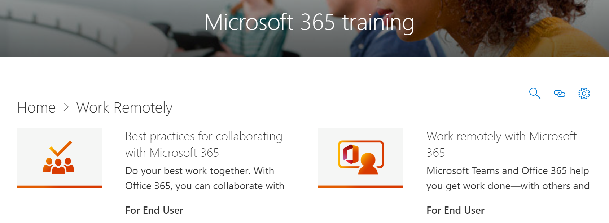

# Microsoft 365 Learning Pathways Content Updates for April
Learning pathways strives to adhere to a quarterly content update cycle. The following list the content updates for April 2020.

## April 2020 Content Updates
 In response to current events, the April 2020 Content Update provides learning playlists and resources designed to enable remote work in your organization. We’ve added a new set of Work remotely playlists, significantly updated the Microsoft Teams content, especially for Teams meetings, added a new set of Office for the web playlists, and added new Microsoft Forms assets. As part of the update, we've also provided a list of Remote Work resources for administrators.  
 
 To learn more about how content updates are applied, and how to manage content updates, see [Manage Content Updates](custom_contentupdatesmanage.md). The following lists the April 2020 Microsoft 365 learning pathways content updates. 

### Office 365 was rebranded to Microsoft 365
Office 365 has been rebranded to Microsoft 365. The name change is reflected throughout the Microsoft 365 learning pathways content. 

### New or Updated Playlists
The following playlists have been added or updated.  

#### Work remotely (2 new playlists/11 new assets)
A new Work remotely subcategory was added to learning pathways that features the following playlists and assets: 

##### Work remotely (5 new assets)
- Work remotely with Office 365
- Get started at Office.com
- Communicate or meet
- Store your work files
- Advanced alternatives
##### Best practices for collaborating with Office 365 (6 new assets)
- Get started
- Share
- Co-author
- Chat in files
- Meet
- Mobile

### Teams (9 new assets/6 updated assets)
A variety of updates have been made to Teams content. 
#### Collaborate in teams and channels (1 new/1 updated asset)
- Create and use private channels (new)
- Show or hide channels (updated)
#### Start chats and calls (2 new/1 updated)
- Start and pin chats (new)
- Hide chats, delete messages (new)
- Make calls (updated)
#### Explore apps and tools (1 new)
- Use apps (new)
#### Work with posts and messages
- Post a message to multiple channels (new)
#### Manage meetings (3 new/4 updated assets)
- Join a Teams meeting (new)
- Create instant meetings with Meet now (updated)
- Meet in a channel (new)
- Manage meetings (new)
- Show your screen during a meeting (updated)
- Show PowerPoint slides (updated)
- Move around during a Teams meeting (updated)
#### Work with post and messages (1 new)
- Post a message to multiple channels (new)

### Office for the web
Office for the web provides a set of playlists for scenarios where users want to create, share, and collaborate with Office on the web. This set of content is also valuable for organizations that are making the switch from Google G Suite to Microsoft 365.
#### Get started (5 new assets)
- Get started
- Find it with Search
- Create new documents
- Get back to work
- Recommended files
#### Outlook for the web
- Get to know Outlook for the Web
- Create an reply to email
- Organize your Inbox
- Create a signature and automatic reply
- Schedule an appointment or meeting
- Create an edit a contact
- Search for email, contacts, and events
#### Word for the web
- Get to know Word for the Web
- Change document layout
- Insert tables and pictures
- Collaborate online
- Cool things in Word for the Web
#### Excel for the web
- Get to know Excel for the Web
- Create formulas
- Insert a PivotTable
- Get insight with ideas
- Collaborate
- Save time with Flash Fill
- Paint a picture with Conditional Formatting
#### PowerPoint for the web
- Get to know PowerPoint for the Web
- Insert pictures, shapes, and more
- Animation and transitions
- Create a presentation with others
- When you’re ready to present
- Designing slides
#### Share your documents
- Share your documents
- Create a shareable link
- Secure your docs only to specific people
- Share with someone outside your organization 

### Microsoft Forms 
By request, there are also some new Forms assets. 
#### Forms (4 new assets) 
- Create a form 
- Share a form 
- View results of a form 
- Frequently Asked Questions about Microsoft Forms 

### Resources for supporting your remote workforce
You can use learning pathways to build a landing page in your learning pathways site for supporting remote workers. Or you can add the learning pathways web part to an existing support page on your learning pathways site and filter the web part to show the Work Remotely playlists. Here’s a list of some of the top resources from Microsoft for supporting remote work in your organization. 
- [How to roll out Microsoft Teams](/microsoftteams/how-to-roll-out-teams)
- [Meetings and conferencing in Microsoft Teams](/microsoftteams/deploy-meetings-microsoft-teams-landing-page)
- [Support Remote Workers using Microsoft Teams](/microsoftteams/support-remote-work-with-teams)
- [FAQ: Support your remote workforce](/microsoftteams/faq-support-remote-workforce)
- [The top 9 ways Microsoft IT is enabling remote work for its employees](https://www.microsoft.com/microsoft-365/blog/2020/03/12/top-9-ways-microsoft-it-enabling-remote-work-employees/)
- [Microsoft Teams Training](/microsoftteams/training-microsoft-teams-landing-page)
- [Education: Microsoft Education Center](https://education.microsoft.com) 
- [Education: Getting started with remote learning](https://education.microsoft.com/resource/4c0c02c0)

For more information about how to customize Learning Pathways, see [Customize learning pathways](custom_overview.md). 

## November 2019 Content Updates
Welcome to the Microsoft 365 learning pathways content update. Starting with our November 2019 update, we'll provide an updated inventory of the learning pathways catalog on a quarterly basis. For the November 2019 update, the following new content subcategories and playlists have been added to the learning pathways catalog. To learn more about how content updates are applied, and how to manage content updates, see [Manage Content Updates](custom_contentupdatesmanage.md).    

### Teams
Several new playlist have been added to the Teams subcategory.
- Work with posts and messages (3 assets)
- Upload and find files (2 assets)
- Set up and attend live events (4 assets)
- Manage your activity feed (2 assets)
- Teams on the go (2 assets)

### Microsoft 365 Success Center
We've added a Microsoft 365 learning pathways Success Center subcategory to the learning pathways experience. The Success Center provides the following playlists.
- What’s New, What Changed (3 asset)
- Plan your learning content (2 assets)
- Customize learning pathways (8 assets?)
- Drive Adoption of learning pathways (1 asset)
- Measure impact of learning pathways (1 asset)

### Outlook
The following playlists has been added to the Outlook subcategory. 
- Outlook mobile: Manage your inbox (4 assets)
- Outlook mobile: Manage your time (8 assets)
- Outlook mobile: People and connections (5 assets)
- Outlook mobile: Search and share (4 assets)

### OneDrive
The following video assets have been added for OneDrive. 
- Set up your iPhone or iPad has been added to the Intro to OneDrive playlist
- Turn on OneDrive Backup has been added to the Manage your files with OneDrive playlist

### Planner
The following playlists and assets have been added to the catalog.  
- Planner Quick Start (6 assets)
- Use Planner (8 assets)

### Accessibility
The Accessibility subcategory of content has been added with the following playlists. 
- Microsoft 365 Accessibility Overview and Resources (3 assets)
- Create more accessible email messages in Outlook (3 assets)
- Create more accessible Word documents (8 assets)
- Create more accessible Excel workbooks (3 assets)
- Create more accessible slides in PowerPoint (5 assets)

### OneDrive
NOTE: Changes need to be added here.....

### Sway
The Sway subcategory of content has been added with the following playlists. 
- Sway Quick Start (4 assets)
- Share and access Sway (5 assets)
- Add content to Sway (11 assets)
- Customize Sway (5 assets)

### Access
- Access Quick Start (4 assets)
- Intro to Access (3 assets)
- Create an Access database (2 assets)
- Add tables (2 assets)
- Use relationships (5 assets)
- Add and edit data (2 assets)
- Manage data with queries (5 assets)
- Create forms (1 asset)
- Create reports (2 assets)
- Protect databases (1 asset)