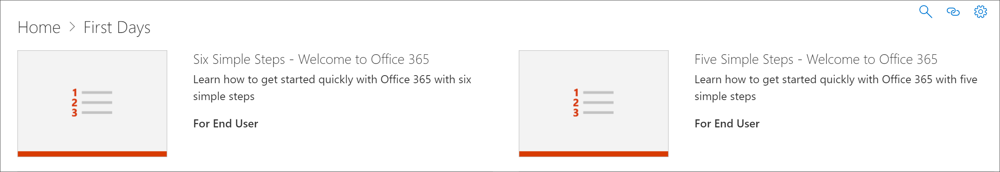

# Copy a Playlist
Quite often, organizations need to modify a Microsoft-supplied playlist by removing or replacing an asset with an asset created by the organization. For example, you might want to remove a step from the Start with Six Simple Steps playlist. Now you can use the learning pathways Copy Playlist feature to easily copy the Six Simple Steps playlist and simply remove an asset, replace an asset, or add new assets. 

## To copy a playlist

1. From the Microsoft 365 learning pathways **Home** page, click **Office 365 training**.
2. Click the **Administration** icon.
3. Under **First Days**, click the **Six Simple Steps - Welcome to Office 365** playlist, and then click **Copy Playlist**. 
4. Click **Edit Detail**, and then fill in the **Title** and **Description** fields as shown in the following example, then click **Save Detail**.  
 

## Add or remove assets from a playlist
With custom playlists, you can:
- add and remove Microsoft assets, but not edit the assets from Microsoft
- add, remove, and edit custom existing SharePoint assets from your organization or SharePoint assets that you create. 

### Remove an asset from a playlist
- Scroll down the **Administration** page, and then under **Playlist Assets** click the delete icon for **Step 5. Set up mobile apps**. 

## Verify the asset is removed from the playlist
1. Return to the tab with the **Microsoft 365 training** page.
2. Click **First Days**, then click the **Five Simple Steps - Welcome to Office 365** playlist. 
3. Click through the playlist to verify that the asset has been removed.

