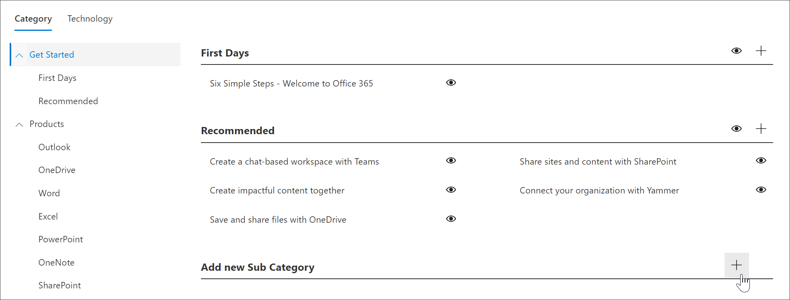

# Create a subcategory 
In some cases, you’ll want to create a new custom Subcategory. For example, if the First Days subcategory doesn’t work for you organization, you can create a new subcategory and then add playlists to it to meet the needs of your organization. 

1. From the Custom Learning Home page, click Office 365 training, click the system menu from the Web part, and then click Administer Playlist. 
2. Select a Category. In this example, select Get Started.  
3. Scroll down the page, 
3. Click the Add new Subcategory + icon.  

> [!TIP]
> Microsoft-provided subcategories can be hidden, but not edited or deleted. 

**Edit a subcategory**
- Select the Edit icon for subcategory, make edits to the Subcategory title, and then click Save.

**Hide a subcategory**
- Select the eyeball for subcategory to hide it. 

**Delete a subcategory**
- Select the Edit icon for subcategory, then select Delete. 

### Next Steps

- [Customize and Share Playlists](customplaylist.md)
- [Drive Adoption](driveadoption.md) 