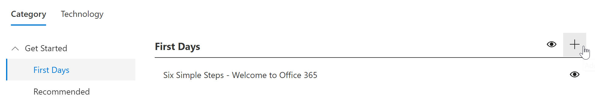
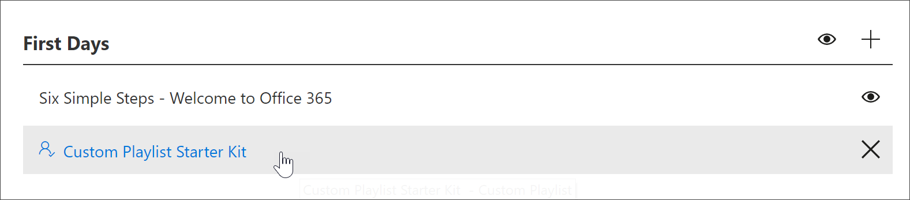
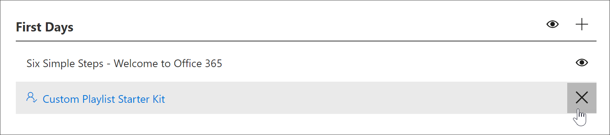

# Create a Custom Playlist

With Microsoft 365 learning pathways, you can create custom playlists from scratch that are tailored to the unique needs of your organization. For example, create a playlist for onboarding new hires to Microsoft Teams. Or create playlists for executive administrators with information suited to their unique role. Or create a First Day for Microsoft 365 playlist that has three simple steps instead of six. You can add a custom playlist to any subcategory. For example, **First Days**, a **Product** subcategory like **Excel**, or even a subcategory that you create. In this section, we’ll cover how to create a playlist, and then cover adding assets to a playlist in the following section, [Add assets to a custom playlist](custom_addassets.md).

## Create a playlist 

1. From the Microsoft 365 learning pathways **Home** page, click **Office 365 training**, and then select the **Administer** icon from the Web part. 
2. Select the **Administer**" icon  subcategory. In this example, select **First Days**.  
3. Click the + icon.  

4.	Fill out the fields in the playlist as shown in the following example. You can leave the default icon for this example. 

5.	When you are done, select **Save Detail**. 

## Edit a playlist

- From the **Custom Learning Administration** page, click the playlist, and then click **Edit Detail**.  

### Delete a playlist

- From the Custom Learning Administration page, click the **Delete** icon for the playlist.  

