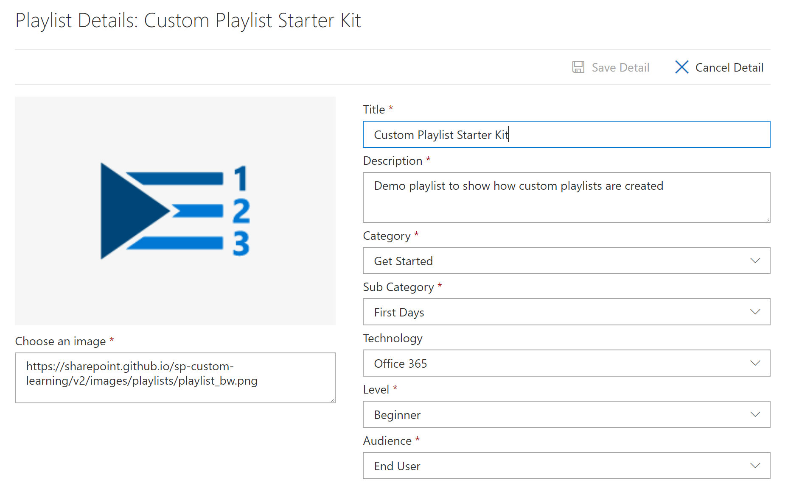
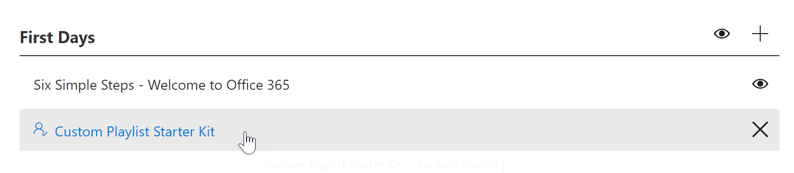
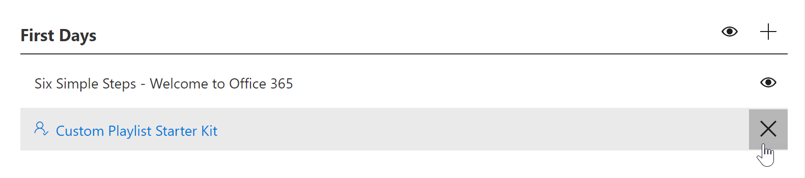

# Creating new playlists

When creating a new playlist, you can add existing Custom Learning assets from Microsoft or you can add new assets such as the SharePoint page covered in the Create SharePoint pages for playlists section. Typically, when creating a new playlist, you first create a series of SharePoint pages, and then go to the Custom Learning Administration page to add the pages to a playlist. 

**Create a new playlist** 

1. From the Custom Learning Home page, click Office 365 training, select the system menu from the Web part, and then select Administer Playlist. 
2. Select a subcategory. In this example, select First Days.  
3. Click the + icon.  

4.	Fill out the fields in the playlist as shown in the following example. You can leave the default icon for this example. 

5.	When you are done, select Save Detail. 

**Edit a playlist**

- From the Custom Learning Administration page, click the playlist, and then click Edit Detail.  

# Delete a playlist

- From the Custom Learning Administration page, click the Delete icon for the playlist.  

### Next Steps

- [Customize and Share Playlists](customplaylist.md)
- [Drive Adoption](driveadoption.md) 