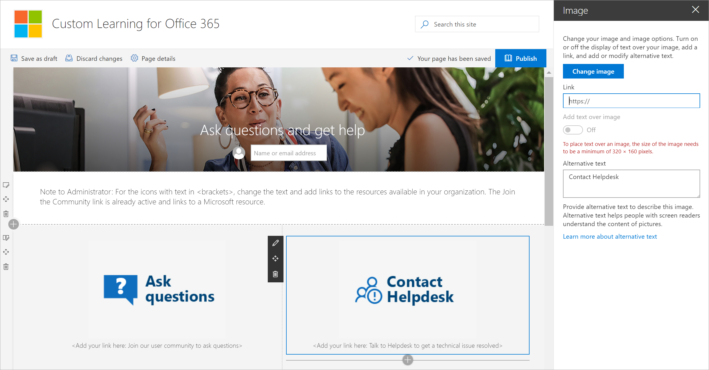

# Customize the Custom Learning site

The Custom Learning site is based on a SharePoint communication template. The template is relatively simple and you can customize the site pages to meet your organization's needs. For example, you can change the site name, logo, menu items, and content on the pages. If you need help customizing a communication site, see **link here**. 

## Customize the Ask questions and get help page

As an administrator of the Custom Learning site, one of the things you’ll definitely want to do is change the links on the Get Help and Support page to point to resources in your organization. 

1.	From the Custom Learning Home page, click Ask questions and get help.
2.	Click the Edit button.
3.	Hover over a Help option button, then click Edit web part.

4.	In the link box, enter the URL for the internal resource. 
5.	Repeat for the other two images that aren’t linked.

## Change the text on the page

1. Hover over the text area, then edit the text for the page. 
2. Click the Publish button when you’re done

## Other customization options
Other pages you might want to consider editing are:

- Training events calendar.aspx
- The Hero web part on Home.aspx

### Next Steps

- [Customize and Share Playlists](customplaylist.md)
- [Drive Adoption](driveadoption.md) 