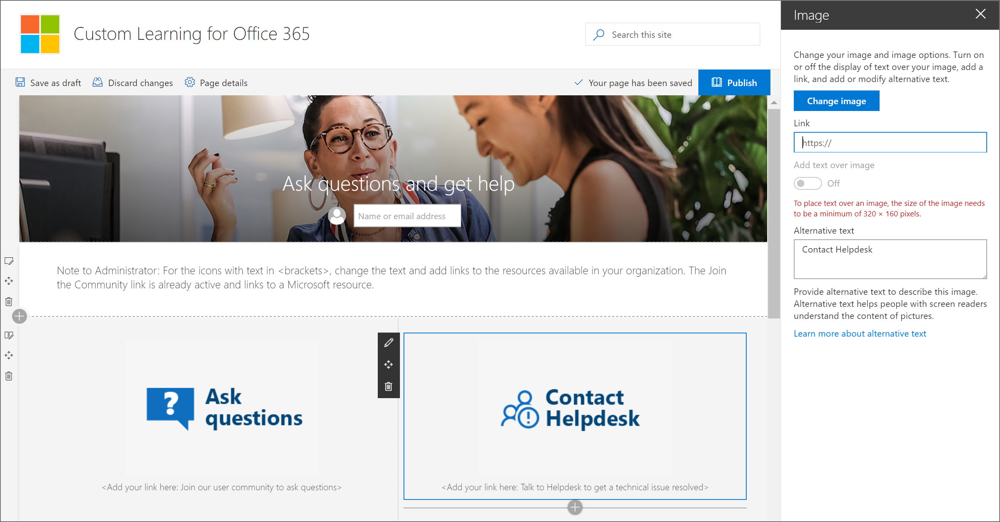
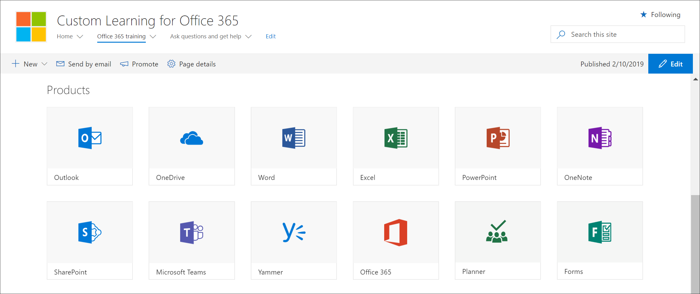

# Explore the site of learning pathways

> Note: To explore the learning pathways site and it's administrative features, you'll need Site Collection Admin, Owner, or Member permissions to the site. If you don't have the neccesary permissions, contact the Site Administrator for the site. The learning pathways site is hosted in your Office 365 tenant, so you'll need to sign in to Office 365 to get to the site. If you haven’t already signed into Office 365, sign in now. 

## Sign in to Office 365 

1.	Open your Web browser and navigate to office.com or your organization’s sign-in location. 
2.	Sign in with your user name and password.
3. 	Navigate to the location of the site using the URL supplied by your tenant administrator or select SharePoint from the Office 365 Home page, and then select the site. 

## Explore the learning pathways site

The learning pathways site is based on a SharePoint communication template, so it's easy to modify the site to meet the needs of your organization. You can change the site name, logo, menu items, and the content on the pages. One of the pages you'll want to modify for your organization is the Ask questions and get help page. Let's take a look.

### View the Ask questions and get help page

The learning pathways site provides default content to help you get starting building your training and support portal. As an administrator or owner of the site, one of the things you’ll want to do is change the links on the **Ask question and get help page** point to resources in your organization. 

1.	From the Microsoft 365 learning pathways Home page, click the **Ask questions and get help** menu item.
2.	Click the **Edit** button.
3.	Hover over a Help option image, then click **Edit web part**.

For instructions on customizing site pages, see [Customize the site](custom_edithelp.md).

### View the learning pathways content in the web part
The Microsoft 365 training page hosts the learning pathways Web part configured to show all the training available for learning pathways. 

1. Scroll down the page to view all the categories and subcategories.
2. Kick the tires a bit. Click a few subcategories, and then click a few playlists to get a feel for how learning pathways content is organized. 

For instructions on customizing the learning pathways web part, see [Customize the Learning Experience](custom_overview.md).

### Get a complete site tour and customization guidance
For a detailed look at learning pathways, including the site, the web part, administrative features, and guidance on how to build unique learning experiences for your environment, see [Customize the Learning Experience](custom_overview.md)

## Next Steps
- [Customize the Learning Experience](custom_overview.md)
- [Drive adoption](driveadoption.md) 
