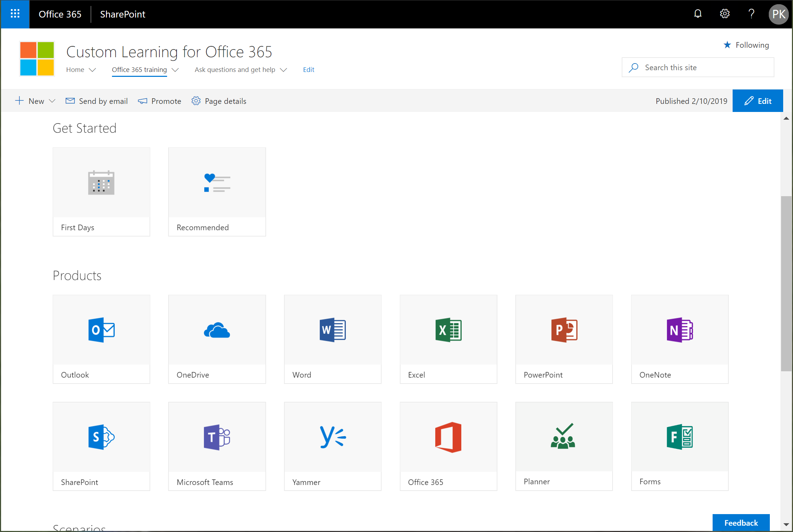

# Go to the Custom Learning for Office 365 site

Custom Learning for Office 365 is hosted in your Office 365 tenant. If you haven’t already signed into Office 365, sign in now. 
1.	Open your Web browser and navigate to office.com or your organization’s sign-in location. 
2.	Sign in with your user name and password.
3. 	Navigate to the location of the site using the URL supplied by your tenant administrator, or 
you can select SharePoint from the Office 365 Home page, and then select the Custom Learning for Office 365 site. 
5. Click the Office 365 training tile to see the full suite of training playlist available with Custom Learning. 

### Next Steps

- [Customize and Share Playlists](customplaylist.md)
- [Drive Adoption](driveadoption.md) 