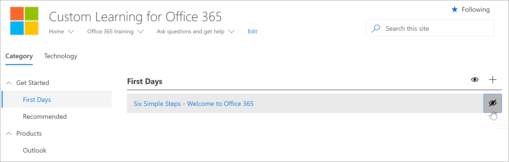
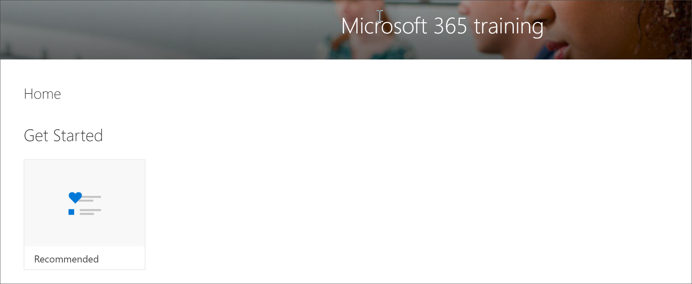

# Hide and show Playlists

To tailor learning pathways for your environment, you can hide playlists provided by Microsoft. 

- You can hide a playlist like Start with Six Simple Steps and replace it with a custom playlist that your create for your organization.
- You can hide a playlist for a product if the playlist covers functionality not supported in your organization. For example, if Microsoft Teams is not configured for calls or meetings, you can hide the **Start chats, calls, and meetings** playlist. 

## Hide a playlist

1. From the learning pathways **Home** page, click the **Office 365 training** tile.
2. From the learning pathways web part, select the **Administer** icon. 
3. From left pane in the **Administration** page, select a subcategory, and then select the eyeball for a playlist to hide it. For this example, click the **Microsoft Teams** subcategory, and then hide the **Start chats, calls, and meetings** playlist.  

### Verify the playlist is hidden
- To verify the playlist is hidden, select the browser tab with the **Get Started with Office 365** page loaded, and then refresh the page. 
Select Microsoft Teams. You should now see the **Start chats, calls, and meetings** subcategory is hidden. 

## Unhide a playlist

- From the **CAdministration** page, select a subcategory, select a playlist, and then select the eyeball for the hidden playlist to unhide it. For this example, unhide the Microsoft Teams ***Start chats, calls, and meetings** playlist.   

