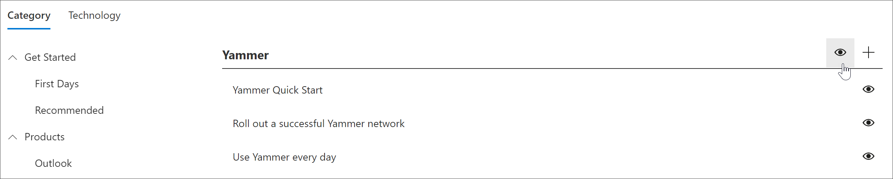
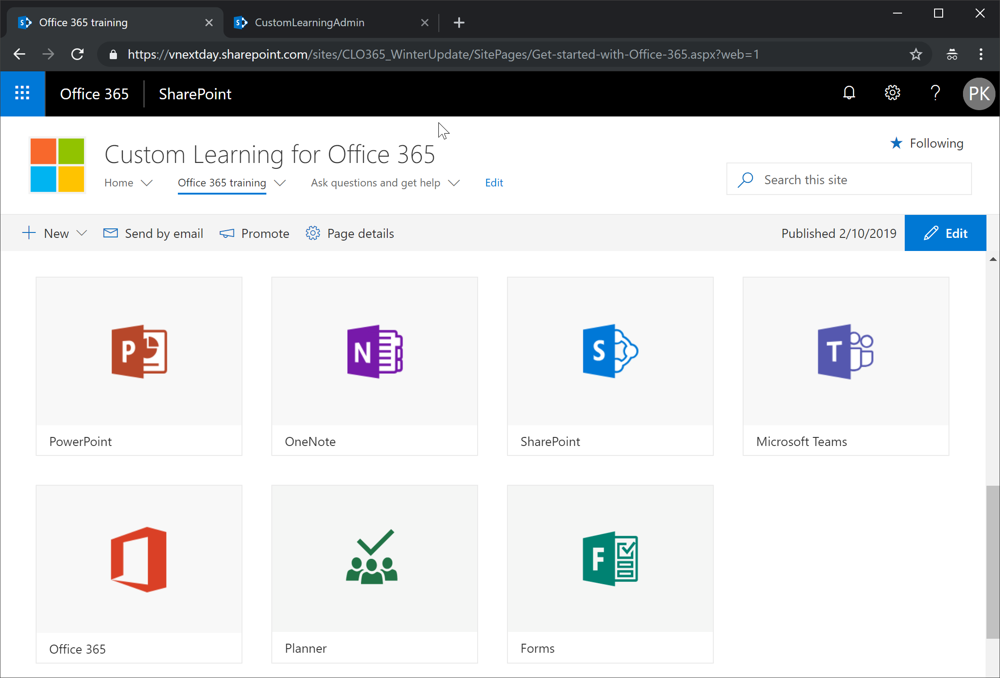

# Hide and show subcategories

With Custom Learning Administration, you can hide and show subcategories. For example, companies that don’t roll out Yammer can hide the Yammer subcategory, so Yammer content won't be available to users. This prevents unwanted support calls from users who might otherwise see information related to services that aren't available in your organization.

### Hide a subcategory 

1. From the Custom Learning Home page, click the **Office 365 training** tile.
2. From the Custom Learning Web part, select the System menu, then select **Administer Playlist**. You should now have two tabs open: One with the Custom Learning Administration page, and one with the Office 365 training page. 
3. From the **Custom Learning Administration** page, under **Category**, select a subcategory, and then select the eyeball for the subcategory to hide it. For this example, hide the **Yammer** subcategory.  

**Verify the subcategory is hidden**
- To verify the subcategory is hidden, select the browser tab with the **Get Started with Office 365** page loaded, and then refresh the page. You should now see the Yammer subcategory hidden in the Products category. 

**Unhide a subcategory** 

- From the **Custom Learning Administration** page, under **Category**, select a subcategory, and then select the eyeball for the hidden subcategory to unhide it. For this example, unhide the Yammer subcategory.