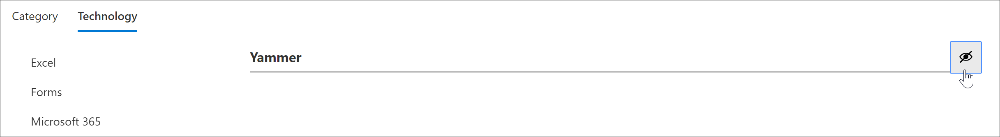
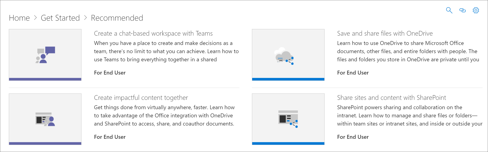

# Hide and show Technology

In some cases, you’ll want to hide content for a technology that’s not supported in your organization. The Hide Technology feature is designed to prevent technology from appearing throughout the Web part. It offers a broader way to hide and show content than hiding it by subcategory or playlist. For example, you can hide a Yammer subcategory, but Yammer may still show up in certain scenario playlists such as "Connect your organization with Yammer". To ensure content for a specific technology is not exposed to end users, hide it by Technology. 

## Hide a Technology

1. From the Microsoft 365 learning pathways **Home** page, click the **Recommended playlists** tile.
2. From the Custom Learning Web part, select the **Aministration** icon.
3. In the dropdown list box in the upper-right section of the **Administration** page, select **Technology**.
For this example, click **Yammer** in the left pane of the page, then click the eyeball next to Yammer.  

### Verify the playlist is hidden
- To verify **Yammer** technology is hidden, select the browser tab with the **Recommended playlists** page loaded, and then refresh the page. You'll notice that the **Connect your organization with Yammer** playlist is hidden. 

## Unhide a Technology

- From the **Administration** page, select a technology, then select the eyeball for the hidden technology to unhide it. For this example, unhide the **Yammer** technology. 