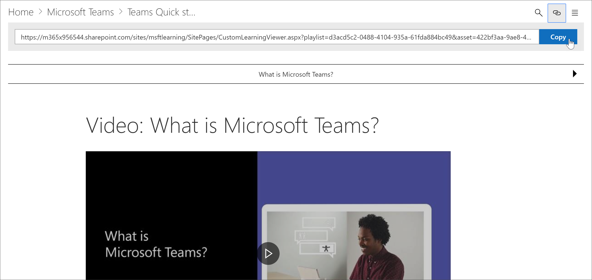
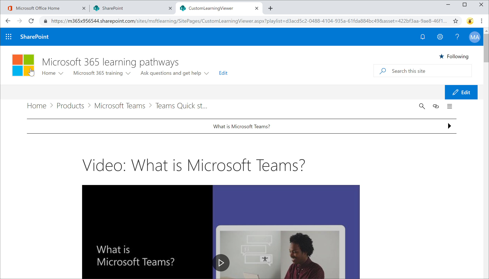

# Link to learning pathways content

With learning pathways, there are two ways to link to content:

- Link to the page that host the Web part filtered for the content you want to display 
- Link directly to an instance of the Web part

## Link to a page

If you've created new pages and learning experiences with the Microsoft 365 learning pathways web part, you can link to the page with the Web part configured to show the content you want to display. In the previous section, we covered how to display Excel playlists on a page. You could now edit the Home page to link to the page. 

1. From the Home page, click **Edit**.
2. Click **Edit details** in one of the Home page tiles. In this example, we edit the **Recommended playlists** tiles.
3. Under **Link**, click **Change**.

4. Click **Site**, then **Site Pages**, click the page you want to link to, and then click **Open**. In this example, we link to the **Create-your-own-experience.aspx** page covered in the previous section.
5. Close the Hero properties pane, click **Publish**, and then test the link. 

## Link to the Microsoft 365 learning pathways web part
Learning pathways gives you, the administrator, or an end-user, the ability to link to an instance of the Web part independent of the page that contains the Web part. You can share the copied link or link to it from other pages. The copied link, when clicked, shows the Microsoft 365 learning pathways web part instance in the CustomLLearningViewer.aspx page. Let's look at an example. 

1. From the Home page, click **Microsoft365 training**.
2. Click **Microsoft Teams**, and then click **Intro to Microsoft Teams**.
3. Click the **Copy** icon.

4. Click Home from the Microsoft 365 learning pathways site menu.
5. Paste the copied URL in the address bar of the browser and press ENTER. 

As shown in the following illustration, the link goes to the CustomLearningViewer.aspx page and displays the content based on the parameters in the copied link. 

