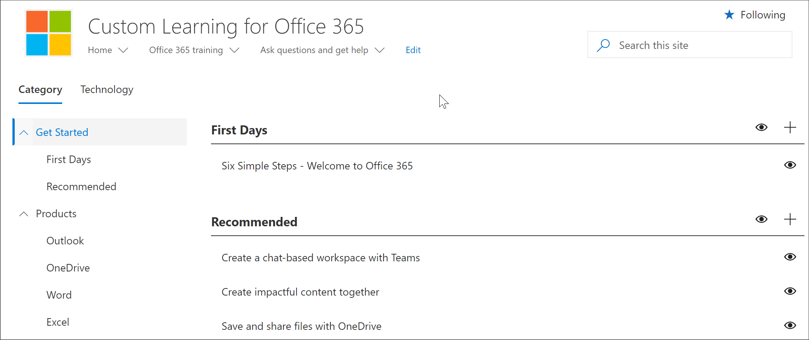

# Learning pathways manual setup

Microsoft 365 learning pathways offers a manual setup for organizations that need support for one of the following scenarios: 

- Your organization has an established SharePoint Online modern communication site dedicated to training and you want to add learning pathways to that site. In this scenario, the learning pathways web part hasn't been set up on the site.

- You want to install learning pathways for multilingual support in one of your organization's SharePoint Communication sites. The site has, or will have, a default language that isn't English and is one of the languages supported by learning pathways. Here are the languages supported by learning pathways:

- English
- Chinese (Simplified)
- French
- German
- Italian (Italy)
- Japanese (Japan)
- Portuguese (Brazilian)
- Russian (Russian)
- Spanish

Manual setup of learning pathways requires experience working with Windows PowerShell and the SharePoint Online Management Shell. Here's an overview of the steps for the manual setup of learning pathways: 

- Validate that you have met all the prerequisites.
- Check the default language settings for your site. If OK, continue with manual install. If you need a different default language setting, you'll need to create a new site. 
- Install the customlearning.sppkg file in your SharePoint Tenant App Catalog.
- Provision/identify a modern communication site to act as your Microsoft 365 learning pathways home site.
- Execute a PowerShell script that will configure your tenant with the artifacts that learning pathways depends on.
- Navigate to the CustomLearningAdmin.aspx site page to load the admin web part to initialize the custom-content configuration.

## Prerequisites
To ensure a successful manual setup of the learning pathways web part, the following prerequisites must be met. 

- You must have set up and configured the tenant-wide App Catalog. See [Set up your Office 365 tenant](https://docs.microsoft.com/sharepoint/dev/spfx/set-up-your-developer-tenant#create-app-catalog-site) and follow the "Create App Catalog" site section. 
- If your tenant-wide App Catalog has already been provisioned, you'll need access to an account that has rights to upload a package to it. Generally this account has a SharePoint administrator role. 
- If an account with that role doesn't work, go to the SharePoint admin center and find the Site Collection Administrators for the App Catalog site collection and either login as one of the Site Collection Administrators, or add the SharePoint administrator account that failed to the Site Collection Administrators. 
- You'll also need access to an account that is a SharePoint Tenant Admin.

## Step 1 - Check your language settings
As the first step of the manual install process, check your site language settings. Here are the possible options:

### Option 1 - You don't want multilingual support
If you don't want multilingual support for your site, ensure it's turned off.
1.	From the SharePoint communication site, select **Settings** > **Site information** > **View all site settings** > **Language settings**. 
2.	Set the **Enable pages and news to be translated into multiple languages** switch to **Off**.
3.	Click **Save**. 
4.	Continue to Step 2.

## Option 2 - You want multilingual support and you're OK with the default language
A SharePoint communication site has a default language. The default language determines the language in which you view learning pathways, including the learning pathways Administration page. The default language setting is set when the site is first created and cannot be changed afterward. Before Continueing with the manual setup, ensure you're OK with default language of the target site.

1.	From the SharePoint communication site, select **Settings** > **Site information** > **View all site settings** > **Language settings**. 
2.	Set the **Enable pages and news to be translated into multiple languages** switch to **On**.
    - If you're OK with the language that appears at the top of the list under **Language**, you can add additional languages, and then click **Save**. Continue to Step 2.
    - If you want a different default language than what's been selected for the site, you'll need to create a new SharePoint Communication site with the language you want. Continue to Option 3. 

## Option #3 - You want multilingual support but want a different default language for the site
With this option, you create a new SharePoint Online communication site with the default language you want, and then set the Language settings for the site. 
1.	To create a new SharePoint communication site, see [Create a communication site in SharePoint Online](https://support.microsoft.com/office/create-a-communication-site-in-sharepoint-online-7fb44b20-a72f-4d2c-9173-fc8f59ba50eb). When creating the site, be sure to set the language to the default language you want for learning pathways. 
2. From the site you created, select **Settings** > **Site information** > **View all site settings** > **Language settings**. 
2.	Set the **Enable pages and news to be translated into multiple languages** switch to **On**.
3. Add additional languages, if necessary, and then click **Save**. 
4. Continue to Step 2. 

>![Note] If you need to migrate custom content from a site to a newly created site, see the "Migrate Custom Content" section later in this document. 

## Step 2 - Get the web part package and setup script from GitHub
As part of the setup process, you'll need the Microsoft 365 learning pathways Web part package and the PowerShell Setup Script.

- Go the [learning pathways GitHub Repository](https://github.com/pnp/custom-learning-office-365).
- Click **Download** to save the web part package and script to a local drive. You'll be using the script and the web part package in later steps of this process.

## Step 2 - Upload the web part to the Tenant App Catalog
To set up Microsoft 365 learning pathways, you upload the customlearning.sppkg file to the tenant-wide App Catalog and deploy it. See [Use the App Catalog to make custom business apps available for your SharePoint Online environment](https://docs.microsoft.com/sharepoint/use-app-catalog) for detailed instructions on how to add an app to the App Catalog.

## Step 3 - Provision/identify a modern communication site
Either identify an existing SharePoint communication site or provision a new one in your SharePoint Online tenant. For more information about how to provision a communication site see [Create a communication site in SharePoint Online](https://support.office.com/en-us/article/create-a-communication-site-in-sharepoint-online-7fb44b20-a72f-4d2c-9173-fc8f59ba50eb) and follow the steps to create a communication site.

## Step 4 - Add the Microsoft 365 learning pathways app to the site

1. From the SharePoint site, click the System menu, then click **Add an App**. 
2. Under **Your Apps**, click **From Your Organization**, and then click **learning pathways for Office 365**. 

## Step 5 - Set permissions for the site
Ensure the following permissions are set for the site:
- **Site Collection Administrator or part of the Owners group** - Permissions required to  initialize the CustomConfig list item that sets up learning pathways for its first use. 
- **Members group** - permissions required to Administer learning pathways, including hiding and showing content, and administering custom playlists
- **Visitors group** - permissions required to view site content. 

## Step 6- Execute PowerShell Configuration Script
A PowerShell script `CustomLearningConfiguration.ps1` is included that you will need to execute to create three [tenant properties](https://docs.microsoft.com/sharepoint/dev/spfx/tenant-properties) that the solution uses. In addition, the script creates two [single part app pages](https://docs.microsoft.com/sharepoint/dev/spfx/web-parts/single-part-app-pages) in the site pages library to host the admin and user web parts at a known location.

1. If you haven't already downloaded the SharePoint Online Management Shell, download it now. See [SharePoint Online Management Shell Download](https://go.microsoft.com/fwlink/p/?LinkId=255251).
2. You may need to set a PowerShell execution policy to run the script. For more information, see [About Execution Policies](https://docs.microsoft.com/powershell/module/microsoft.powershell.core/about/about_execution_policies?view=powershell-6).
3. Execute the `CustomLearningConfiguration.ps1` script. In addition to your Tenant Admin credentials, the script will prompt you for your tenant name and site name. Considering the following example for your site URL, `https://contoso.sharepoint.com/sites/O365CL`, `contoso` is the tenant name and `O365CL` is the site name. 

### Disabling Telemetry Collection
Part of this solution includes anonymized telemetry tracking opt in, which by default is set to on. If you are doing a manual install and you would like to turn telemetry tracking off, change the `CustomlearningConfiguration.ps1` script to set the $optInTelemetry variable to $false and run the script.

## Validate Provisioning Success and Initialize the CustomConfig List

After the PowerShell script is successfully run, you navigate to the site, initialize the **CustomConfig** list item that sets up learning pathways for its first use, and validate the site is working.

- Go to `<YOUR-SITE-COLLECTION-URL>/SitePages/CustomLearningAdmin.aspx`. Opening **CustomLearningAdmin.aspx** initializes the **CustomConfig** list item that sets up learning pathways for first use. You should see a page that looks like this:

## Add Owners to Site
As the Tenant Admin, it's unlikely you'll be the person customizing the site, so you'll need to assign a few owners to the site. Owners have administrative privileges on the site so they can modify site pages and rebrand the site. They also have the ability to hide and show content delivered through the learning pathways Web part. In addition, they'll have the ability to build custom playlist and assign them to custom subcategories.  

1. From the SharePoint **Settings** menu, click **Site Permissions**.
2. Click **Advanced Permission Settings**.
3. Click **learning pathways for Office 365 Owners**.
4. Click **New** > **Add Users to this group**, and then add the people you want to be Owners. 
5. Add a link to [Explore the Site](https://docs.microsoft.com/Office365/CustomLearning/custom_explore) in the Share message, and then click **Share**.

## Migrate Custom Content
After you reestablish your learning pathways site by following the steps above, you will need to move the contents of your **CustomPlaylists** list and your **CustomAssets** list. You can also, optionally, move the actual custom pages that make up your custom assets if they live in the existing learning pathways site, and your intent is to delete it. The task can be difficult because  for all the items in the **CustomPlaylists** list, the ID of the list item in the **CustomAssets** list is buried in the JSONData field of each playlist list item. So, simply moving the contents of the **CustomPlaylists** list from one site to the other will not be sufficient. Further, the **CustomAssets** list contains the absolute URL to the custom asset's page in the JSONData field of the list item. If the assets aren't moved and the site isn't renamed (thus changing the absolute URL to the asset's page), then **CustomAssets** can remain. But you will need to manually correct the entries. Given the complexity of this type of migration we suggest you consider enlisting one of our learning pathways partners to assist you in making this transition. 

### Next Steps
- See [Customize learning pathways](custom_overview.md). 
- See [Translate site pages](custom_translate_page_ml.md).

