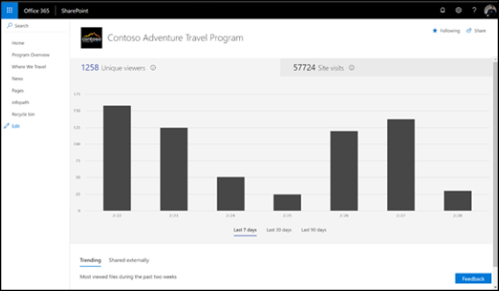

# Measuring impact of Microsoft 365 learning pathways

Administrators should leverage SharePoint’s built-in site usage reporting capabilities to measure organizational impact of the Microsoft 365 learning pathways. There are two primary scenarios for measuring impact: 
- Site level impact – view usage data for the Custom Learning for Office 365 specific site 
- Organization level impact – understand Customer Learning for Office 365 usage with respect to all other sites within your organization

## Site-level impact

As a SharePoint Online site owner, you can view information that shows you how users are interacting with your site. For example, you can see the number of people who have visited the site, how many times people have visited the site, and a list of files that have received the most views. See [Report Details](https://support.office.com/article/view-usage-data-for-your-sharepoint-site-2fa8ddc2-c4b3-4268-8d26-a772dc55779e). 

## Organization-level impact
The Office 365 Admin Center SharePoint site usage report enables Administrators to get a high level view of the value you are getting from the Custom Learning for Office 365 site relative to all other SharePoint sites. See [Report Details](https://docs.microsoft.com/office365/admin/activity-reports/sharepoint-site-usage?view=o365-worldwide).
 
Follow the referenced article to: 
1. Learn how to get to the SharePoint site usage report 
2. Interpreting the SharePoint site usage report details. Sort on the Site URL field to more easily identify your Microsoft 365 learning pathways site. 
3. Leverage the report Export functionality for more advanced data analysis or if your organization has greater than 2,000 sites. 

## Feedback

As of today, reporting is limited to the SharePoint site level. Lend your vote to our [User Voice](https://go.microsoft.com/fwlink/?linkid=2109552) forum to help prioritize enhanced reporting functionality requests.   

