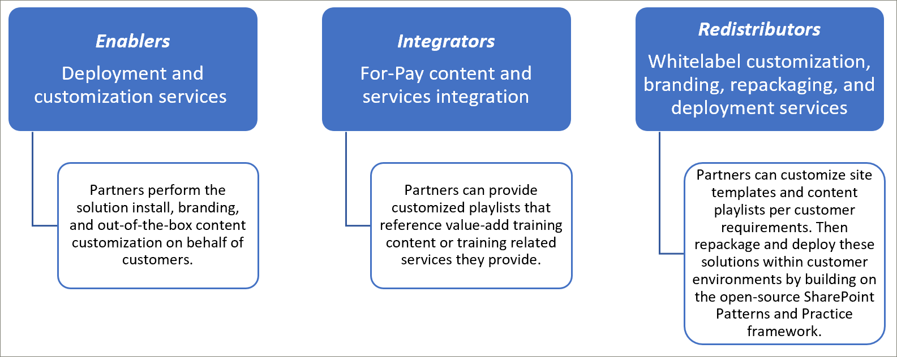
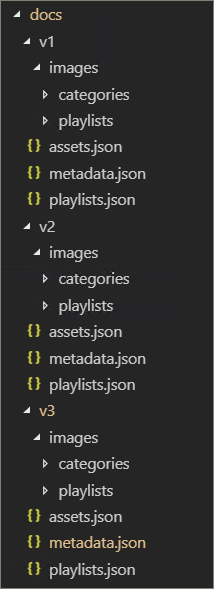
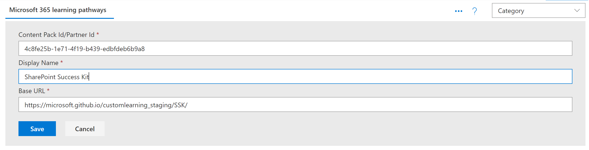
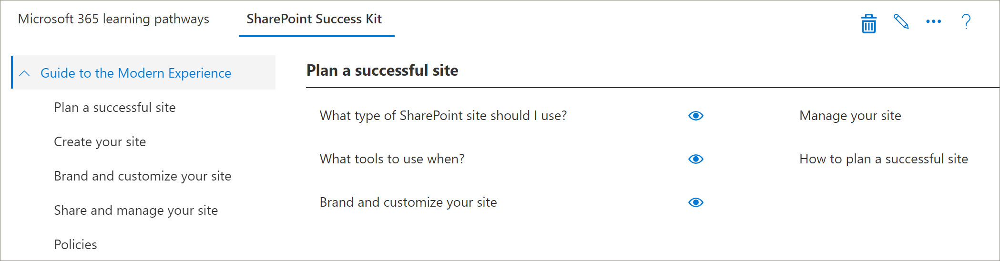
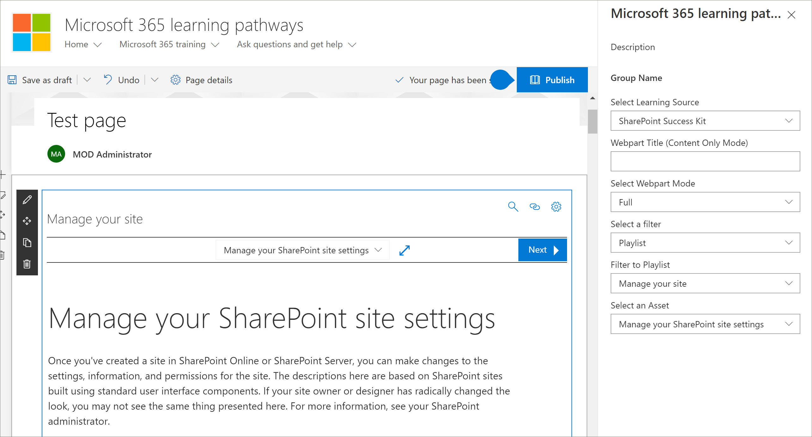

# Partner integration models
While it’s not possible to supplement the Microsoft 365 learning pathways content directly ‘out of the box’ from the SharePoint Online Provisioning service, there are several integration models that partners can leverage to create aligned value-add service offerings. The partner integration models above are presented in order of ascending complexity and levels of investment. Hence our guidance is to build your expertise and graduate to more advanced levels based on your business models.

 

## How should I get started? 
To get started, here are some best practices to follow. 	

### 1. Begin with building expertise as an Enabler. 
You can help a percentage of your customer base right away by enabling their learning pathways training portal and performing targeted Microsoft content curation. For instructions on provisioning learning pathways, see [Provision a new learning pathways solution](/office365/customlearning/custom_provision).  

### 2. Then extend your services as an Integrator
Perform an automation return on investment analysis - depending on the quantity of your content and/or services integration needs. For example, it may not make sense to take on the development and operational costs with respect to our content integration guidelines if you can quickly manually create a targeted custom playlist(s) pointing to your for-pay content or reference your services.

### 3. When the return on investment makes sense – consider Redistribution 
When the return on investment makes sense – consider Redistribution (or working with related learning pathways partners) to build repackaged solutions. These are based on the SharePoint Patterns and Practice framework which provides solutions to extract customized sites and then deploy into customer environments 

## Partner-provided content integration guidelines
Content for Microsoft 365 learning pathways is driven by a set of JSON files that act as content manifests for your learning package. There are three files: metadata.json, playlists.json, and assets.json. These files need to be structured to match the models the web part recognizes and then hosted from a content delivery network (CDN) to allow the web part to load them. Microsoft will provide starter templates of these files to get you started.  

**Disclaimer:** the JSON file structure is subject to change based on upcoming solution work. The Microsoft 365 learning pathways partner Early Adopter Program (EAP) will be informed of any impending changes of this nature. Along with any customer backwards compatibility and/or transition guidance. 

### Download the Microsoft 365 learning pathways solution
You can download the Microsoft 365 learning pathways solution, along with the JSON files, from the GitHub repository: https://github.com/pnp/custom-learning-office-365. Note that at this time, Microsoft is not taking GitHub pull request on the solution. But you can use the GitHub files as a starting point for creating your own custom content pack. 

### Metadata.json Structure
You can think of this file as the brains of the menus and structure. It contains all the navigation structure as well as pick lists for data in the other two files. 

|              Name        |                     Description                                                               | 
|:-----------------------------|-------------------------------------------------------------------------------------------|
|**Technologies**              |Content is tagged and can be hidden based on the Technology it’s assigned.                 |  
|&nbsp;&nbsp;Id                |GUID representing the technology                                                           |  
|&nbsp;&nbsp;Name              |Display name of the technology                                                             |
|&nbsp;&nbsp;*Subjects[ ]*     |An array of subjects that are a subset of the technology                                   | 
|&nbsp;&nbsp;&nbsp;&nbsp;Id    |GUID representing the subject                                                              |
|&nbsp;&nbsp;&nbsp;&nbsp;Name  |Display name of the subject                                                                |
|**Categories [ ]**             |Categories inform the navigation of the webpart. Each category represents a top level of the navigation                                                                                                                 |
|&nbsp;&nbsp;Id                |GUID representing the category/subcategory                                                 |
|&nbsp;&nbsp;Name              |Display name for the category/subcategory                                                  |
|&nbsp;&nbsp;Image             |URL for the image that should be displayed in the UX (relative to the CDN base)            |
|&nbsp;&nbsp;TechnologyId      |The GUID of the Technology this content is related to (optional – empty string)            |
|&nbsp;&nbsp;SubjectId         |The GUID of the Subject this content is related to (optional – empty string)               |
|&nbsp;&nbsp;Source            |From Source array, not specifically used in UX other than custom data added by the user is marked as “Tenant” and the UX admin area does not allow editing of anything not marked “Tenant”.                           |
|&nbsp;&nbsp;*Subcategories[ ]*|Sub-Categories are basically the nav level from level 2 down. The structure is the same as a Category just nested.          |
|**Audiences [ ]**             |When playlists associated with a category/subcategory are various audiences tagged, a selector will be available to show the available audiences. |         
|&nbsp;&nbsp;Id                |GUID of the audience                                                                       |  
|&nbsp;&nbsp;Name              |Display name of the audience                                                               |       
|**Sources [ ]**               |Array of strings that tag content with its source, not specifically used in UX other than custom data added by the user is marked as “Tenant” and the UX admin area does not allow editing of anything not marked “Tenant”.                                                   |  
|**Levels  [ ]**               |When playlists associated with a category/subcategory are various levels tagged, a selector will be available to show the available levels.             |  
|&nbsp;&nbsp;Id                |GUID of the Level                                                                          |  
|&nbsp;&nbsp;Name              |Display name of the Level                                                                  | 
|**StatusTag  [ ]**           |Status tag is to identify content with various status that will be exposed in the UX. Some of these flags will be show to the consumer and some only to the admin.                                                   |  
|&nbsp;&nbsp;Id                |GUID of the StatugTag                                                                      |  
|&nbsp;&nbsp;Name              |Display name of the StatusTag                                                              | 
|**Telemetry  [ ]**            |                                                                                           |  
|&nbsp;&nbsp;AppInsightsKey    |GUID of the app insights key that you have set up to track the loading of the viewer web part. Tracking can be turned off by an administrator for the entire tenant, but the information sent is anonymized user with the tenant id. Please see this section for more information https://github.com/pnp/custom-learning-office-365#disabling-telemetry-collection               |  
|**Version**                   |Version information is used by the solution to indicate to administrators that the webpart has updated and also allow the webpart to self-update custom content to the latest version of the manifest if significant changes have been made.         | 
|&nbsp;&nbsp;Manifest          |The version of the manifest                                               |
|&nbsp;&nbsp;ManifestMinWebPart|The minimum version of the webpart that works with the version of the manifest             |
|&nbsp;&nbsp;CurrentWebPart    |URL for the image that should be displayed in the UX (relative to the CDN base)            |
|&nbsp;&nbsp;RepoURL           |The url of the repository where the updating web part instructions are.                    |
|**Content Packs**             |At this time content packs for additional CDN’s is not supported. Content packs allow Microsoft to suggest other Microsoft created solutions that can be provisioned via the Provisioning service that leverage M365LP to deliver content and are in and of themselves custom CDNs.       | 
|&nbsp;&nbsp;Id                |GUID of the content pack/CDN                                                              |
|&nbsp;&nbsp;Name              |Display name of the CDN                                                                   |
|&nbsp;&nbsp;Description       |Description to be displayed in UI for adding a content pack                               |
|&nbsp;&nbsp;Image             |Image to be displayed in UI for adding a content pack                                     |
|&nbsp;&nbsp;ProvisionURL      |The URL to the provisioning service package to create the content pack’s site collection  |
|&nbsp;&nbsp;CDNbase           |The Base URL for the manifests for the content pack                                       |
|AssetOrigins                  |An array of URL origin’s utilized in the assets.json file described later. If the origin URL supports it, a post message will be sent to help_getClientHeight. A response in the data property of: "help_getClientHeight={height of content}" (for example "help_getClientHeight=5769") will allow the iFrame to be resized to the appropriate height of the framed content.         |

### Playlists.json Structure
playlists.json – The playlists manifest is an array of objects that describe the metadata about a playlist and the assets that are included in the playlist.

|              Name        |                     Description                                                               | 
|:-----------------------------|-------------------------------------------------------------------------------------------|
|Id                            |GUID representing the playlist                                                             |  
|Title                         |Display name of the playlist                                                               |
|Image                         |Relative URL (from CDN) to an image to visualize the playlist                              |                      
|LevelId                       |Associated level                                                                           |
|AudienceId                   |Associated audience                                                                        |
|TechnologyId                 |Associated technology                                                                      |
|SubjectId                    |Display name for the category/subcategory                                                  |
|Source                        |From the source array, not specifically used in UX other than custom data added by the user is marked as “Tenant” and the UX admin area does not allow editing of anything not marked “Tenant”.                                              |
|CatId                         |The Category or SubCategory ID that represents the container the playlist should be shown in. Currently the manifest does not support selecting a Category or SubCategory as the container if it also has SubCategory children.        |
|Description                   |A description showed for each playlist in the UX                                           |
|StatusTagId                   |Associated status tag                                                                      |
|StatusNote                    |Notes about content displayed to administrators                                            |
|*Assets[]*                        |An array of GUID’s for the assets that are part of this playlist, in display order.        |         

### Asset.json Structure
playlists.json – The playlists manifest is an array of objects that describe the metadata about a playlist and the assets that are included in the playlist.

|              Name        |                     Description                                                               | 
|:-----------------------------|-------------------------------------------------------------------------------------------|
|Id                            |GUID representing the playlist                                                             |  
|Title                         |Display name of the playlist                                                               |
|Description                   |---                                                                                           |                      
|URL                           |The source url for the asset, to be applied to the iFrame                                  |
|TechnologyId                  |Associated technology                                                                      |
|SubjectId                     |Associated subject                                                                         |
|Source                        |Display name for the category/subcategory                                                  |
|StatusTagId                   |Associated status tag                                                                      |
|StatusNote                    |Notes about content displayed to administrators.                                           |

### Caching
The current version of the viewer web part utilizes a cached version of the manifest files for 24 hours. After 24 hours, the first user that hit’s the webpart takes the performance hit to refresh the cache by downloading the manifests from the source CDN and merge that information with hidden technologies and playlists as well as merging in custom sub-categories, playlists, and assets. Alternately the admin web part always downloads the content from the manifests and merges them in and updates the cache.  So, in other words, the administrator can force a cache update at any time by loading the admin web part, aka going to the Administration page.

## Content Pack Guidelines
The Content Pack feature unlocks the following scenarios:
- The ability for partners to redistribute value-added custom learning content custom tailored to customers’ environment
- The ability for organizations with a strong training team and IT support to build custom learning content directed at their own internal systems and governance
- The ability for Microsoft to deliver additional learning pathways in the future that customers can opt into

This current documentation set is intentionally targeted for Partners due to the feature’s complexity. The service team is actively working to better support and enable scenario #2, in the future. 

### How Content Packs work
Microsoft utilizes GitHub pages as a Content Delivery Network (CDN) source for its manifest files and images. We have a docs folder at the root of our GitHub repository that includes sub folders for each version of the manifest files. Inside each folder there are three manifest files, plus an images folder to store all the category, subcategory, and playlist images. 

It is important that you maintain the same versioning structure that Microsoft does should you choose to extend the learning pathways solution with your own content pack. Your CDN endpoint should not include the version folder, as the manifest version the web part supports is baked into it and is automatically appended to the CDN url. We will obviously give you time to create new instances of your manifest files any time we revision it.

 

For more information about utilizing GitHub pages as your CDN source please see the following help documentation: [https://help.github.com/en/articles/configuring-a-publishing-source-for-github-pages](https://help.github.com/en/articles/configuring-a-publishing-source-for-github-pages).

Microsoft’s solution makes the information about the assets open to the public as there is no security around who has access to these files. We believe that there should be a free layer of content for a consumer, that said if you have a need for pay wall for some or all of your content you will need to implement this differently within the technical limitations of the solution and using GitHub pages is by no means a requirement. Any CDN provider you would like to use is fine if you maintain the version numbering structure we’ve outlined. As stated previously, the version of the manifest structure the web part supports is baked into the code and is automatically appended to the CDN URL. 

### Content Pack Integration Guidance 
The admin and viewer web parts have been extended to allow the consumer to configure additional CDN endpoints in their tenant which will then allow the viewer web part to select which CDN they should source the data they display. 

Key framing to keep in mind for this feature: 
- This is primary applicable for partner redistribution scenarios – where manual playlist configuration is too cumbersome 
- Custom Content Packs are an advanced feature and should only be used by Partners with experience administrating web content. Untrustworthy content sources may introduce unsafe content into your site. You should only add sources that you trust.

> **IMPORTANT**
> Before adding a Custom Content Pack, you must have provisioned Microsoft 365 learning pathways 3.0 or later. For informataion about provisioning Microsoft 365 learning pathways, see [Provision Microsoft 365 learning pathways](./custom_provision.md).

### Content reliability
As a partner it’s your responsibility to assist your consumers in making sure your content is rendered reliable in their environment. We suggest you create a test scenario in their environment to validate that your content can be iFrame’d into a SharePoint page inside of their firewall. Follow the [Create SharePoint pages for Custom Playlists](custom_createnewpage.md) instructions to confirm this is the case.

### Add a Content Pack to Learning Pathways
Once you've created modified the JSON and defined your CDN, you can add the Contact Pack to learning pathways. 

1. From the learning pathways site **Home** page, point to **Home** and then click **Learning pathways administration**. 
2. From the **Administration** page, click the **... Add Content Pack** in the upper-right corner of the page.
3. Click Custom Content Pack, and then enter a name of the Content Pack and then specify the CDN where the JSON files are located.

4. Click **Save**. The content from your Custom Content Pack should now appear in the Administration page. Here is an example. 

### Filter to the Content Pack in the web part
With learning pathways, you can add the learning pathways web part to a page, filter the web part to point to the Custom Content Pack source, and then filter the web part to the category, subcategory, playlist, and asset that you want. 

1. From the learning pathways site, click **New**, and then **Page**.
2. Click **Blank**, and then **Create Page**.
3. Give the page a name. 
4. Click **+ Add a new section** on the left side of the page.
5. Click **+** in the top-middle of the new section, and then add the **Microsoft 365 learning pathways** web part.
6. Click the Web part, and then click the **Edit** icon.
7. In the **Select the Learning Source** box, select your Custom Content Pack, and and then filter the web part to the content you want. The following provides an example of the Web part filtered to a playlist from a Custom Content Pack.

  

