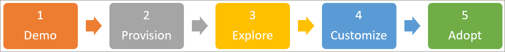

# Partner Onboarding Guide
Get started with learning pathways by following the three steps outlined below. With the three steps, you can build a compelling demo that you can use for engaging presentations with customers. 

## 1. Create a Microsoft 365 demonstration environment
You can use demos.microsoft.com to create a demo environment where you can provision the service, validate it, and use it for presenting learning pathways to customers. All partners have access to https://demos.microsoft.com for these purposes. You can use the demos.microsoft.com **Getting Started Guide** if you are new to the demo environment.

## 2. Provision Microsoft 365 learning pathways
You can provision learning pathways with the SharePoint Online Provisioning Service.
- To provision learning pathways, go to the [Microsoft 365 learning pathways](https://provisioning.sharepointpnp.com/details/3df8bd55-b872-4c9d-88e3-6b2f05344239) solution page. Review the [Learning pathways setup options](https://docs.microsoft.com/en-us/office365/customlearning/custom_setupoptions). 
- Review the [Solution Prerequisites](https://docs.microsoft.com/en-us/office365/customlearning/custom_provision) – as these are common impediments for customer new to SharePoint who may not have all the correct permissions or necessary environment configuration in place, such as a tenant app catalog.
- Try to deploy the solution via a non-Administrator role – to familiarize yourself with the provisioning service error-handling and email service.

## 3. Explore your newly provisioned learning pathways site to get familiar with its capabilities
[Explore your newly provisioned learning pathways site](https://docs.microsoft.com/en-us/office365/customlearning/custom_exploresite) to familiarize yourself with its capabilities. Review the [Admin Success Center](https://docs.microsoft.com/en-us/office365/customlearning/custom_successcenter) for information about content and feature updates, plus planning, customization, adoption, and measuring impact guidance.

## 4. Customize the learning experience
[Customize the learning pathways experience](https://docs.microsoft.com/en-us/office365/customlearning/custom_overview) by working through the following functional areas:
- [Hide and show Subcategories](https://docs.microsoft.com/en-us/office365/customlearning/custom_hideshowsub), [Playlists](https://docs.microsoft.com/en-us/office365/customlearning/custom_hideshowplaylists), and [Technologies](https://docs.microsoft.com/en-us/office365/customlearning/custom_hideshowtech).
- [Copy a playlist](https://docs.microsoft.com/en-us/office365/customlearning/custom_copyplaylist)
- [Create a Custom Playlist](https://docs.microsoft.com/en-us/office365/customlearning/custom_createnewplaylist) – starting with [SharePoint pages](https://docs.microsoft.com/en-us/office365/customlearning/custom_createnewpage), [playlist creation](https://docs.microsoft.com/en-us/office365/customlearning/custom_createnewplaylist), [adding assets](https://docs.microsoft.com/en-us/office365/customlearning/custom_addassets), and [creating subcategories](https://docs.microsoft.com/en-us/office365/customlearning/custom_createnewcat).

## 5. Create a sample learning pathways communication campaign
Create a sample learning pathways communication campaign based on the [downloadable Adoption Kit](https://teamworktools.azurewebsites.net/m365lp/m365lpadoptionkit.zip) and highlight the custom content you created in Step 4. You can leverage this when demoing the complete customer experience. 

