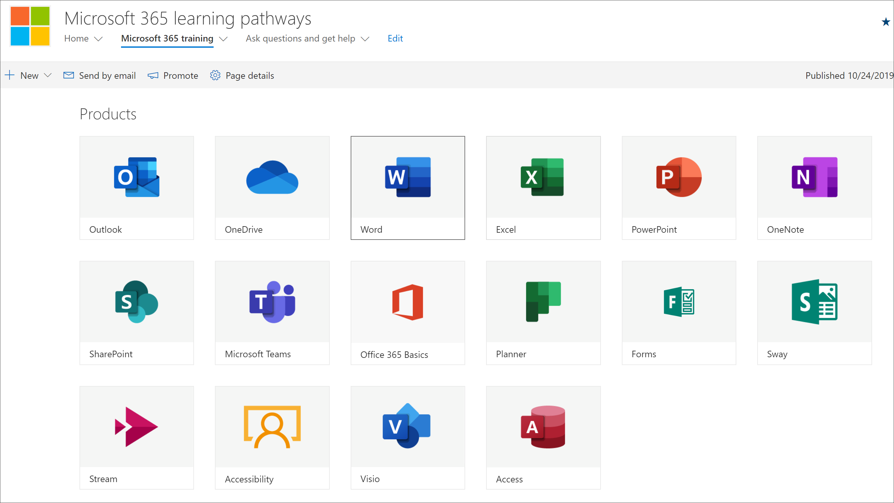
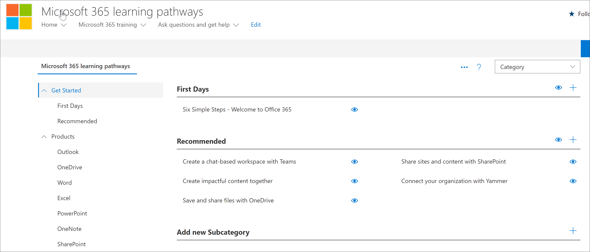

# Plan your learning pathways content
Before you dive into rolling out Microsoft 365 learning pathways, it’s a good idea to take some time to survey the learning content, tools, and capabilities available to you. Our goal is to help you get your organization's users up to speed, and productive, as quickly and efficiently as possible. When it comes to planning for learning pathways, we recommend a three-step process:

1. **Review the available resources** – both the resources provided through learning pathways and the resources available in your organization. The best learning plans combine both Microsoft resources and resources from your organization.
2. **Get to know the capabilities of the Learning Pathways tool** - we'll give you a quick tour. 
3. **Create a content plan** – review the available Adoption Guides to help you with building an overall plan.

## Review the available resources
Before you create a content plan for Microsoft 365 learning pathways, take some time to discover all the resources that are available to you.  

### Review the learning pathways SharePoint site
The Microsoft 365 learning pathways solution provides a SharePoint communication site with a web part that's connected to an online catalog. The SharePoint site is fully customizable, including the site name, logo, pages, menu items, themes, and tiles. Take some time to click the tiles and menu items to discover what's available with the learning pathways site.

### Review the content from the Online catalog with the Web part
The Web part, by default, is added to a series of pages in the SharePoint Communication site. The complete set of content is provided on the Microsoft 365 training page. The Microsoft 365 training page hosts the learning pathways Web part configured to show all the training available for learning pathways. 

**To view the Microsoft 365 Training page**
1. Click the Microsoft 365 training menu item. 
1. Scroll down the page to view all the categories and subcategories.
2. Kick the tires a bit. Click a few subcategories, and then click a few playlists to get a feel for how learning pathways content is organized. 

### View the Administration Page
The Administration page provides a listing of the content available to you. This is where you can hide content, create new playlists, and add, edit, and remove playlist. Click through the various categories and playlists to see the full breath of the content available. 

**To view the Administration page.**
1. From the learning pathways site, point to the Home menu dropdown arrow, then click Learning pathways Administration.  
2. Then click through the various categories, subcategories, and playlists to get a feel for the breath of content available to you. 

### Get to know the capabilities of Microsoft 365 Learning Pathways
With Microsoft 365 Learning Pathways, you can have content provided by Microsoft mixed with content you create to target specific policies and procedures that are unique to your organization. As a best practice, try to leverage Microsoft-provided content as much as possible. Microsoft updates individual assets on a regular basis and updates the full inventory of content on a quarterly basis. Typically an organization will create 10-20% unique content, then leave the remaining 80% to Microsoft to keep up-to-date. The following lists describes how learning pathways content is organized, along with guidelines for the content that can be modified or created. Guidance for customizing content is provided in the Customizing learning pathways section of the Admin Success Center.

- **Categories** - are containers for subcategories. Categories are provided by Microsoft and cannot be created or modified.
- **Subcategories** - are containers for playlists. Microsoft provides subcategories which you cannot modify, but you can create your own subcategories. 
- **Playlist** - are containers for assets. Microsoft provides playlists which you cannot modify, but you can create your own playlists.  
- **Assets** - are the learning pages within playlist. Microsoft provides assets in playlists which you cannot modify, but you can create your own assets and add them to playlists.est

### Review additional resources from Microsoft
Microsoft provides help and training resources that you can leverage when planning for content for learning pathways.  

-  [Office Help and Training](https://support.office.com)
-  [Office 365 Training Center](https://support.office.com/office-training-center)

### Review the learning resources in your organization
Take stock of the learning content already available to you in your organization.
For example, your organization have may already have custom Quick Start Guides, Cheat Sheets, or SharePoint pages dedicated to Microsoft 365 readiness, HelpDesk, onboarding or training. Existing SharePoint assets can be incorporated into the Microsoft 365 Portal playlists and or mixed with Microsoft content in a playlist to build a targeted playlist for your organization. For more information about mixing your organization's content with Microsoft's content, see the [Customizing learning pathways](custom_overview.md).Customizing learning pathways section of the Admin Success Center.

### Leverage the Adoption Resources
Note that you can get started using learning pathways within days, but it’s best to do some up-front planning before executing a learning campaign strategy to onboard a new technology or set of services. Developing a content plan and using learning pathways is really part of a more extensive effort in planning an overall Change Management strategy, so we provide adoption materials that you can leverage for planning your overall strategy. As part of your planning effort, check out [Adoption Resources](https://resources.techcommunity.microsoft.com/adoption/).

### Build a Learning Plan and Iterate 
Many companies who’ve successfully rolled out Learning Pathways have adopted Learning campaigns focusing on specific scenarios or technologies. For example, "Be more collaborative - using Teams" or “Be more mobile with Outlook mobile.” You can see examples of potential learning campaigns using the [downloadable Adoption Kit](https://teamworktools.azurewebsites.net/m365lp/m365lpadoptionkit.zip).

 
