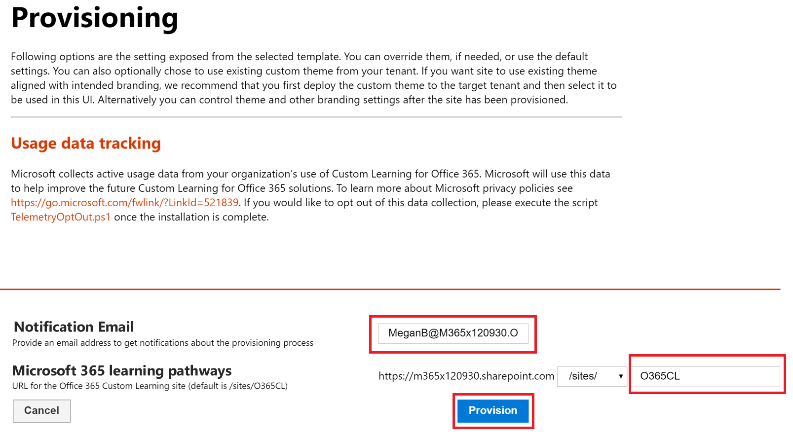
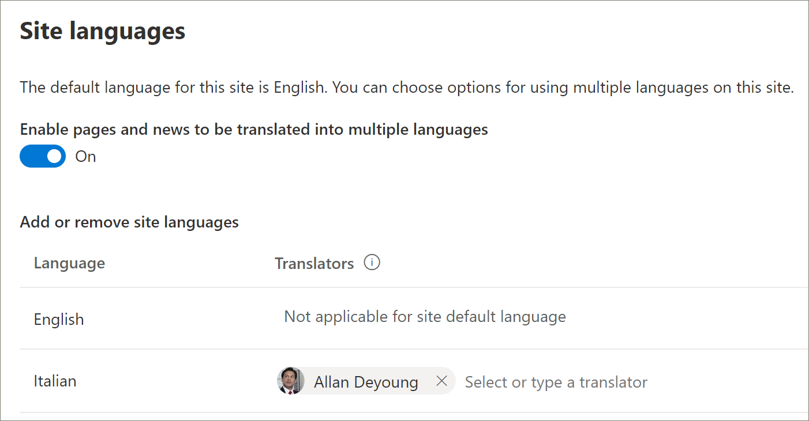

# Provision a new learning pathways multilingual solution
Organizations that that don’t have learning pathways provisioned in their tenant can use the SharePoint Provisioning Service to add the multilingual learning pathways solution. With this option, the learning pathways SharePoint template is translated into nine languages and can be used with a minimum of modification. 

> [!IMPORTANT]
> If you already have learning pathways provisioned in your tenant, it's recommended that you follow the [update path](custom_update_ml.md) for learning pathways. If you install learning pathways over an existing instance in your tenant, any changes made to the the learning pathways site template or playlists may be lost.

## Prerequisites for multilingual support
 
To successfully set up Microsoft 365 learning pathways with the Provisioning Service, the person doing the provisioning must meet the following pre-requisites: 
 
- The person provisioning learning pathways must be a Tenant Administrator of the tenant where learning pathways will be provisioned.  
- A tenant App Catalog must be available within the Apps option of the SharePoint Admin Center. If your organization doesn't have an SharePoint tenant App Catalog, refer to the [SharePoint Online documentation](/sharepoint/use-app-catalog) to create one. You must wait at least two hours after creating the App Catalog before provisioning learning pathways.  
- The person provisioning learning pathways must be a Site Collection Owner of the Tenant App Catalog. If the person provisioning learning pathways is not a Site Collection Owner of the App Catalog, [complete these instructions](addappadmin.md) and continue. 

## Ensure the Tenant Admin account doesn't have a language selected
Before you provision learning pathways, ensure that the Admin Account for the tenant doesn't have a language selected. Here’s how to verify if the Admin account doesn't have a language selected. 
1.	With your Edge Admin profile, go to office.com.
2.	Enter the user credentials (if necessary).
3.	In Microsoft 365, click **All Apps** > Delve. 
4.	Click **Me** > **Update Profile**.
5.	Scroll down the page and click **How can I change language and regional settings**.
6.	Click **here**, and then click the ellipses **...**.
7.	Under **My Display Languages**, you should see **No languages selected**. If a language is selected, unselect it.

### To provision learning pathways

1. Go to the [Microsoft 365 learning pathways solution page](https://provisioning.sharepointpnp.com/details/3df8bd55-b872-4c9d-88e3-6b2f05344239).
2. Click **Add to your tenant**. If you aren't signed into to your tenant, the Provisioning Service will ask for your Tenant Admin credentials. 
3. From the Permissions requested dialog box, select **Consent on behalf of your organization** and then select **Accept**.

The provisioning service requires these permissions to create the tenant App Catalog, install the application into the tenant App Catalog and provision the site template. There's no overall impact on your tenant. These permissions are explicitly used for the purpose of the solution installation. You must accept these permissions to continue with the installation.

4. Complete the fields on the provisioning information page as appropriate for your installation. At a minimum, enter the email address where you wish to get notifications about the provisioning process and the destination URL for your site to be provisioned to.  
> [!NOTE]
> Make the destination URL for your site something friendly to your employees such as "/sites/MyTraining" or "/teams/LearnMicrosoft365".

6. Click **Provision** when ready to install learning pathways into your tenant environment.  The provisioning process can take up to 15 minutes. You will be notified via email when the site is ready. 

> [!IMPORTANT]
> The Tenant Admin who provisions the learning pathways site must go to the site, and then open **CustomLearningAdmin.aspx** to initialize learning pathways Admin properties. At this time, the Tenant Admin should also assign Owners to the site. 

## Validate Provisioning Success and Initialize the CustomConfig List

When provisioning is complete, the Tenant Admin who provisioned the site receives an email from the PnP Provisioning Service. The email contains a link to the site. At this point, the Tenant Admin should go to the site using the link provided in the email and set up the site for first use:

- Go to `<YOUR-SITE-COLLECTION-URL>sites/<YOUR-SITE-NAME>/SitePages/CustomLearningAdmin.aspx`. Opening **CustomLearningAdmin.aspx** initializes the **CustomConfig** list item that sets up learning pathways for first use. You should see a page that looks like this:

## Add Owners to Site
As the Tenant Admin, it's unlikely you'll be the person customizing the site, so you'll need to assign a few owners to the site. Owners have administrative privileges on the site so they can modify site pages and rebrand the site. They also have the ability to hide and show content and build custom playlist and subcategories.  

1. From the SharePoint **Settings** menu, click **Site Permissions**.
2. Click **Advanced Permission Settings**.
3. Click **Microsoft 365 learning pathways Owners**.
4. Click **New** > **Add Users to this group**, and then add the people you want to be Owners. 
5. Add a link to [Explore the Site](custom_exploresite.md) in the Share message, and then click **Share**.

## Add translators to the site
If you will be using translators for the site, you can assign them permissions. Translators require Member permissions or higher. 

## Choose options for using multiple languages on the site
The SharePoint Provisioning Service creates the Learning Pathways site in nine languages. The following recommendations apply:
- Turn off the languages you don’t want to support
- If you are not supporting a multilingual site, turn off the multi-lingual feature. See the "Turn off multilingual support" section later in this topic.

### Remove languages you don’t want to support
For organizations that choose to support only one language, in addition to the default English language, we recommend removing languages that aren’t supported. 
1. From the Learning Pathways site, select **Settings** from the top-right of the page, and then select **Site information**.
2. At the bottom of the site information pane, select **View all site settings**.
3. Under **Site Administration**, select **Language settings**.
4. Under **Enable pages and news to be translated into multiple languages**, slide the toggle to **On**. It should be On by default.
5. Under Add or remove site languages, click **Remove** to remove the languages you don't need for the site. The following shows an example of the Language Settings page to show Italian supported for the site, in addition to the default English language.

> [!NOTE]
> When removing languages you cannot remove the default English language. 

### Assign translators
If you're going to translate pages, optionally assign one or more translators for each language (except the site default language). 
- In the **Translator** column, start typing the name of a person you want to be a translator, and then select the name from the list. 

> [!NOTE]
> Anyone in your organization's Active Directory can be assigned as a translator. People assigned as translators will not automatically be given appropriate permissions. When someone without edit permissions to a site tries to access the site, they will be directed to a web page where they can request access.

## Turn off multilingual support
If you don’t want a multilingual site, for example, you want an English-only site, it’s recommended that you turn off the multilingual feature. 

1. From the Learning Pathways site, select **Settings** from the top-right of the page, and then select **Site information**.
2. At the bottom of the site information pane, select **View all site settings**.
3. Under **Site Administration**, select **Language settings**.
4. Under **Enable pages and news to be translated into multiple languages**, slide the toggle to **On**. It should be On by default.
- Under **Enable pages and news to be translated**, select **Off**. 

### Add languages
Learning pathways supports 9 languages, but it’s recommended that you add only the languages you need to support for the learning pathways site. You can add langauges at any time. 
- Under **Add or remove site languages**, start typing a language name in **Select or type a language**, or choose a language from the dropdown. You can repeat this step to add multiple languages. You can add or remove languages from your site at any time by going back to this page.