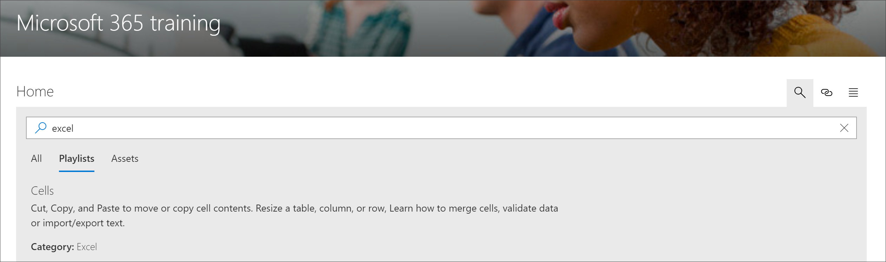

# Search for Microsoft 365 learning pathways content

Microsoft 365 learning pathways provides the ability to search for content by subcategory, playlist, or asset. 

> [!TIP]
> Microsoft 365 learning pathways Search is scoped to learning pathways content, including the content provided by Microsoft and any content added to custom playlists or subcategories. SharePoint pages that are not in a learning pathways playlist are not included in Search results.     

- Click the **Search** icon and type a Search phrase. 

