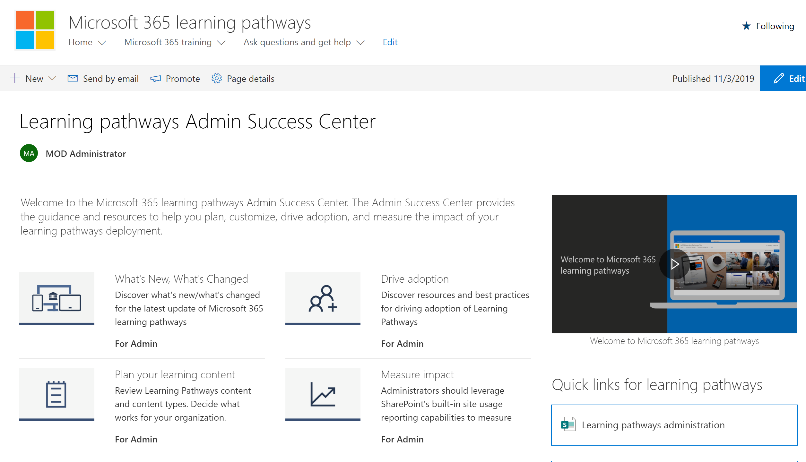

# Learning pathways Admin Success Center

Welcome to the Microsoft 365 learning pathways Admin Success Center. The Admin Success Center provides the guidance and resources to help you plan, customize, drive adoption, and measure the impact of your learning pathways deployment.

## Sign in to Office 365 

1.	Open your Web browser and navigate to office.com or your organization’s sign-in location. 
2.	Sign in with your user name and password.
3. 	Navigate to the location of the site using the URL supplied by your tenant administrator or select SharePoint from the Office 365 Home page, and then select the site. 

### Get started with the Admin Success Center

The Admin Success Center provides the guidance and resources to help you plan, customize, drive adoption, and measure the impact of your learning pathways deployment. 

- From the Microsoft 365 learning pathways **Home** page, click **Get started with the Admin Success Center**.

Learning pathways provides guidance within the Admin Success Center in the solution. Documentation for the Admin Success Center is also available in this documentation set: 

- [Plan your learning content](custom_plancontent.md)
- [Customize learning pathways](custom_overview.md)
- [Drive adoption](driveadoption.md)
- [Measure impact](custom_measureimpact.md)

