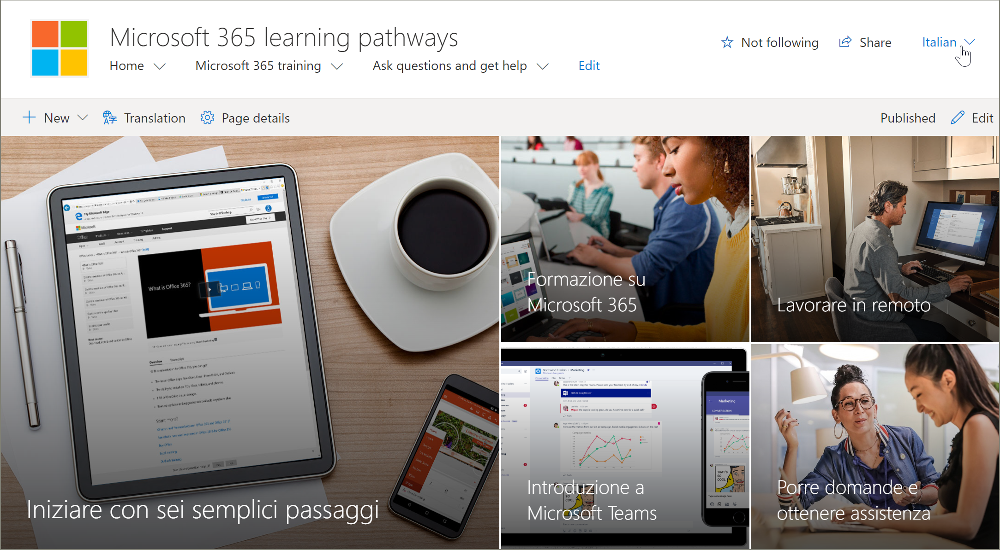
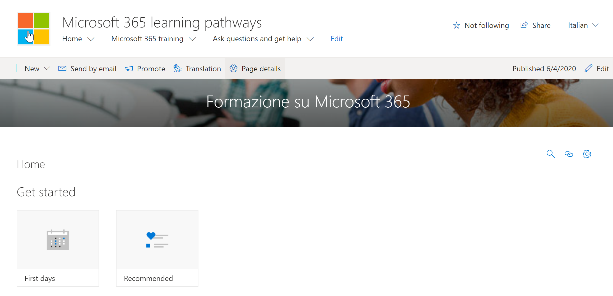

# Translate site pages
Before you start translating the learning pathways site, it’s important to understand a few key concepts of how the multilingual feature works with learning pathways. 
- Site information - Navigation, logo, and site name translations require that the site is viewed in the user’s language profile.  
- The learning pathways Web part must be viewed with user’s language profile for it to appear in a non-English language. The Web part and the Microsoft-supplied content is already translated for you.
- The method you used to provision Learning Pathways will determine whether you already have translated pages available or whether you need to manually translate the pages. 

## Working with a newly provisioned site
If you provisioned a new Learning Pathways site from the SharePoint Provisioning Service, the translated pages are already available to you. By default, the site provides the following pages:

- Home.aspx
- Start-with-Six-Simple-Steps.aspx
- Get-started-with-Microsoft-365.aspx
- Get-started-with-Microsoft-Teams.aspx
- Get-started-with-SharePoint.aspx
- Get-started-with-OneDriive.aspx
- Ask-questions-and-get-help.aspx
- Training events calendar.aspx
- Become-a-Champion.aspx
- Recommended-Playlists.aspx
- Learning pathways Admin Success Center

## View translated pages from the newly provisioned site
To get familiar with the translated learning pathways site, let's take a look at a few translated pages.

### View the translated Home page
From the Learning Pathways Home page, select a language from the language dropdown as shown in the following example. In the example, you see Italian selected in the upper right corner.

### View the translated Microsoft 365 training page
To help demonstrate some important concepts, let's take a look at the Microsoft 365 training page. 

1. From the learning pathways site **Home** page, click **Microsoft 365 training**.
2. In the upper-right corner of the page, select a language. In this example, Italian is selected.

What translations are visible when the language is selected?
- The SharePoint page is translated as shown in the graphic above. Notice the text for the page banner is now in Italian.

What’s translations are not visible?
- The site name is in English
- The site navigation is in English
- The learning pathways web part is in English

## View the fully translated site 
To view a fully translated site in a specific language, including the site pages, navigation, and web part, the user’s personal language and regional settings must be set for that language. For more information on setting language and regional settings, see [Change your personal language and regional settings](https://support.microsoft.com/en-us/office/change-your-personal-language-and-region-settings-caa1fccc-bcdb-42f3-9e5b-45957647ffd7). Note that it’s best to use a separate account or have another user with the different language settings view the translated pages. 

## Working with an updated or manually installed learning pathways site
If you updated an existing Learning Pathways site or manually installed the web part to an existing site, you will need to manually translate the site pages. The learning pathways web part and content are already translated and will appear in the user's preferred language. To translate pages, see the following instructions "Create pages for the languages you want". 

## Create pages for the languages you want
Once you've enabled your site for multilingual features and you've chosen the languages you want to make available, you can create the translation pages you want. 

1. Go to the default language page you want to make available in another language.
2. On the top bar, select Translation.
3. Select Create for the languages you want.

> [!IMPORTANT]
> After you create the translation pages, you must publish (or republish) the default language page to ensure that:
>- Translation pages are shown in the corresponding language site
>- Translation pages display correctly in the News web part and the Highlighted content web parts
>- The language dropdown at the top of the site includes all of the languages you enabled
>- Translators are notified of the translation request.

Once the page(s) are created, the status of the page (draft saved, published, and so on) are shown in the translation pane next to each language. Also, the translator(s) you assigned will be notified in email that a translation is requested.

### View the fully translated site in a specific language
To view a fully translated site in a specific language, including the site pages, navigation, and web part, the user’s personal language and regional settings must be set for that language. For more information on setting language and regional settings, see [Change your personal language and regional settings](https://support.microsoft.com/en-us/office/change-your-personal-language-and-region-settings-caa1fccc-bcdb-42f3-9e5b-45957647ffd7). Note that it’s best to use a separate account or have another user with the different language settings view the translated pages.

## What does a translator do?
 After the site is set up in English, a user with Spanish, for example, as their preferred personal language, manually edits and translates the title, navigation, and footer content into Spanish. A user with German as their preferred personal language does the same for German. Once the content is translated, it will display for all users of those preferred languages. The Web part picks up the user's preferred language and shows the content translated in that language. 

Translators manually translate the copies of the default language page into the language(s) specified. When the copies of the page(s) are created, translators are notified in email. The email includes a link to the default language page and the newly created translation page. The translator will:
1. Select the **Start translating** button in the email.
2. Select **Edit** on the top right of the page, and translate the content.
3. When done, select **Save as draft** (if you're not ready to make it visible to readers)or, if the page is ready to be visible to everyone who is using that language on the site, select **Publish** or **Post news**.

For more information about the translation process, see [Create multilingual communication sites, pages, and news](https://support.office.com/en-us/article/2bb7d610-5453-41c6-a0e8-6f40b3ed750c). 

## Updating the default language page
When the default language page is updated, the page must be republished. Then, the translator(s) for the translation pages are notified in email that an update has been made so updates can be made to the individual translation pages.

## Set up a multilingual site name, navigation and footer
To show the site name, navigation, and footer of your site in the different languages you've made available, each must be translated manually.

For example, let's say you've created a  communication site with an English default language, and you've enabled the site for Spanish and German languages. When you create a site, you set up the site name and description in the default language (in this case, English). You can also update the site name and description after site creation. Then you create the navigation nodes and footer content in English.

After the site is set up in English, a user with Spanish as their preferred personal language manually edits and translates the title, description, navigation and footer content into Spanish. A user with German as their preferred personal language does the same for German. Once the content is translated, it will display for all users of those preferred languages. 

> [!NOTES]
>- Users who translate the site content for their preferred languages should be members of the Owners group for the site or have equivalent site permissions.
>- If a change is made to the site name, navigation or footer in the default language, the corresponding translated item in another language is not automatically updated unless you choose to overwrite existing site translations. If you do that, the translated item is replaced by the update in the default language and would have to be manually translated again. To overwrite translations, go to the Site languages page for the default language, and select Show advanced settings. Then, slide the toggle for Overwrite translations to On. This option does not apply to page or news content.

### To view the fully translated site in a specific language
To view a fully translated site in a specific language, including the site pages, navigation, and web part, the user’s personal language and regional settings must be set for that language. For more information on setting language and regional settings, see [Change your personal language and regional settings](https://support.microsoft.com/en-us/office/change-your-personal-language-and-region-settings-caa1fccc-bcdb-42f3-9e5b-45957647ffd7). Note that it’s best to use a separate account or have another user with the different language settings view the translated pages.

## For more information
- For more information about translating SharePoint communication site pages, see [Create multilingual communication sites, pages, and news](https://support.office.com/en-us/article/2bb7d610-5453-41c6-a0e8-6f40b3ed750c).
- For more information about customizing learning pathways, see [Customize Learning Pathways](custom_overview.md).  
