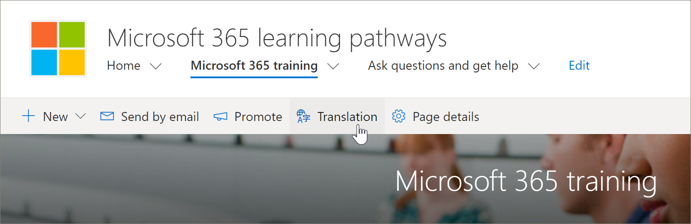

# Translate pages
When the learning pathways solution is updated, the learning pathways SharePoint site pages remain unchanged. Translations must be done manually. The learning pathways site, by default, offers the following pages:

- Home.aspx
- Start-with-Six-Simple-Steps.aspx
- Get-started-with-Microsoft-365.aspx
- Get-started-with-Microsoft-Teams.aspx
- Get-started-with-SharePoint.aspx
- Get-started-with-OneDriive.aspx
- Ask-questions-and-get-help.aspx
- Training events calendar.aspx
- Become-a-Champion.aspx
- Recommended-Playlists.aspx
- Learning pathways Admin Success Center

## Create pages for the languages you want
Once you've enabled your site for multilingual features and you've chosen the languages you want to make available, you can create the translation pages you want. To help demonstrate some important concepts, we'll use the Microsoft 365 training page as an example. To do this:

1.	From the learning pathways **Home** page, click **Microsoft 365 training**.  
2.	On the top bar, select **Translation**.

3. If you want to create a page for translation in each of all languages available for your site, select **Create for all languages**. Otherwise, select **Create** only for the languages you want. In this example, we'll select Italian.
4.	Click **View**. The page is now ready for translation. 

## An important concept to know
Notice that in the following example, the page has been translated to Italian. But the Site title, navigation, and web part, still appear in English. 

 After the site is set up in English, a user with Spanish, for example, as their preferred personal language manually edits and translates the title, description, navigation and footer content into Spanish. A user with German as their preferred personal language does the same for German. Once the content is translated, it will display for all users of those preferred languages. The Web part picks us the users preferred language and shows the content translated in that language. 

> [!IMPORTANT]
> Important: After you create the translation pages, you must publish (or republish) the default English-language page to ensure that:
- Translation pages are shown in the corresponding language site
- Translation pages display correctly in the News web part and the Highlighted content web parts
- The language dropdown at the top of the site includes all of the languages you enabled

## What does a translator do?
Translators manually translate the copies of the default language page into the language(s) specified. When the copies of the page(s) are created, translators are notified in email that a translation is requested. The email includes a link to the default language page and the newly created translation page. The translator will:
1. Select the Start translating button in the email.
2. Select Edit on the top right of the page, and translate the content.
3. When done, select Save as draft (if you're not ready to make it visible to readers)or, if the page is ready to be visible to everyone who is using that language on the site, select Publish or Post news.

If approvals or scheduling is on, the buttons may say Submit for approval or Publish later/Post later. An email notification will be sent to the person who requested the translation.

## Email notifications
When a translation page is created, an email is sent to the assigned translator(s) to request a translation. The email includes a Start translating button.

### Translation request email
- When a translation page is published by a translator, an email is sent to the person who requested the translation.
= When an update is made to the default language page and saved as a draft, an email is sent to the translator to notify them that an update to the translation page may be required.
- Email notifications are batched in 30-minute increments as needed. For example, when the first email related to a page is sent, and an update is made to the default language page, the next notification email or any others that need to be sent, will be batched and sent after 30 minutes.

### Page approvals
When page approvals are on, the default language page and the translation pages must be approved and published before the translation pages are available to everyone who has access to the page.

## Updating the default language page
When the default language page is updated, the page must be republished. Then, the translator(s) for the translation pages are notified in email that an update has been made so updates can be made to the individual translation pages.

## Next Steps
- [Customize the Learning Experience](custom_overview.md)
- [Drive adoption](driveadoption.md) 
