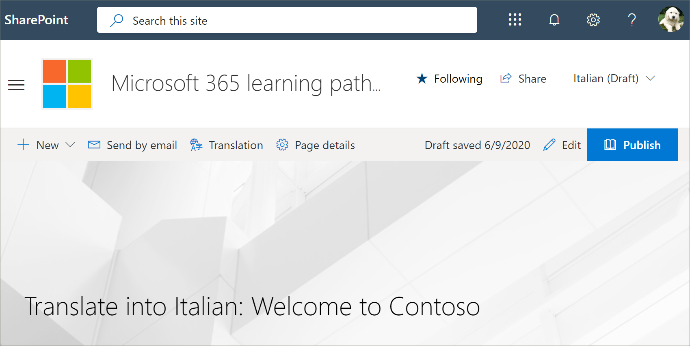
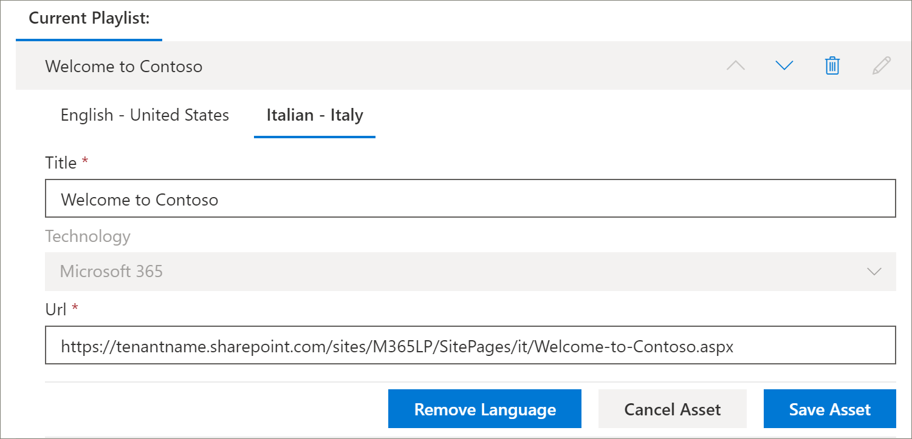

# Translate a learning pathways custom playlist
If you've created learning pathways custom playlists for your site, you can translate the playlists into the languages enabled for this site.

1.	From the learning pathways **Home** menu, click **Learning pathways administration**. 
2.	Click the custom playlist. In this example, we'll use **Five Simple Steps - Welcome to Contoso**. 
3.	Click **Edit Detail**, then in the **Add language** box, select a language. In this example, we'll use **Italian – Italy**. 
5.	Click **Save Detail**. 

> [!IMPORTANT]
> Translator notifications are not built into custom playlists. Translators will need to be notified manually. 

## What does a translator do?
Translators manually translate the copies of the default language page into the language(s) specified. You will need to notify the translator of the translations required for playlist details. It's recommended that you finish all playlist changes,including adding, editing, or deleting playlist assets, then notify the translator of the required translations.

## Translate the assets in the custom playlist
Any assets in a playlist that are supplied by Microsoft are not editable and do not require translation. If you’ve added custom assets from your tenant's SharePoint site, those assets will require translation. Let's take a look at how to translate a custom asset in a playlist.

### Add a language for an existing asset
1. Under **Assets**, select the **Edit** icon next to the custom asset. 
2. Select a language from the **Add language** box, and then select **Save Asset**.

### Add a language page for an existing asset
1. In the asset list, click the English asset, and then click **Open**.
2. On the top bar, select **Translation**.
3. From the language dropdown, select the language for the asset, select **Create**, and then **View**. Your page should now look something like this. 

4. Click **Publish**, and then copy the URL for the page. It should look something like this, with the language code in the URL.
https://tenantname.sharepoint.com/sites/M365LP/SitePages/it/Welcome-to-Contoso.aspx.
5. Return to the SharePoint Administration page, add the URL for the language for the asset, and then click **Save**. 

6.	Scroll up the page and click **Close Playlist**.

## What the translator does?
The translator will:
- Translate playlist details.
- Translate asset details.
- Translate added language pages for asset.
- Notify the requestor of the translations that the translations are ready for review

### Translate playlist details
From the Learning Pathways **Home** menu, click **Learning pathways administration**. 
1. Click the custom playlist that requires translation, then click the languages. 
2. Click **Edit Detail**, make the translations for the playlist, then click 
3. Click **Save Detail**. 
4. Notify the translation requestor that the translation is complete. 

### Translate asset details
From the Learning Pathways **Home** menu, click **Learning pathways administration**. 
1. Click the custom playlist that requires translation. 
2. Scroll down the page, then under Assets, select edit for the asset you want to edit, then select the language. 
3. Make the translations for the asset, and then click **Save Asset**.  

## Translate the added language page for the asset
From the Learning Pathways **Home** menu, click **Learning pathways administration**. 
1. Click the custom playlist that requires translation. 
2. Scroll down the page, then under Assets, select the asset, select the language, and then click Open. 
3. Make the translations for the page, and then click **Publish**.  

## Create a new multilangual playlist
For instructions on how to create a new playlist for a site, see [Create a Custom Playlist](custom_createnewplaylist.md). After you've created the playlist and assets, refer back to this documentation for instruction on how to translate the playlist and assets. 