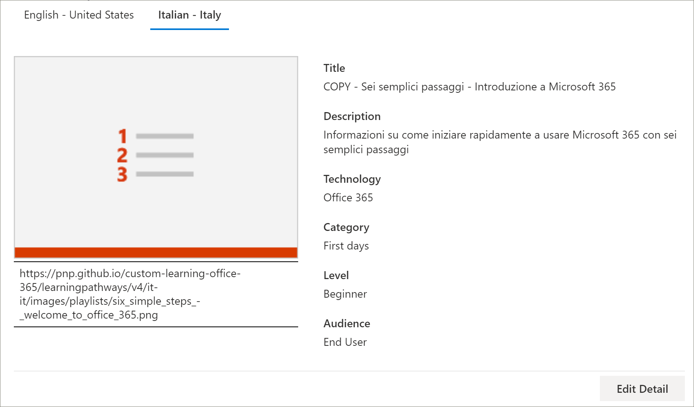
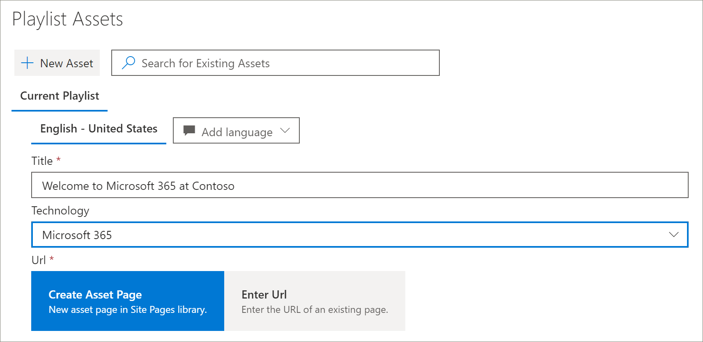
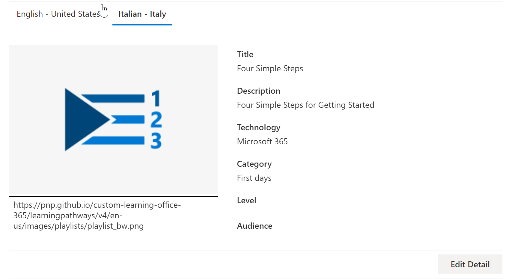

# Translate learning pathways custom playlists
With Learning Pathways, the way you work with custom playlists depends on how you set up learning pathways.  

- If you provisioned a new learning pathways multilingual site, you can copy or create a new playlist and translate the playlist into the languages that the site supports.
- If you upgraded an existing learning pathways site that has pre-existing custom playlists, you can translate the existing playlists into the languages that your site supports. You can also copy and create new playlists. 

> [!IMPORTANT]
> - Microsoft-supplied playlists are already translated and can't be modified unless you create a copy of the playlist. 

## Create or copy a playlist and have it translated
If you've provisioned a new learning pathways multilingual site or upgraded the site with the multilingual web part, you can copy or a create custom playlist and translate the playlist and playlist assets into the languages supported by your site. 

### Copy a playlist and have it translated
To demonstrate how to create a new custom playlist and have it translated, we'll use the Copy playlist feature of learning pathways.

1.	From the learning pathways **Home** menu, click **Learning pathways administration**. 
2.	Under **Microsoft 365 learning pathways**, select **First Days**, then select **Six Simple Steps - Welcome to Microsoft 365**. 
3. Click **Copy Playlist**, scroll down the page and click **Edit Detail**.   
4. Change the title of the playlist. In this example, we'll change the playlist title to to **Five Simple Steps**. The languages available will depend on the supported languages selected for the site. To add additional languages, you need to add additional supported languages to the site.   
5. Click **Save Detail**. 
6. Click a language to the right of the default language (in this case English) to view the copied playlist details. The details for the new language reflect the original copied playlist and require translation.
7. Make a note to notify the translator of the playlist details to be translated.  

> [!IMPORTANT]
> Translator notifications are not built into custom playlists. Translators will need to be notified manually. Translators manually translate the copies of the default language details into the language(s) specified. You'll need to notify the translator of the translations required for playlist details. It's recommended that you finish all playlist changes,including adding, editing, or deleting playlist assets, then notify the translator of the required translations for playlist details and assets.

## Create multilingual assets in a custom playlist
Any assets in a playlist that are supplied by Microsoft are not editable and do not require translation. Microsoft-supplied assets will be available in the languages supported by the site. For custom assets that you create, or existing custom assets, you can add the languages supported by the site.  Let's take a look at how to add languages for new and existing custom assets in a playlist. 

### Create a new multilingual asset for a playlist
These instructions assume you're using the Five Simple Steps playlist in the example in this topic. 

**To create the asset**
1. For the Five Simple Steps playlist, under **Assets**, select **+ New Asset** and then fill out the details for the asset. 
- For **Title**, enter "Welcome to Microsoft 365 at Contoso". 
- For **Technology**, select **Microsoft 365**.

2. Select **Create Asset**, and then select **Save Asset**.

**To open the asset**
1. Select the asset you created, and then click **Open**.  
2. Make the changes to the page as desired. For now, you can change the title of the page and add some text to the page as shown in the following example, and then click **Publish**. 
3. Click **Translation**.
4. Select **Create** for the language(s) you want. For this example, we'll select Italian.
5. Select **View**. You should now see a page similar to the following example depending on your supported languages.

6. Click **Publish**.
7. For the translation page you created, copy the URL from the browser and return to the learning pathways Administration page.

**To add a language for the translation asset you created** 
1. Return to the learning pathways Administration page and select the Edit icon (pencil) for the "Five Simple Steps" asset you opened. 
2. Click **Add language**, and then select a language. In this example, we've selected Italian. 
3. Enter the URL of the translated page you created. You should see a page similar to the following example. 

4. Click **Save Asset**.

## Add languages for existing custom playlists and assets
If you have upgraded learning pathways for multilingual support and have existing custom playlists and assets, you can add supported languages for the playlists and assets. These instructions assume you have a custom playlist to which you can add languages. If you don't have a custom playlist, see "Create or Copy a Playlist" earlier in this topic. 

> [!IMPORTANT]
> - Microsoft-supplied playlists are already translated and can't be modified unless you create a copy of the playlist. You can only add languages for custom playlists. 
> - To add languages for custom playlists and assets, multilingual support and languages must be enabled. For more information, see [Set Language Settings](https://docs.microsoft.com/office365/customlearning/custom_update_ml#set-language-settings). 

### To add languages for an existing playlist
1.	From the learning pathways **Home** menu, click **Learning pathways administration**. 
2.	Select a custom playlist. A custom playlist is identified by the people icon with the checkmark, as shown in the following example.
 
3. Select **Edit Detail**. You may need to scroll down to find the **Edit Detail** button.   
4. Select **Add language** and then select a language.  
5. Select **Save Detail**.
 The languages available will depend on the supported languages selected for the site. To add additional languages, you need to add additional supported languages to the site.   
5. Click a language to the right of the default language (in this case English) to view the copied playlist details. The details for the new language reflect the original copied playlist and require translation.
 
7. Make a note to notify the translator of the playlist details to be translated.  

**To open the asset**
1. Select the asset you created, and then click **Open**.  
2. Make the changes to the page as desired. For now, you can change the title of the page and add some text to the page as shown in the following example, and then click **Publish**. 
3. Click **Translation**.
4. Select **Create** for the language(s) you want. For this example, we'll select Italian.
5. Select **View**. You should now see a page similar to the following example depending on your supported languages.

6. Click **Publish**.
7. For the translation page you created, copy the URL from the browser and return to the learning pathways Administration page.

## Notify the translator
When you've finished creating translation assets, notify the translator of the required translations. The translator will:
- Translate playlist details.
- Translate asset details.
- Translate added language pages for an asset.
- Notify the requestor of the translations that the translations are ready for review

## Add languages for an existing custom playlist
If you have upgraded learning pathways for multilingual support and have existing custom playlists and assets, you can add supported languages for the playlists and assets. 

> [!IMPORTANT]
> - Microsoft-supplied playlists are already translated and can't be modified unless you create a copy of the playlist. You can only add languages for custom playlists. 
> - To add languages for custom playlists and assets, multilingual support and languages must be enabled. For more details on enabling multilingual support and options, see [Set Language Settings](https://docs.microsoft.com/office365/customlearning/custom_update_ml#set-language-settings). 

## Instructions for the translator
When you add languages to playlists, you need to notify the translator of the changes. You can point the translator to the following 

### Translate playlist details
From the Learning Pathways **Home** menu, click **Learning pathways administration**. 
1. Click the custom playlist that requires translation, then click the languages. 
2. Click **Edit Detail**, make the translations for the playlist, then click 
3. Click **Save Detail**. 
4. Notify the translation requestor that the translation is complete. 

### Translate asset details
From the Learning Pathways **Home** menu, click **Learning pathways administration**. 
1. Click the custom playlist that requires translation. 
2. Scroll down the page, then under Assets, select edit for the asset you want to edit, then select the language. 
3. Make the translations for the asset, and then click **Save Asset**.  

### Translate the added language page for the asset
From the Learning Pathways **Home** menu, click **Learning pathways administration**. 
1. Click the custom playlist that requires translation. 
2. Scroll down the page, then under Assets, select the asset, select the language, and then click Open. 
3. Make the translations for the page, and then click **Publish**.   

## For more information
- For more information about customizing learning pathways, see [Customize Learning Pathways](custom_overview.md).   

