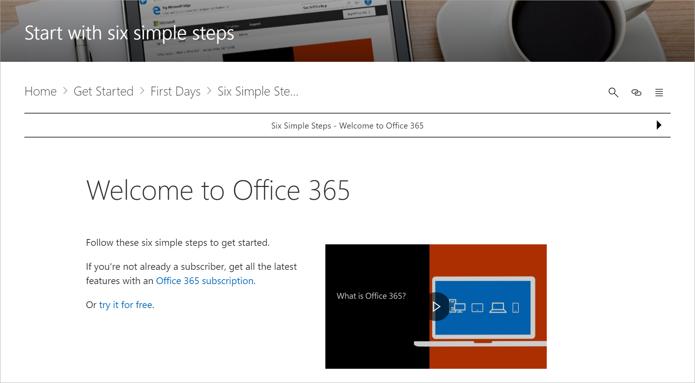

# Where is the Custom Learning web part?

When Custom Learning is provisioned in your organization, the Custom Learning SharePoint site and web part are added to your organization’s SharePoint tenant. As part of the provisioning, the Custom Learning web part is added to the following pages of the Custom Learning Web site:

- Start-with-Six-Simple-Steps.aspx 
- Recommended-Playlists.aspx
- Get-started with-Office 365.aspx
- Get-started-with-Microsoft-Teams.aspx
- Get-started-with-OneDrive.aspx
- Get-started-with-SPO.aspx

For each page, the Web part is configured differently to show the categories and playlists designed to support the intent of the page. The Custom Learning web part, as we’ll show you later, can be filtered to show specific categories, playlists, or assets. Let's take a look. 

## View Microsoft Teams playlists

Here’s an example of the Get Started with Microsoft Teams page with the Web part filtered to show the learning playlists for Teams. 

- From the Custom Learning Home page, select Get started with Microsoft Teams.

## View the Six Simple Steps playlist

The web part on the Start-with-Six-Simple-Steps.aspx page is configured to show the first asset in the Six Simple Steps playlist.

- From the Home page of Custom Learning for Office 365, select Start with six simple steps. 

The following page, Start-with-Six-Simple-Steps.aspx, appears with the Web part configured to show the first asset in the Six Simple Steps playlist.

## View all Office 365 training

The Web part on the Office 365 training page is configured to show all the categories and subcategories available from the Custom Learning catalog. This includes subcategories from Microsoft along with any subcategories that you create for your organization.

- From the Custom Learning Home page, click Office 365 training. The page appears appears with the Web part configured to show all the categories and subcategories available from the Custom Learning Catalog.

## Next Steps

- [Customize and Share Playlists](customplaylist.md)
- [Drive Adoption](driveadoption.md) 