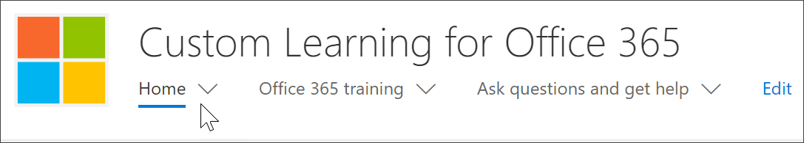

# Where's the Microsoft 365 learning pathways web part?

When learning pathways is provisioned in your organization, the learning pathways site and web part are added to your organization’s SharePoint tenant. As part of the provisioning, the Microsoft 365 learning web part is added to the following pages of the Microsoft 365 learning pathways site:

- Start-with-Six-Simple-Steps.aspx 
- Recommended-Playlists.aspx
- Get-started with-Office 365.aspx
- Get-started-with-Microsoft-Teams.aspx
- Get-started-with-OneDrive.aspx
- Get-started-with-SPO.aspx

For each page, the Web part is configured differently to show the categories, subcategories, playlists or asset designed to support the intent of the page. The learning pathways web part, as we’ll show you in later sections, can be added to just about any SharePoint page and filtered to show specific all categories, or subcategories, playlists, or just assets. Let's take a look. 

## View Microsoft Teams playlists

Here’s an example of the **Get Started with Microsoft Teams** page with the Web part filtered to show the learning playlists for Teams. 

- From the learning pathways Home page, select **Get started with Microsoft Teams**.

- Click the **Home** menu on the learning pathways site menu to return to the site Home page.

## View the Six Simple Steps playlist

The web part on the **Start-with-Six-Simple-Steps.aspx** page is configured to show the first asset in the Six Simple Steps playlist. 

- From the learning pathways Home page,  click **Start with six simple steps**. 

## View all Office 365 training

The Web part on the **Office 365 training** page is configured to show all the categories and subcategories available from the learning pathways catalog. This includes subcategories from Microsoft along with any subcategories that you create for your organization.

- From the learning pathways Home page, click **Office 365 training**. The page appears appears with the Web part configured to show all the categories and subcategories available from the Custom Learning catalog.

- Click the **Home** menu on the learning pathways site menu to return to the site Home page.

