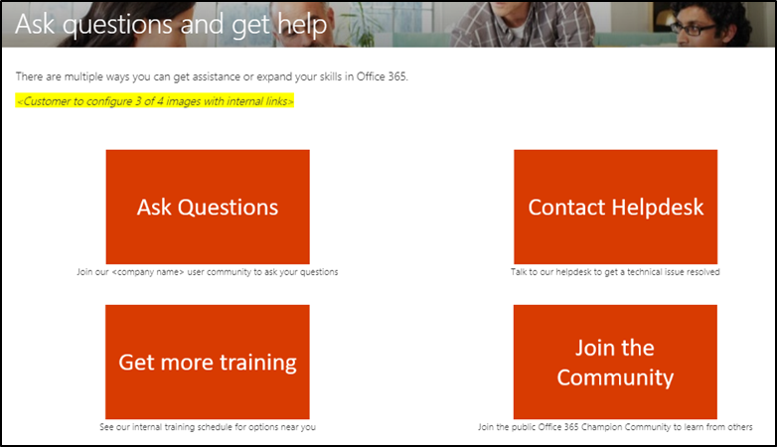
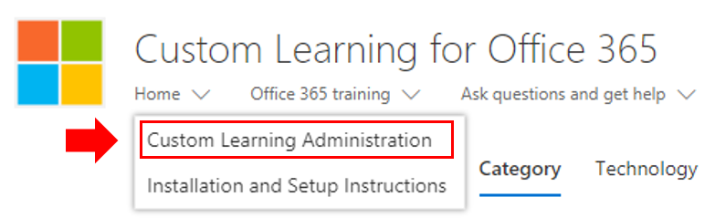
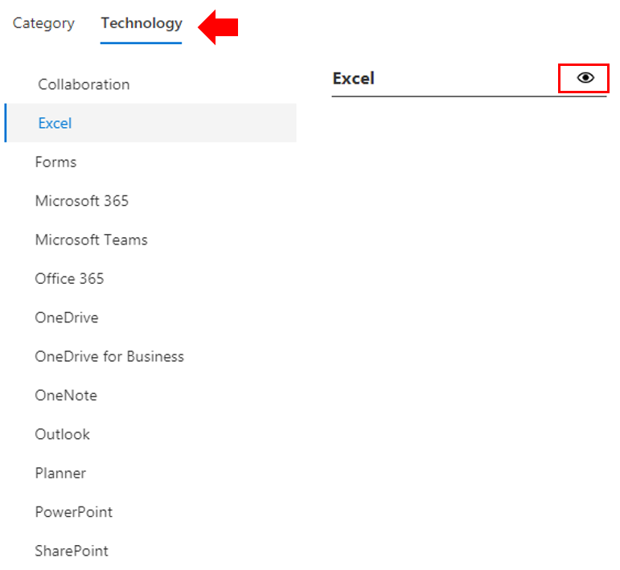
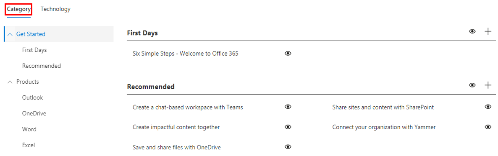

# Customize the training experience

This is a test four. By default both the site experience and the webpart include content for all Office 365 and Windows 10 services.  If only all or some of these services are available in your company you can adjust what content is available to your users.  

There are several kinds of customizations that are available to the owners of this site. 

- [Customize web pages](#customizing-web-pages)
- [Customize available services](#customize-available-services)
- [Customize and share playlists](customplaylist.md)

Some or all of these customizations can be completed before you launch the site to your user community.  

> [!TIP]
> Gather feedback from your employees and periodically complete additional customizations.  Add playlists, target webpages to specific roles or turn on new training content when launching new services. 

## Customizing web pages

You can fully customize the Custom Learning web site. If you are not familiar with creating pages within modern SharePoint Online sites we suggest you review [Customize your SharePoint site](https://support.office.com/article/customize-your-sharepoint-site-320b43e5-b047-4fda-8381-f61e8ac7f59b) article on support.office.com. 

### Customize the **Ask Questions and Get Help** page

As a starting point for customizing the site, select Ask questions and get help from the menu bar, then click the SharePoint Edit button and change the images and the links. 

## Customize available services

1.	Navigate to the Custom Learning Administration page within the website

1. Select **Technology** to see the full list of services that are included in the solution
1. Select a technology and **click the eye symbol** to hide this content.  Click the eye symbol again to show the content within the experience. 

The same process can be repeated for categories of playlists within the experience.  Simply select the Category option to show/hide playlists. 

### Next steps

- [Customize and Share Playlists](customplaylist.md)
- [Drive Adoption](driveadoption.md) 
