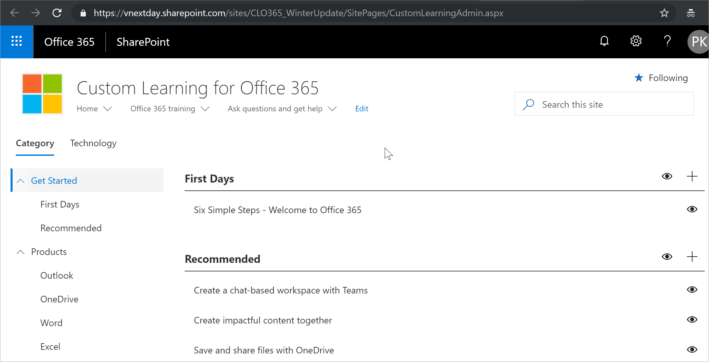
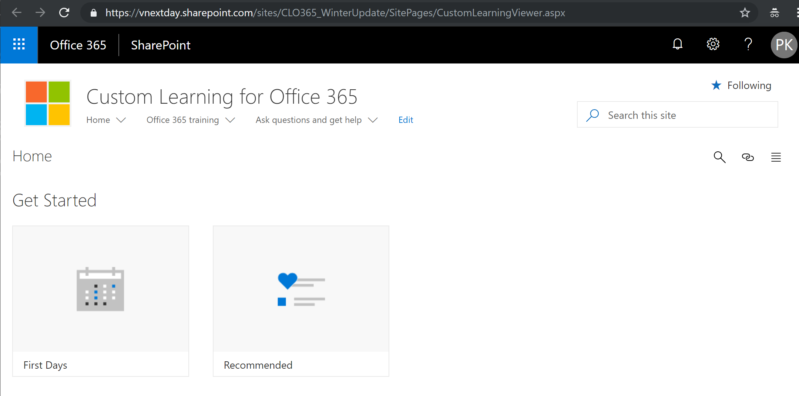

# Get to know the SharePoint Application Pages for Custom Learning

Custom Learning provides two SharePoint Application pages that you should know about as an administrator of the solution. These two pages non-editable. 

- CustomLearningAdmin.aspx
- CustomLearningAdmin.aspx

## CustomLearningAdmin.aspx

The CustomLearningAdmin.aspx page provides Administrative features for Custom Learning, including hiding and showing content and creating and editing subcategories and playlists. We’ll cover this page and its functionality in more detail in later topics.

**To view CustomLearningAdmin.aspx**

1. Click the SharePoint Settings icon, and then click Site Contents. 
2. Click CustomLearningAdmin.aspx. 

## CustomLearningAdmin.aspx
The CustomLearningViewer.aspx page provides a Viewer page for displaying Custom Learning contents. For example, if you copy a Playlist link and share it with a co-worker, the link, when clicked, takes the user to the Viewer page and displays the linked content. We’ll cover this page and its functionality in more detail in later topics.

**To view CustomLearningViewer.aspx**

1. Click the SharePoint Settings icon, and then click Site Contents. 
2. Click CustomLearningViewer.aspx. 

## Next Steps

- [Customize and Share Playlists](customplaylist.md)
- [Drive Adoption](driveadoption.md) 