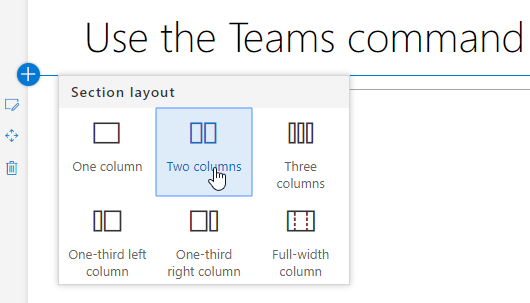
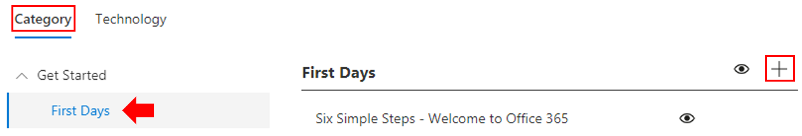
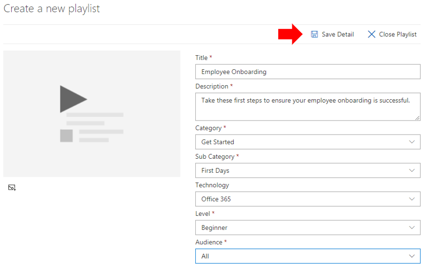
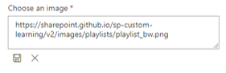
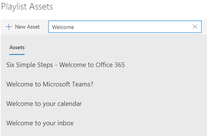
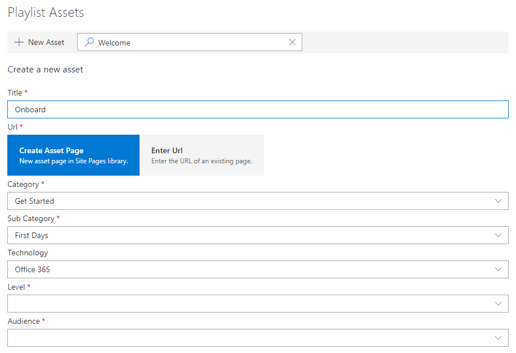
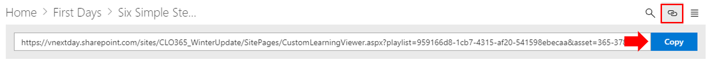

# Customize and Share Playlists

## Create a Playlist

A playlist is a compliation of "assets". An "asset" is a SharePoint page or existing item of Microsoft training content. When you create a playlist you select assets that go together to create a learning path for your user.  

The benefit of adding SharePoint pages is that you can create SharePoint pages with a YouTube videos or videos hosted in your organization. You can also create pages with Forms or other Office 365 content.  

#### Step 1: Create a SharePoint page for your playlist
In this example, we’ll first create a SharePoint page to add to the playlist. We’ll create a page with a YouTube video web part and Text web part.  These instructions assume you are using the SharePoint Online service. 

#### Create a new page
1.	Select the Settings menu > Site Contents > Site Pages > New > Site Page.
2.	In the title area, type Use the Teams command box
3.	Select the Add a new section, and then select Two Columns.

4.	In the left-hand box, select Add a new web part, and then select Embed. 
5.	In a Web browser, go to this URL https://youtu.be/wYrRCRphrp0 and get the embed code for the video. 
6.	In the SharePoint Web part, select Add Embed code and then paste it into the Embed box. 
7.	In the right-hand box, select Add a new web part, and then select Text. 
8.	In a Web browser, go to this URL: https://support.office.com/en-us/article/13c4e429-7324-4886-b377-5dbed539193b and copy the Try it! Instructions from the page and paste them into the Text Web part. Your page should look like the following. 

9.	Click **Publish**, and then copy the URL of the page and paste it in Notepad

#### Step 2: Create the Playlist

1. Navigate to the **Custom Learning Administration** page in your site experience.

1. Make sure **Category** is selected 
1. Click on the category where you'd like your new playlist to appear
1. Next to the category name, click on the plus symbol

1. Fill in the values as shown in the example below and select **Create**. 

- **Title** - Display name of the playlist
- **Description** - Information about what will be learned
- **Category** - Preselected based on your initial selection
- **Sub Category** - Preselected based on your intial selection
- **Technology** - Select as applicable
- **Level** - Beginner, Intermidate or Advanced
- **Audience** - This allows you to target content based on a pre-defined list of roles provided by Microsoft.

6. Click **Save Detail**

> [!TIP]
> You can customize the icon image for your playlist.  Click the image icon and insert an URL of a previously uploaded image.  Make sure the image is located within the Custom Learning site collection or in another location that all users will have access to the file.  

#### Step 3: Add assets to the playlist
In this step, you’ll add existing assets from Microsoft and the SharePoint page you created to the playlist. 

1. Once you have saved the details for your Playlist you can use the Search for Existing Assets.
1. **Enter in any search term** to see a list of predefined assets that are available from other playlists. **Click on the name** of an asset to include it in your new playlist.

You can also add the SharePoint page you created earlier or create one from scratch in the experience.

1. Click on the **New Asset** option in the Playlist Assets dialog
1. Give your asset a **Title**. Once entered, additional options will display

1. You can now create a new asset page in SharePoint Online or enter in the URL of an existing page to add it to your custom playlist. 
1. **Category**, **Sub Category** and **Technology** fields will be pre-populated based on your previous selections for this playlist.
1. Make the appropriate selections for Level and Audience for this individual asset.  
1. Click **Save Asset** to add it to the custom playlist
1. Repeat these steps, either searching or adding individual pages, until your playlist is complete. 
1. Click **Close Playlist** to save

Your playlist with this content will now be available anywhere you have installed / embedded the Custom Learning webpart. 

> [!NOTE]
> If you make a mistake once you have closed the playlist, you can delete it from the category by clicking the X next to the playlist name.  

#### Things to Think About

Custom playlists can be used to assist your end users in a variety of tasks.  Do you have a time off request form?  A form to request hardware equipment?  Any existing training assets can be programmed into the experience.  

## Share Playlists

1. Navigate to any playlist within the webpart or site experience
1. In the upper left hand corner you will see three icons
1. Click on the icon representing a link
1. Copy the URL to the playlist

This URL can now be inserted in your site navigation or utilized in other communications to take your employees directly to that playlist. 

### Next Steps - [Drive Adoption](driveadoption.md)
