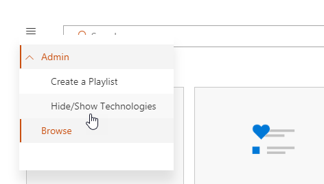
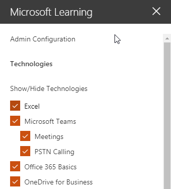
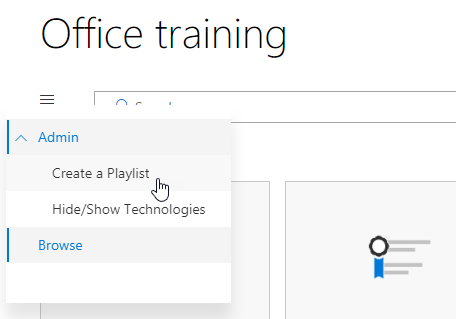
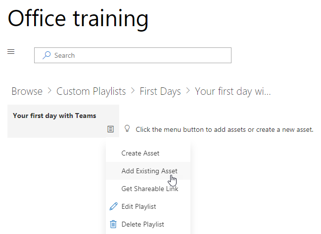
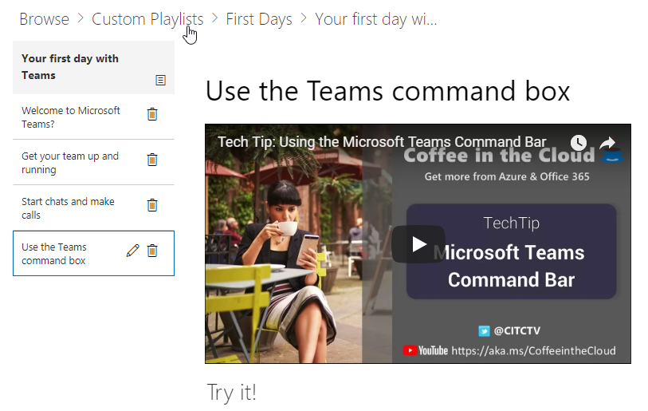

# Customize the Services and Playlists

By default both the site experience and the webpart include content for all Office 365 services.  If only all or some of these services are available in your company you can adjust what content is available to your users.  In this article we will customize the webpart content.  

## Customizing the webpart content

The Custom Learning webpart provides two key features:
- Hide/Show Technologies
- Create a Playlist

### Hide or Show Technology Categories

To hide and show content in the Web part: 
1.	Click the dropdown menu on the webpart, then click Hide/Show Technologies

2. Select a checkox to hide or show a technology and select **Apply**.

### Create a Playlist

A playlist is a compliation of "assets". An "asset" is a SharePoint page or existing item of Microsoft training content. When you create a playlist you select assets that go together to create a learning path for your user.  

The benefit of adding SharePoint pages is that you can create SharePoint pages with a YouTube videos or videos hosted in your organization. You can also create pages with Forms or other Office 365 content.  

#### Step 1: Create a SharePoint page for your playlist
In this example, we’ll first create a SharePoint page to add to the playlist. We’ll create a page with a YouTube video web part and Text web part.  These instructions assume you are using the SharePoint Online service. 

#### Create a new page
1.	Select the Settings menu > Site Contents > Site Pages > New > Site Page.
2.	In the title area, type Use the Teams command box
3.	Select the Add a new section, and then select Two Columns.

4.	In the left-hand box, select Add a new web part, and then select Embed. 
5.	In a Web browser, go to this URL https://youtu.be/wYrRCRphrp0 and get the embed code for the video. 
6.	In the SharePoint Web part, select Add Embed code and then paste it into the Embed box. 
7.	In the right-hand box, select Add a new web part, and then select Text. 
8.	In a Web browser, go to this URL: https://support.office.com/en-us/article/13c4e429-7324-4886-b377-5dbed539193b and copy the Try it! Instructions from the page and paste them into the Text Web part. Your page should look like the following. 

9.	Click Publish, and then copy the URL of the page and paste it in Notepad

#### Step 2: Create the Playlist
1.	Navigate to where you have installed the Custom Learning webpart. In the full site experience it is hosted on the Office 365 training page. 
2.	From the dropdown menu select Create New Playlist. 

3.	Fill in the values as shown in the example below and select **Create**. 

#### Step 3: Add assets to the playlist
In this step, you’ll add existing assets from Microsoft and the SharePoint page you created to the playlist. 

1.	Click the menu button, then click Add Existing Asset.

2.	Filter on Office 365 Apps > Microsoft Teams Training
3.	Add Welcome to Microsoft Teams, Get your team up and running, and Start chats and make calls.
4.	Select the menu button > Create Asset.
5.	Type Use the Teams command box in the Asset title box. 
6.	Paste the SharePoint Use the Teams command box page URL you copied in the Asset content field. 
7.	Now navigate back to the Home Page > Custom Playlists > Your first days with Teams > Use the Teams command box. Your page should look like the following. 

Your playlist with this content will now be available anywhere you have installed / embedded the Custom Learning webpart. 

#### Things to Think About

Custom playlists can be used to assist your end users in a vareity of tasks.  Do you have a time off request form?  A form to request hardware equipment?  Any existing training assets can be programmed into the experience.  
