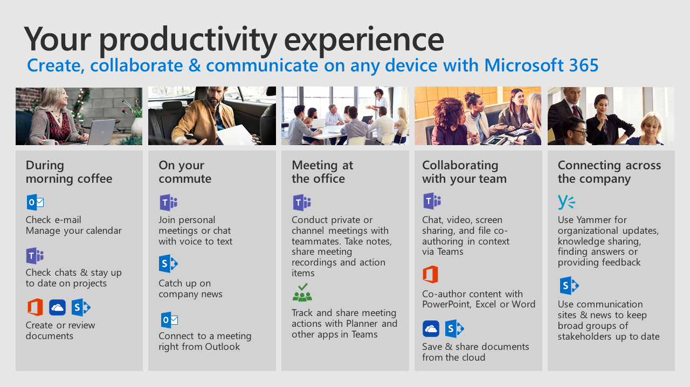

# Day in the Life with Office 365

Use Office 365 cloud services to improve your teamwork on any device.  Follow us through these common scenarios to see how you can streamline your collaboration, communication, and content creation as you go through your day.  

