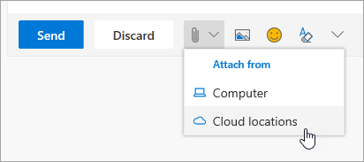

# Collaborating with Colleagues

It's 2:00 PM and time to collaborate with colleagues. Office 365 provides best-in-class opportunities for collaboration, enabling teams to work together in a number of ways. 

## Tools
- Microsoft Teams
- Office Online
- OneNote
- SharePoint & OneDrive
- 
## Checklist for collaborating with colleagues
- Create or join a Microsoft Team to collaborate
- Create and share files from OneDrive 
- Co-create in Office 365 
- Use cloud attachments

## Create or join a Microsoft Team for collaboration

Microsoft Teams and channels are places where people can collaborate by sharing files, tracking team action items and much more. Every Microsoft Teams has an integration into a SharePoint site, a OneNote notebook and other assets. This service of Office 365 is best used for people who work together frequently on shared projects or outcomes. 

## Share Files from your OneDrive
Files that have been saved on OneDrive for Business can be shared with anyone either from the browser or Office 365 desktop applications like Word or Excel. It is possible to share with individuals using their name, alias, or company email address. 

## Co-create in Office 365
Co-creation is when we work simultaneously with colleagues on the same file. This is possible in the web-based versions of the core Office 365 apps and in the desktop versions of those applications from Office 2016 onward.  Save time and work together on the same document and Office will synchronize those changes for you, even if one of you is offline. 

## Use Cloud Attachments - Stop Emailing that Spreadsheet!
How many times have you had to hunt for the right version of a document when it was attached to an email? Now in Office 365 you can share a link to the file, called a cloud attachment, so that everyone is editing the same version.  You can chose to either send a link and whether or not people can view or edit the file. 

