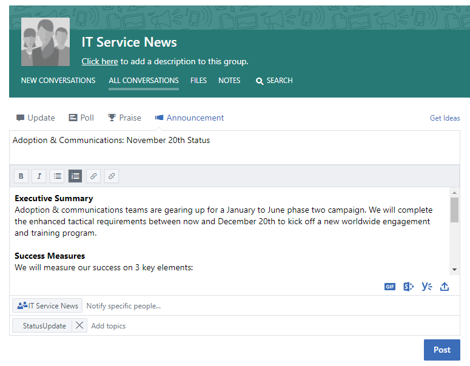
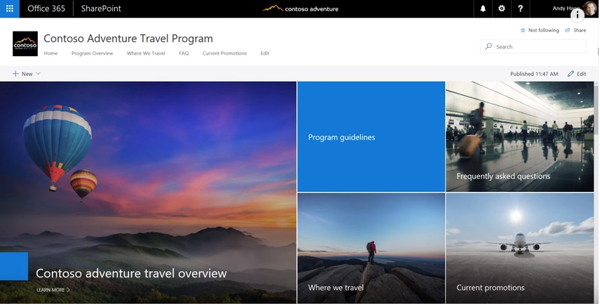
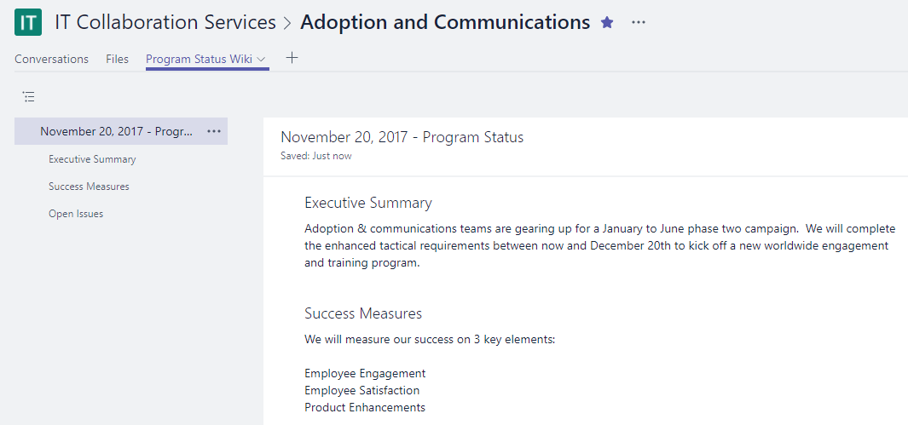

# Connecting Across the Company

It's been a busy day, but before you leave the office you want to ensure that all the people interested in your work are informed about what is happening. Making sure that all your stakeholders -- inside and outside of your team -- understand your goals, progress, and results is an important part of what you do.  

## Tools
- SharePoint
- Yammer
- Outlook
- Microsoft Teams 

## Checklist for communicating across the company
- Understand your audience and their existing communication methods
- Target your key messages by persona, for example, project stakeholder, team member, or employee
- Select communication tools that compliment each other, for example, author a post on your Yammer community and send an alert via e-mail 
- Co-author your information with others on your team
- Publish your information and send a notification to all of your interested parties 
 
## Select your communication method
Use the information below to decide the best way to communicate with your team. Balance using new technology with traditional email announcements while people transition to new communications methods. Having a consistent communication approach is an effective way to drive awareness and organizational change. 

**Yammer**: You can drive conversation across a broad group of people by using Yammer to share your updates. Post a standard update or use the Announcement feature to ensure a copy of your update goes to each member's mailbox. 

**SharePoint**: If you want to reach people outside of your  working group, consider writing a brief news article on your charter and progress that is readily available and kept for the life of your project in SharePoint online. Use a modern page in a SharePoint team site, or for a larger programs, consider creating a SharePoint communication site. 

SharePoint communication sites provide visual and flexible news articles that allow you to embed images, dashboards, and text together. Information is then available via any browser or through the SharePoint mobile app. This video provides a quick overview of what these powerful sites can do. To ensure the best visibility pin the communication site as a tab for your working group in Microsoft Teams.

**Microsoft Teams**:  If this broad group of people is already a part of your working group in Microsoft Teams why not post a note in your General channel with key facts and a link to a Wiki page for your longer update.  Wiki pages can be co-authored by multiple people and persist over the life of that team. 

## Tip to Modernize Your Communication

**For your email centric colleagues**: Subscribe them to alerts from either your Yammer group or your SharePoint news feed.  This way they will get a notification in their email that you've published new information and can then click through to your source information without you having to create a separate email.  Want to get snazzy?  Customize the notification with Microsoft Flow or PowerApps. Consider having a brownbag to show these users how to use Microsoft Teams, SharePoint or Yammer on their mobile devices. 

**Get people talking!** Encourage engagement by turning on comments for your SharePoint communication site pages.  If you are using Yammer ensure that people participate in your community by monitoring it regularly for questions that you can answer. 

**Share externally**:  Microsoft Teams, SharePoint and Yammer all support external sharing if your administrator allows that in your instance of Office 365.  By using external sharing you can share your updates with people who work for partners, suppliers and of course, your customers.