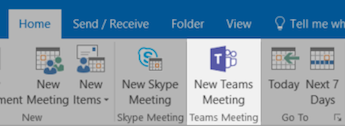
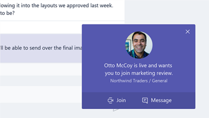
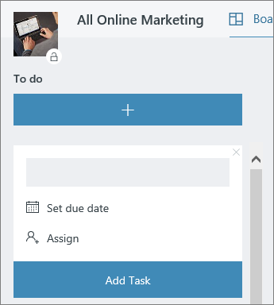

# Meeting at the Office

It's 10:00 AM and time for your meeting. In this section, we'll show you how to make your meetings more productive.  This involves best practices for meeting preparation and Office 365 tools.  

## Tools
- Outlook
- Microsoft Teams
- Skype for Business
- OneNote

## Checklist for your meeting
- Plan and book your meeting
- Join a meeting
- Present information in a meeting
- Use OneNote in a meeting for co-creation and notes
- Use Planner in a meeting to track action items for that project
- End a meeting
 
## Plan and book your meeting
There are a few things you can do to ensure your meeting is as productive as possible:

1. **Do you need a meeting?** Consider sharing a file in chat with the necessary approvers first.  
1. **Have a clear agenda.**  Include your meeting agenda in the notes section of your online meeting invitation so attendees can be prepared.
1. **Record your meeting**  Use meeting recording functions in Microsoft Teams to share the meeting with people who could not attend or to transcribe notes later.  

Now you're ready to book that meeting:  Book the meeting with Microsoft Teams or Skype for Business details in Outlook. Doing so enables you to include team members from different locations, record the meeting and utilize video (when available) to enhance communication. 

## Join a meeting
Join from anywhere. It is possible to join a Microsoft Teams or Skype for Business meeting from anywhere using a mobile device, either by calling the dial-in number in the meeting details or using the mobile apps. When using the mobile apps, be conscious of mobile data usage limits that apply to you or your country.

> [!TIP]
> **Use a headset.** If you are connecting from your computer at your desk, use a headset rather than your computer's built-in microphone and speakers to ensure a better call quality.

> [!TIP]
> Turn on your video! When cameras are available, it's worth using them, as face-to-face communication provides non-verbal cues that can be missed when just using voice. Don't worry, your hair looks great. 

## Present information in a meeting
Sharing content from your device is a great way to focus your meeting and provide context to the discussion. In general, sharing your entire screen can be a bad idea. It means that everything that comes up on your screen will appear on the screens of everyone attending the meeting. Avoid this by simply selecting the content you want to share in Microsoft Teams. 

## Use OneNote in a meeting
OneNote can allow for real-time collaboration and co-creation, making it an ideal tool for brainstorming and note taking in meetings. As long as everyone has access to the location where the OneNote is shared, you can post a link to the notebook and start brainstorming right away.

You can create a specific section for meeting notes in the team notebook. You can also use the "meeting details" functionality in OneNote to create pages with a summary of the details of the meeting.

## Use Planner in a meeting
Directly adding action items into a plan for your project saves you from transcribing them after the fact. It's a best practice in large project meetings to assign someone to action tracking & note taking. This is normally a different person than the individual running the meeting. Action item reminders are sent directly to the individual to whom it is assigned as are reminders if the item passes it's due date. 

## End a meeting
When everything on the agenda has been discussed, end the meeting, regardless of the time. Assign and send action items to all participants. If you are collaborating in Microsoft Teams, you can easily share action items in the appropriate channel. Action items can also be entered and assigned in Planner during the meeting, providing a fast way to track for completion which can also be [accessed in Microsoft Teams](https://support.office.com/article/use-planner-in-microsoft-teams-62798a9f-e8f7-4722-a700-27dd28a06ee0). 