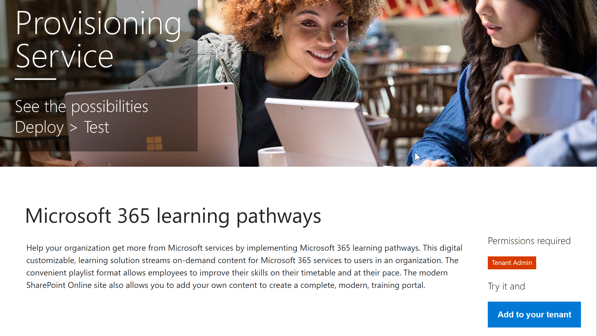

# Microsoft 365 learning pathways Beta Preview
Microsoft 365 learning pathways, formerly known as Custom Learning for Office 365, is a customizable, on-demand training solution designed to increase usage and adoption of Microsoft 365 services in your organization.  

## On-demand, custom training from Microsoft

Microsoft 365 learning pathways offers:

- **A fully customizable SharePoint Online communication site** - The learning pathways training portal can be customized to add your organization's help, support, and community content
- **Easy provisioning** - Provision learning pathways from the SharePoint Online Provisioning Service with just a few easy steps
- **The ability to create your own training playlists** - with learning pathways, you can create targeted training playlists to meet the unique needs of your environment
- **Up-to-date content** - Learning pathways provides content through a Microsoft online content catalog, so the content at your site is regularly updated

## Learning pathways components
Microsoft 365 learning pathways consists of three parts: 

- **An online catalog of Microsoft content** - Learning pathways is connected to an online catalog of Microsoft training content
- **A SharePoint Online communication site** - Learning pathways provides an easy-to-provision training portal that can be customized to the needs of your organization.
- **a SharePoint web part** - Learning pathways provides a SharePoint web part that can be filtered to present targeted training content. Organizations can also use the Web part to create their own custom playlists.

## SharePoint Online Provisioning Service 
Learning pathways can be provisioned from the SharePoint Online Provisioning Service. When Custom Learning is provisioned, organizations get a SharePoint Online communication site designed to be an out-of-the box training portal, along with a learning pathways Web part connected to an online catalog of training content. 

## 3 Easy Steps
Let's get started creating a learning pathways experience for your environment.
1. Choose a [setup option](custom_setupoptions.md) and provision Microsoft 365 learning pathways.  
2. Tailor learning pathways for your environment.
3. Share learning pathways with your users using our [adoption tools](driveadoption.md).

## Feedback and Support

Microsoft 365 learning pathways is an open source project supported through our [online issues list](https://aka.ms/CustomLearningHelp) on GitHub. The learnng pathways solution and it's components are not covered by any existing Microsoft support contract.  

## Additional Resources
You can use the Microsoft 365 learning pathways site to provide links to any new or existing user community forums. Consider starting an internal user group, if you don't have one already, to enable people to share their success and learn from each other.  If you don't have time to nurture an internal user group, you and your employees can join the [Microsft Office 365 Champion community](https://aka.ms/O365Champions) for monthly training, membership in the online community, and early access to tools and resources for Office 365.