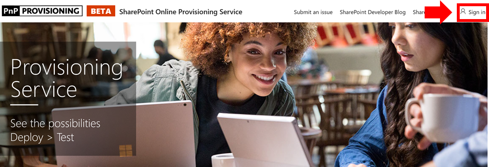
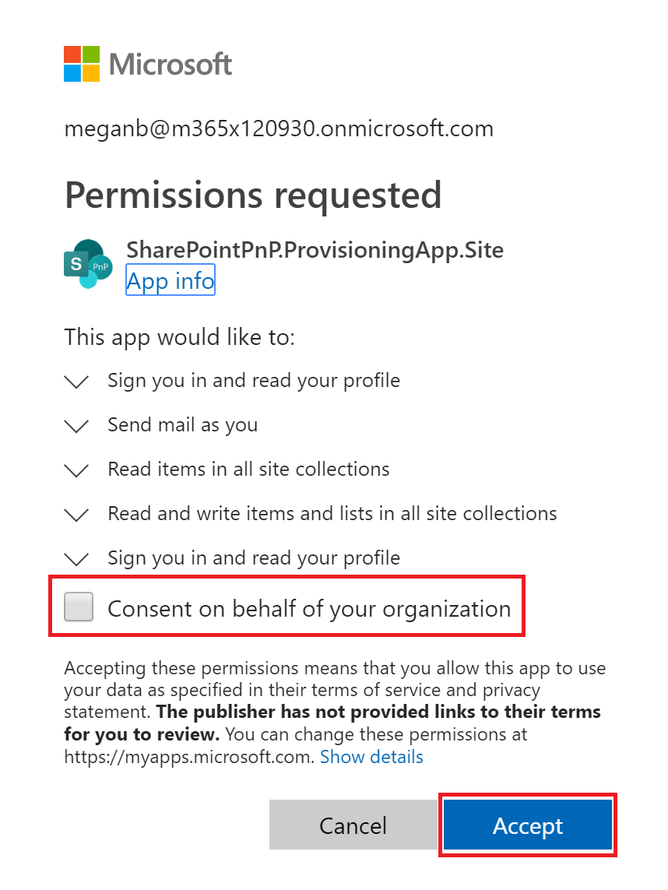
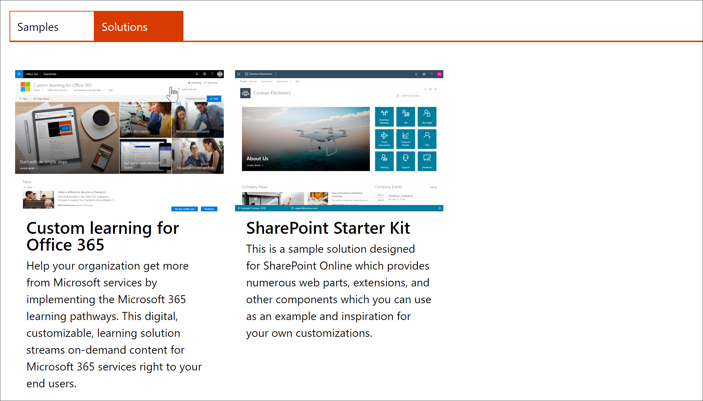
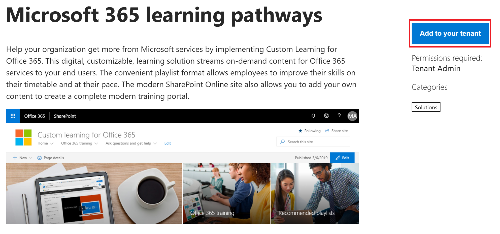

# Provision the Custom Learning Site

With the SharePoint Online Provisioning Service, an Office 365 Tenant Administrator can start the provisioning process with a few simple clicks. The Provisioning Service is the recommended way to provision Custom Learning. It's fast, easy, and takes only a few minutes to start the process. Before getting started with the Provisioning Service, however, make sure you've met the prerequisites for provisioning.

## Prerequisites
 
To successfully set up Custom Learning with the Provisioning Service [SharePoint Online Provisioning Service](https://provisioning.sharepointpnp.com), the person doing the provisioning must meet the following pre-requisites: 
 
- The person provisioning Custom Learning must be a Tenant Administrator, also known as the Office 365 Global Administrator, of the tenant where Custom Learning will be provisioned.  
- A tenant App Catalog must be available within the Apps option of the SharePoint Admin Center. If your organization does not have an SharePoint tenant App catalog, refer to the [SharePoint Online documentation](https://docs.microsoft.com/en-us/sharepoint/use-app-catalog) to create one.  
- The persono provisioning Custom Learning must be a Site Collection Owner of the Tenant App Catalog. If the person provisioning Custom Learning is not a Site Collection Owner of the App Catalog [complete these instructions](addappadmin.md) and continue. 

### To provision Custom Learning

1. Go to http://provisioning.sharepointpnp.com and **sign in** from the upper right hand corner of the home page.  Sign in with the  credentials for the targeted tenant where you plan to install the site template.

2. Clear the **Consent on behalf of your organization** and select **Accept**.

3. Select **Custom Learning for Office 365** from the solution gallery.

4. From the solution home page select **Add to your Tenant**

5. Complete the fields on the provisioning information page as appropriate for your installation. At a minimum enter the email address where you wish to get notifications about the provisioning process and the destination URL for your site to be provisioned to.  
> [!NOTE]
> Make the destination URL for your site something friendly to your employees such as "/sites/MyTraining" or "/teams/LearnOffice365".

6. Select **Provision** when ready to install Custom Learning into your tenant environment.  The provisioning process will take up to 15 minutes. You will be notified via email (to the notification email address you entered on the Provisioning page) when the site is ready for access.

> [!IMPORTANT]
> The Tenant Admin who provisions the Custom Learning Site must go to the site and assign owners to the site. 

7. When provisioning is complete, the Tenant Admin receives an email from the PnP Provisioning Service. Copy the link to the site provided in the email, and then follow the instructions to go to the site. As a Tenant Admin, your job isn't over.

8. Favorite the site in the upper right hand corner and bookmark the URL for future reference.  

### Next Steps
- Explore the [default content](sitecontent.md) included in the webpart.
