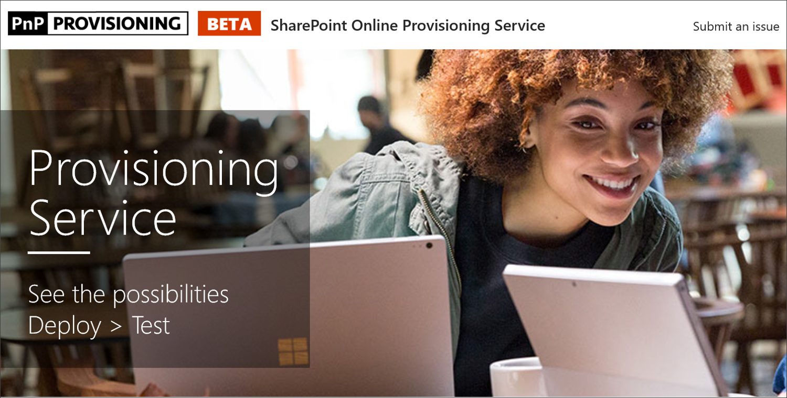

# Provision the Custom Learning Site

1. Go to http://provisioning.sharepointpnp.com and sign in using your credentials for the targeted tenant you plan on using for the installation.

1. Check off Consent on behalf of your organization and select Accept.
1. Select Custom Learning for Office 365 from the solution gallery. 
1. Select Add to your Tenant 
1. Adjust default selections on the provisioning page as required and select Provision when ready to install CLO365 into your tenant environment.  
1. The provisioning process will take up to 15 minutes. You will be notified via email (to the notification email address you entered on the Provisioning page) when the site is ready for access. 
1. Once logged on to CLO365 in your tenant, favorite the site and copy the url for future reference.  

## Next Steps
- Explore the [default content](sitecontent.md) included in the webpart.
- [Customize](customization.md) the training experience for your organization.
- [Drive adoption](driveadoption.md) of your training solution.

