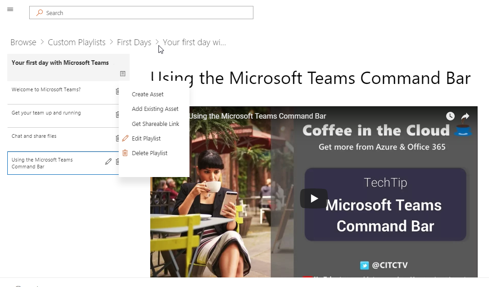

# Installing the Custom Learning Solution Webpart

**Option 1**: [The Custom Learning SharePoint Online Site Package](installsitepackage.md)

Custom Learning can be easily provisioned from the SharePoint Patterns and Practices Provisioning Service. When provisioned, you get a SharePoint Online communication site designed to be an out-of-the box training portal for your company. Formerly known as Toolkit for Teamwork, this training portal can be customized to add your organization's help, support, and community content. You can also remove any content related to services not supported within your organization. 

## Prerequisites for a tenant-wide installation

- To install the Custom Learning webpart for your entire tenant you will need to have Office 365 Administrative permissions.  If you do not have these permissions you can either work with your Office 365 Administrator or install the webpart for an individual site collection.
- You or your Office 365 Administrator must have setup and configured a tenant-wide [App Catalog](https://docs.microsoft.com/en-us/sharepoint/dev/spfx/set-up-your-developer-tenant) or a [Site Collection App Catalog](https://docs.microsoft.com/en-us/sharepoint/dev/general-development/site-collection-app-catalog)to receive the webpart.]
- We support SharePoint Online only. The web part is not support for installation on any version of SharePoint on premises.

## Add the Custom Learning webpart to your tenant 

1. Download the Custom Learning webpart and save it to your local drive.  This file is named "ms-custom-learning.sppkg".  Do not change the name or suffix of the file. 
2. Navigate to the [Office 365 Admin portal](https://admin.microsoft.com/AdminPortal/Home#/homepage) for your tenant
3. From the left navigation select Admin Centers, SharePoint. This will open in a new tab. 
, In the SharePoint Admin Center select Apps, App Catalog, Apps for SharePoint 
4. Select upload the webpart and choose the "ms-custom-learning.sppkg" file you downloaded
5. For this tenant-wide installation check the box next to "Make this solution available to all sits in the organization."  
 
> [!NOTE]
> Once the webpart is installed you will find it in your webpart gallery in SharePoint Online.  **In the gallery the webpart is named "Microsoft Learning"**

## Add the Microsoft Learning webpart to a SharePoint Online Page

After Custom Learning is installed in your tenant you can add the Web part to a SharePoint page. When you do Office 365 and Windows 10 training is available to your site.

1. Add the Custom Learning webpart in a full width column layout:

2. In the SharePoint page, select Add section and then select full width column.  You'll see the following prompt:

3. Select Microsoft Learning.  You should now see the following: 

 You can now click on the tiles to explore the default content included in the solution.  

 Along with the SharePoint site, the provisioning service also installs a Custom Learning Web part. Connected to an online catalog of Microsoft content, the Custom Learning Web part can be dropped on any SharePoint page and configured to support  

**Option 2**: [The Custom Learning for Office 365 web part ](installwebpart.md)
The Custom Learning web part option is designed for organizations that want to integrate Office 365 training into an existing SharePoint Online communication site. The Custom Learning web part can be installed on any SharePoint Online page and provides an up-to-date feed of the full suite of Office 365 training content from Microsoft's Support.Office.com site. Training content delivered through the web part is organized in easy-to-consume playlists. Administrators can also use the web part to build custom training playlists, combining content from YouTube, locally hosted content like .PDFs, and Office 365 training content, to provide training experiences tailored to the unique needs of the organization.

### Next Steps
- Explore the [default content](webpartcontent.md) included in the webpart.
- [Customize](customization.md) the training experience for your organization.
- [Drive adoption](driveadoption.md) of your training solution.

