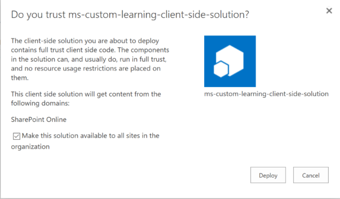
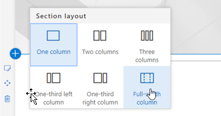
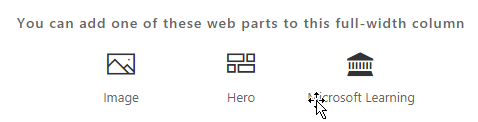
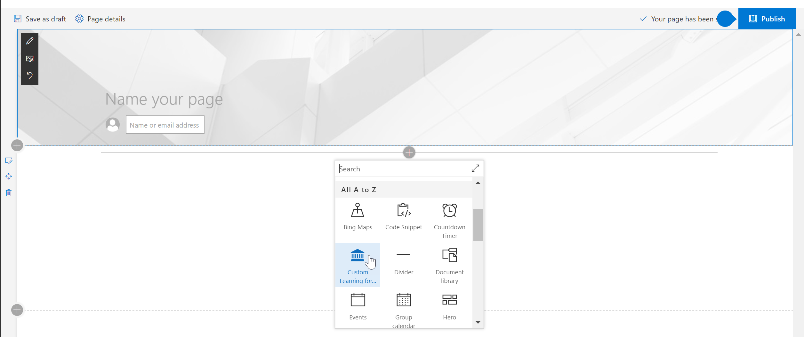

# Installing the Custom Learning Solution Webpart

## Prerequisites for a tenant-wide installation

- To install the Custom Learning webpart for your entire tenant you will need to have Office 365 Administrative permissions.  If you do not have these permissions you can either work with your Office 365 Administrator or install the webpart for an individual site collection.
- You or your Office 365 Administrator must have setup and configured a tenant-wide [App Catalog](https://docs.microsoft.com/en-us/sharepoint/dev/spfx/set-up-your-developer-tenant) or a [Site Collection App Catalog](https://docs.microsoft.com/en-us/sharepoint/dev/general-development/site-collection-app-catalog)to receive the webpart.]
- We support SharePoint Online only. The web part is not support for installation on any version of SharePoint on premises.

## Add the Custom Learning webpart to your tenant 

1. Download the Custom Learning webpart and save it to your local drive.  This file is named "ms-custom-learning.sppkg".  Do not change the name or suffix of the file. 
2. Navigate to the [Office 365 Admin portal](https://admin.microsoft.com/AdminPortal/Home#/homepage) for your tenant
3. From the left navigation select Admin Centers, SharePoint. This will open in a new tab. 
, In the SharePoint Admin Center select Apps, App Catalog, Apps for SharePoint 
4. Select upload the webpart and choose the "ms-custom-learning.sppkg" file you downloaded
5. For this tenant-wide installation check the box next to "Make this solution available to all sits in the organization."  

## Add the Customer Learning webpart to a SharePoint Online Page

After Custom Learning is installed in your tenant you can add the Web part to a SharePoint page. When you do, suddenly Office 365 training is available to you. 

1. Add the Custom Learning webpart in a full width column layout:

2. In the SharePoint page, select Add section and then select full width column.  You'll see the following prompt:

3. Select Microsoft Learning.  You should now see the following: 

 You can now click on the tiles to explore the default content included in the solution.  

## Next Steps
- Explore the [default content](webpartcontent.md) included in the webpart.
- [Customize](customization.md) the training experience for your organization.
- [Drive adoption](driveadoption.md) of your training solution.

