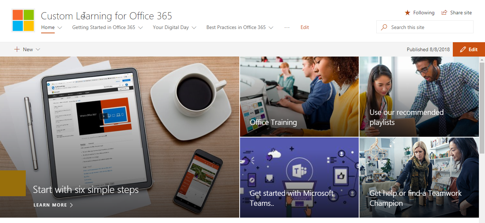
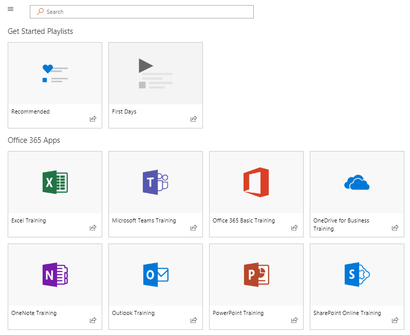
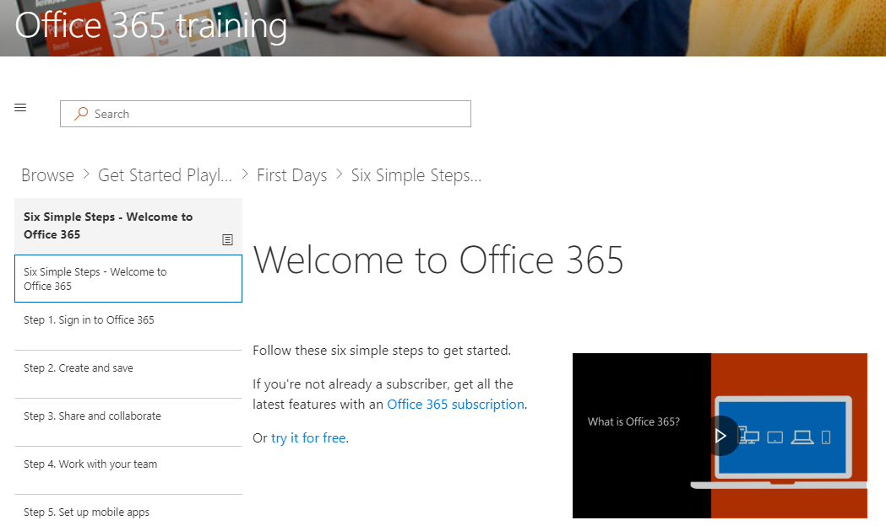
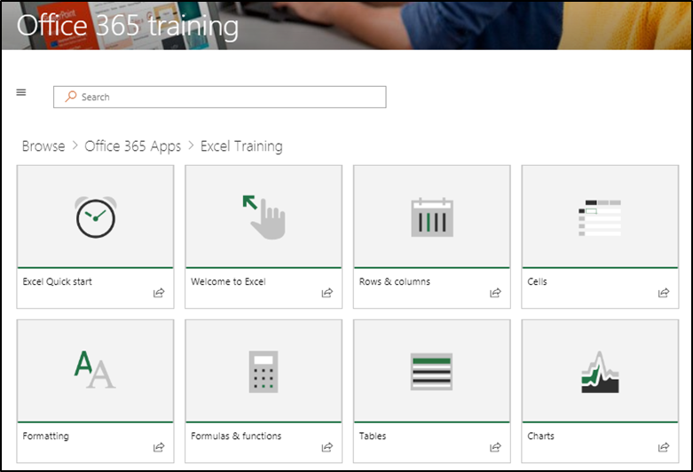
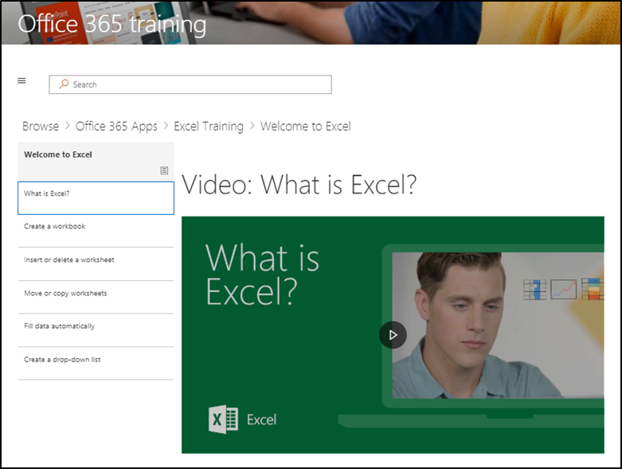

# Browse the site and default content

### Tour the site 

Navigate to the Home page and select Office 365 Training. EAch page in the SharePoint Online site is configured to host the Microsoft Learning webpart. This enables the page to  display all the content available within the webpart.

From the menu bar, select the navigation item **Office 365 Training** and then select **Get Started with OneDrive**. In this case, the Web part filters the content to show only OneDrive content.

Repeat these steps for the other two menu options, **Get Started with Teams** and **Get Started with SharePoint Online** to review their content and test the navigation.

Navigate back to the Home page and select **Start with Six Simple Steps**. This takes you to the Six Simple Steps playlist.

> [!TIP]
> The Six Simple Steps are derived from a Microsoft research team. These are the steps that Microsoft researchers have found to be the most sticky, meaning if users go through these steps, their use of Office 365 will increase and they will become more productive workers. And that’s good for everybody.

### Go to Start with Six Simple Steps
- From the Home page, click Start with six simple steps. 
- You see the Office Training page with the Custom Learning web part routed to the Start with six simple steps playlist.  

### View a list of playlists for a category

From the Office 365 training page select Excel Training to go to a list of Excel Training playlists.

### View a Playlist

Click **Welcome to Excel** to view the playlist

Your site is now set up with the correct content being displayed on each page. 

## Next Steps
- [Customize site content](customization.md)
- [Drive adoption](driveadoption.md) 
